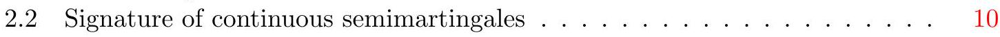
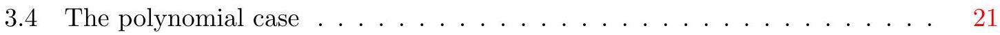
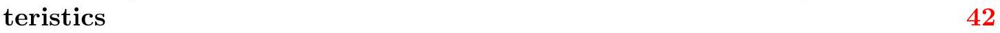
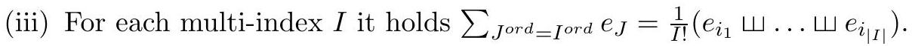
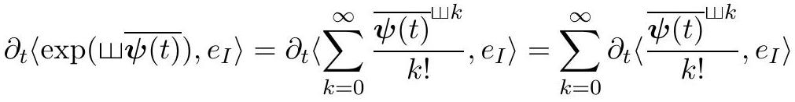
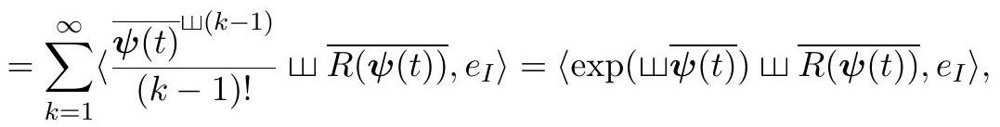
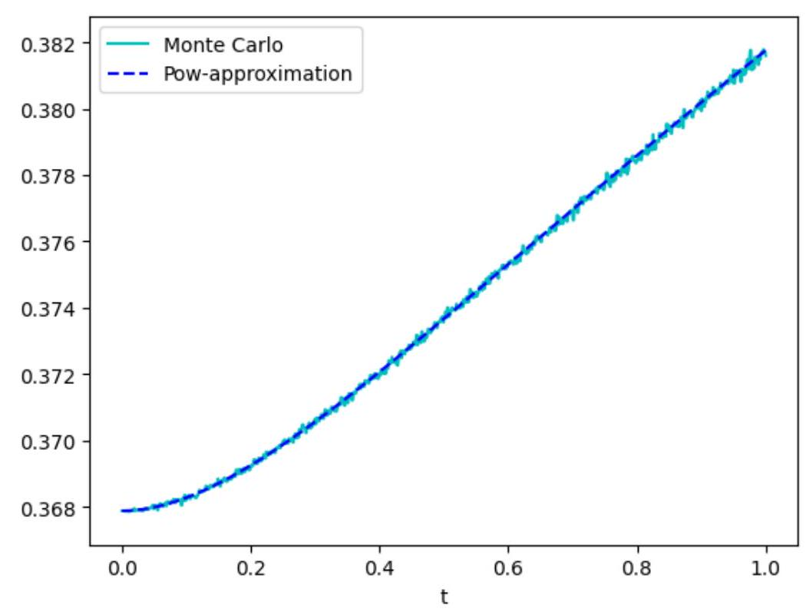
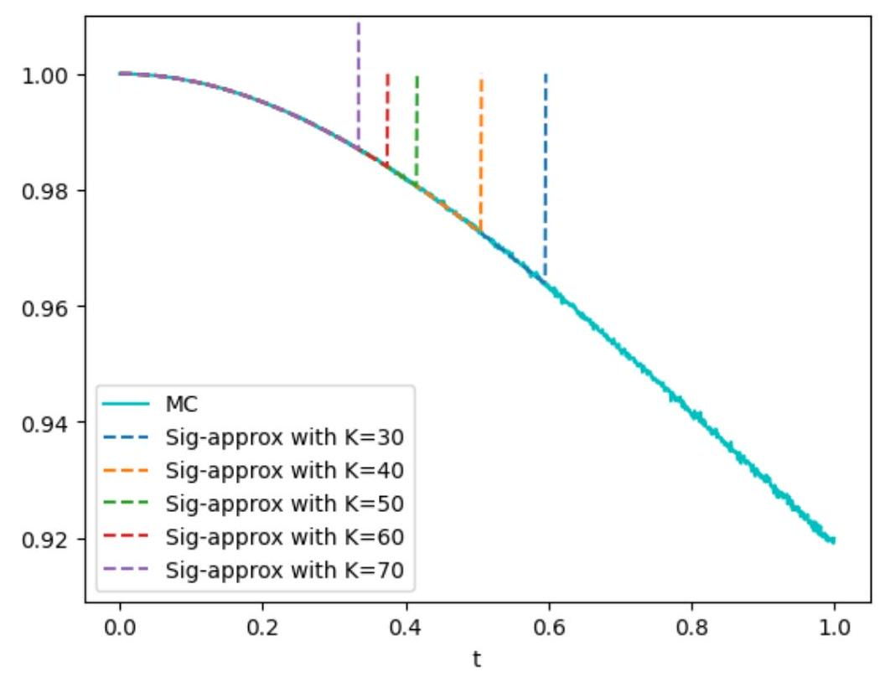
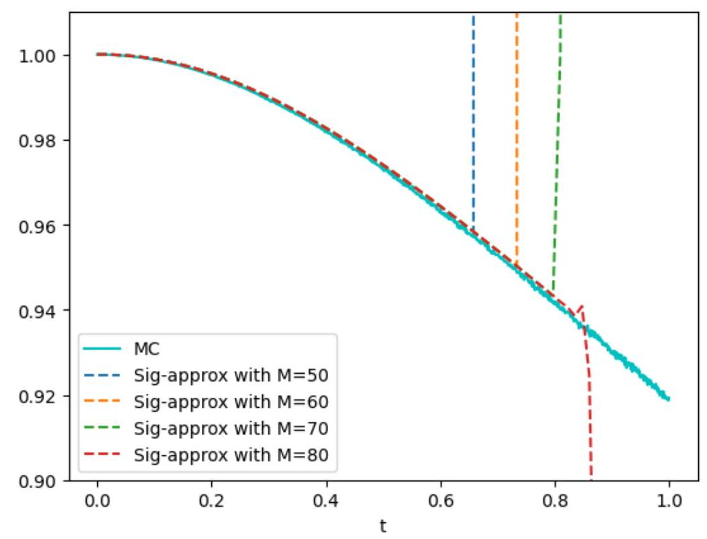
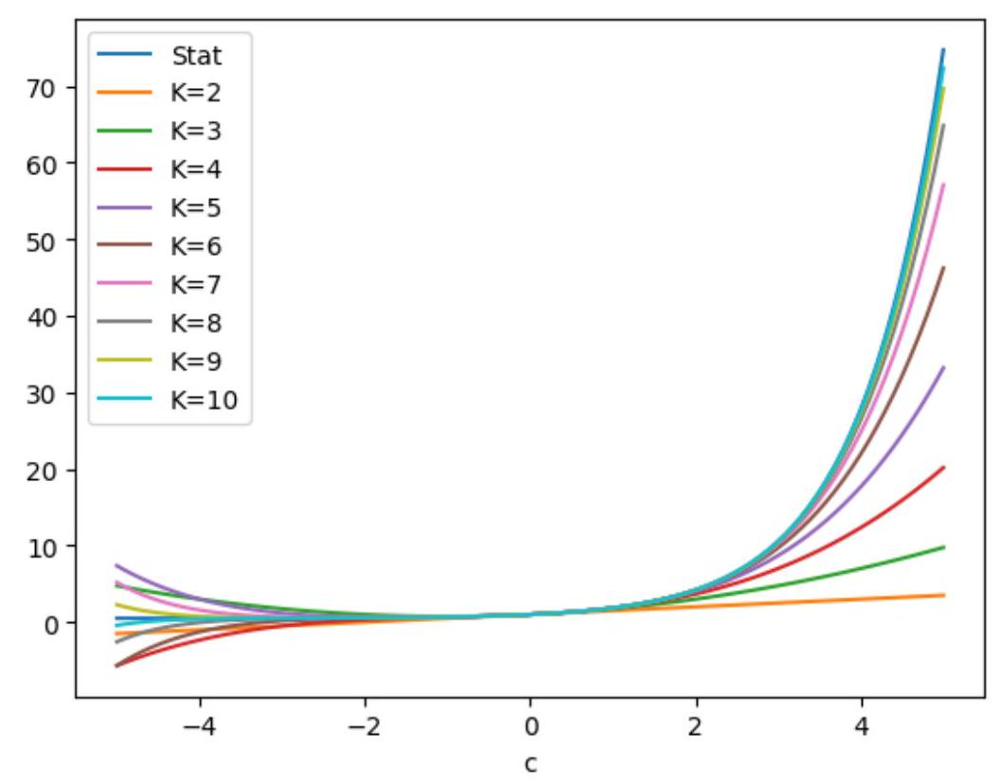

$ Sara Svaluto-Ferro ${ }^{\dagger} \quad$ Josef Teichmann $\ddagger$
}

Keywords: Signature SDEs, affine and polynomial processes, real-analytic and entire functions on path spaces and groups, power series expansions for Fourier-Laplace transforms, and expected signature

MSC (2020) Classification: 60G20; 60L10; 58K20; 60L70

\section{Contents}

1 Introduction $\quad 2$

2 Preliminaries $\quad 6$

$2.1$ Affine and polynomial processes from a duality point of view . . . . . 6

2.1.1 Affine case ........................ 7

2.1.2 Polynomial case .... . . . . . . . . . . 8

*Vienna University, Department of Statistics and Operations Research, Data Science @ Uni Vienna, Oskar-Morgenstern-Platz 1, A-1090 Wien, Austria, christa.cuchiero@univie.ac.at

${ }^{\dagger}$ University of Verona, Department of Economics, Via Cantarane 24, 37129 Verona, Italy, sara.svalutoferro@univr.it

${ }^{\ddagger}$ ETH Zurich, Departement of Mathematics, Rämistrasse 101, 8092 Zurich, Switerzland, josef.teichmann@math.ethz.ch.

The first author gratefully acknowledges financial support by the FWF START grant Y 1235. 3 Affine and polynomial processes on $T\left(\left(\mathbb{R}^{d}\right)\right) \quad 14$

$3.1 \quad$ State space and spaces of dual elements . . . . . . . . . . . . . . 14

$3.2 \quad$ Martingale problems _ . . . . . . . . . . . . . . . . . . . . 16

$3.3$ The affine case $\ldots \ldots \ldots \ldots \ldots \ldots \ldots \ldots \ldots \ldots \ldots \ldots \ldots \ldots \ldots \ldots \ldots \ldots \ldots \ldots \ldots \ldots \ldots \ldots \ldots \ldots \ldots$

4 Signature SDEs and their signature process $\quad 24$

4.1 State space of signature processes, shuffle-compatible spaces of dual elements and entire functions $\ldots \ldots \ldots \ldots \ldots \ldots \ldots \ldots \ldots \ldots \ldots \ldots \ldots \ldots \ldots \ldots \ldots \ldots \ldots \ldots \ldots \ldots$

$4.2$ Connections to classical theory of real-analytic functions on path spaces . 28

$4.3 \quad$ Signature SDEs as affine and polynomial processes . . . . . . . . . . 33

4.3.1 The affine case ... . . . . . . . . . . . . . 35

4.3.2 The polynomial case _.. . . . . . . . . . .. $.38$

4.3.3 Combining the approaches . . . . . . . . . . . . . . . . 39

5 Power sequences of one dimensional diffusions with real-analytic charac-

$5.1$ The affine case ... . . . . . . . . . . . . . . . . 43

$5.2$ The polynomial case . . . . . . . . . . . . . . . . . . . . $4.5$

$6 \quad$ Examples and numerical illustrations $\quad 49$

$6.1 \quad$ Riccati ODE for a one dimensional Brownian motion . . . . . . . . . 49

$6.2 \quad$ Examples on $[0,1] \ldots \ldots \ldots \ldots \ldots \ldots \ldots \ldots \ldots \ldots \ldots \ldots \ldots \ldots \ldots \ldots \ldots \ldots \ldots \ldots \ldots \ldots \ldots \ldots \ldots \ldots$

A An adaptation of Theorem 4.4.11 of Ethier and Kurtz (2005) 58

B Proof of Lemma $6.1 \quad 59$

\section{Introduction}

A plethora of stochastic models used in diverse areas, like mathematical finance, biology or physics, stems from the class of affine and polynomial processes. This is not always visible at first sight, because many stochastic models only appear as projections of infinite dimensional processes, and the corresponding affine or polynomial lift is often not the first object of attention.

Recognizing whether a Markovian semimartingale model falls in the class of finite dimensional affine or polynomial processes, as systematically introduced in Duffie et al. (2003) and Cuchiero et al. (2012); Filipović and Larsson (2016), respectively, is usually simple and consists in verifying the properties of its semimartingale characteristics. Indeed, in a diffusion setup, the polynomial property holds true if the drift is affine and if the instantaneous covariance matrix is at most quadratic in the state variables. If the latter is also affine, then the affine property is additionally satisfied. Even though this appears to be a rather narrow definition, solely the finite dimensional setting already contains many well known processes, e.g. Lévy processes, Ornstein-Uhlenbeck processes, Feller-type diffusions, Wishart processes (see Bru (1991); Cuchiero et al. (2011)), the Black-Scholes model, the Cox-Ingersoll-Ross model, the Heston model, the Fisher-Snedecor process, or the WrightFisher diffusion, also called Kimura diffusion (see Kimura (1964)) or Jacobi process, as well as all possible combinations thereof. Many of those processes also have infinite dimensional analogs, which can often be realized as measure valued processes, in particular when their state space corresponds to some positive cone or bounded domain, such as probability measures. For a general introduction to measure valued processes and their relevance in population genetics we refer to Dawson et al. (1993); Etheridge (2000); Dawson and Perkins (2012). For the affine and polynomial case in this context we refer to $\mathrm{Li}$ (2011); Cuchiero et al. (2019, 2021), showing that all well-known examples from the literature, including the famous Dawson-Watanabe superprocess and the Fleming-Viot process, fall into this class. Another possibility to move to an infinite dimensional setup is to consider Hilbert space valued processes which has recently been pursued in Schmidt et al. (2020); Cox et al. (2022) for the affine case.

Beyond these measure valued and Hilbert space valued analogs, which have been constructed as direct generalizations of affine or polynomial processes, it has been realized that a wide variety of finite dimensional models, in particular non-Markovian ones, actually appear as projections of infinite dimensional affine or polynomial processes. This applies in particular to Markovian lifts of stochastic Volterra processes (see Protter (1985)) and Hawkes processes (see Hawkes (1971)), implying that essentially all examples in the field of rough volatility and rough covariance modeling, such as the rough Heston model (see El Euch and Rosenbaum (2019)), the rough Wishart processes (see Cuchiero and Teichmann (2019); Abi Jaber (2022)) or the rough Bergomi model (see Bayer et al. (2016)), can be viewed as infinite dimensional affine or polynomial processes, as shown in Abi Jaber and El Euch (2019); Cuchiero and Svaluto-Ferro (2021); Cuchiero and Teichmann (2019, $2020)$.

Such Markovian lifts are of course not only restricted to Volterra-type processes, but can generically be applied by linearizing the models' characteristics, making a multitude of stochastic processes a projection of sequence-valued affine and polynomial processes. This suggests a certain universality of the affine and polynomial model class in the space of all stochastic processes driven by Brownian motion (or also other semimartingales), comparable to real-analytic functions being dense in continuous functions on compacts.

Originally, affine and polynomial processes have been considered on state spaces like $\mathbb{R}^{n}$ or $\mathbb{R}_{+}^{m} \times \mathbb{R}^{n}$, where linear functionals constitute a small subspace of all functions, making affine or polynomial processes an important but still rather narrow class of processes. This changes when state spaces become more involved. For instance, linear functionals on $\left\{\left(x^{n}\right)_{n \in \mathbb{N}}: x \in \mathbb{R}\right\} \subset \mathbb{R}^{\mathbb{N}}$ form a point-separating algebra. By invoking the Stone-Weierstrass theorem, it is therefore natural to conjecture that infinite dimensional affine or polynomial processes on general state spaces admit certain universal approximation properties within all stochastic processes.

It is the purpose of this article to make one aspect of this universality of affine and polynomial processes mathematically precise. Indeed, we shall 'linearize' generic classes of stochastic differential equations, called signature SDEs (introduced in Section 4.1), with the goal to develop an affine and polynomial theory of their prolongations. The prolongations consist of adding the signature of the corresponding process (rigorously defined in Section 2.2) to the state variables, which essentially allows to view all real-analytic pathdependent characteristics (that are additionally invariant under tree-like equivalences) as power (or rather linear) series in the state variables of the prolonged process, i.e. in the signature components. This is related to the well-known fact that signature components constitute a linear regression basis on path space, as precisely stated in Theorem $2.16$.

Here we go further by considering infinite sums of signature elements paired with appropriate dual elements from the extended tensor algebra (see Section $3.1$ and Section 4.1). This means that, in contrast to the usual setup where only finite sums of signature components are considered (with the exception of stochastic Taylor series expansions as in Kloeden and Platen (1992); Litterer and Oberhauser (2014); Dupire and Tissot-Daguette (2022)), we here deal with a novel and proper notion of entire and real-analytic functions on (subsets of) group-like elements (see Section 4.1), being the state space of the signature process. In particular, in Section $4.2$ we also develop a connection to classical theory of real-analytic functions on path spaces, which allows to deduce convergence properties (see Theorem 4.16) as well as an identity theorem similar to the one for finite dimensional real-analytic functions (see Theorem 4.19). This identity theorem allows to apply the affine and polynomial theory in view of Fourier-Laplace transforms and moment formulas to such real-analytic functions on group-like elements. For notational simplicity and also due to certain mathematical difficulties we, however, opted in this article to stay rather in the setting of entire functions (in the sense of Definition 4.6), where we have (pointwise) convergence on the whole state space (and not only locally around expansion points).

To cast the signature process of signature SDEs on the state space of group-like elements into an affine and polynomial (or rather linear) framework, we first consider in Section 3 affine and polynomial processes on general subsets of the extended tensor algebra. Based on the duality point of view summarized in Section $2.1$ for the simple one-dimensional case, we derive under certain integrability conditions the affine transform formula as well as the moment formula. The affine transform formula, which computes the Fourier-Laplace transform of the state vector, can be expressed either in terms of an extended tensor algebra valued Riccati ordinary differential equation (ODE) (see Theorem 3.9) or in terms of the corresponding transport partial differential equation (PDE) (see Theorem 3.16). The latter has the advantage that zeros of the Fourier-Laplace transform can be treated without leading to exploding solutions of the Riccati ODEs. In case of the moment formula, derived via polynomial technology, an extended tensor algebra valued linear ODE has to be solved to obtain expressions for the moments and converging infinite sums thereof (see Theorem 3.21). From a reversed perspective the affine transform and moment formulas also provide explicit stochastic representations of solutions of novel classes of extended tensor algebra valued ODEs.

In Section $4.3$ we apply this theory to the signature process of signature SDEs, a setting where affine and polynomial processes coincide (see Proposition 4.21). We thus get novel explicit formulas in terms of (converging) power (or rather linear) series for both, the Fourier-Laplace transform and the expected value of entire functions of the signature. This implies that we can compute the expected signature for all (appropriately integrable) signature SDEs by solving an infinite dimensional linear ODE. We explicitly express the vector fields of the Riccati ODEs and the linear ODEs in terms of the entire characteristics (in the signature) of the corresponding SDEs (see Theorem $4.24$ and Theorem 4.29), yielding similar structures as in finite dimensions. Indeed we get quadratic expressions for the Riccati equations and linear ones for the linear ODEs. In certain specific cases of signature SDEs, including classical polynomial processes, the results lead to a representation of the expected truncated signature involving only a finite dimensional linear ODE. The corresponding solution can thus be computed via a finite dimensional matrix exponential (see Example $4.31$ and Remark 4.32).

Our approach efficiently calculates time-dependent expansion coefficients of solutions of certain parabolic equations (or their Cole-Hopf transforms) with entire coefficients (in the sense of Definition 4.6), where expansion is meant with respect to state variables. This is reminiscent of Cauchy-Kovalevskaya theory. We are aware that basic counter examples of Cauchy-Kovalevskaya theory exclude parabolic partial differential equations, like Kolmogorov forward or backward equations. This, however, does not mean that solutions of those equations are not entire or real-analytic with respect to the state variables: the problems rather appear when space and time are jointly considered, which we do not do.

Notice also that we can characterize laws on path spaces by means of signature without ubiquitous exponential moment conditions (see Chevyrev and Oberhauser (2022) and the references therein for related considerations), since we can work with Fourier-Laplace transforms. Formally speaking we apply that a time-extended process path $t \mapsto \widehat{X}_{t}(\omega)$ for $t \in[0, T]$ is uniquely characterized by its signature at time $T$, denoted by $\widehat{\mathbb{X}}_{T}(\omega)$. As we are able to calculate the Fourier-Laplace transform of $\widehat{\mathbb{X}}_{T}(\omega)$ in generic cases, we can therefore characterize the full law of $X$ on path space. Exponential moments are not needed for this approach.

As a special case we consider in Section 5 one-dimensional signature SDEs which translate - using a reparametrization of the signature - to classical SDEs with real-analytic characteristics. The prolongation of these processes are then simply sequences of monomials that are again affine and polynomial processes whose corresponding deterministic dual processes are sequence-valued Riccati and linear ODEs, respectively. In this setup we can give concrete specifications under which the required integrability conditions for the respective transform formulas hold true.

To illustrate the practical feasibility of this affine and polynomial approach we solve in Section 6.1 the infinite dimensional Riccati ODEs and transport PDEs to compute the Laplace-transform of a geometric Brownian motion as well as the Laplace transform of the forth power of a Brownian motion. These cases are particularly challenging from a numerical point of view since exponential moments do not exist. We also implement the linear ODEs to obtain the moment generating function of a Jacobi diffusion (see Section 6.2).

Our theoretical and numerical results have important implications on several modern models that are especially relevant in machine learning contexts. This concerns in particular neural SDEs (with real-analytic activation functions), as considered e.g. in Gierjatowicz et al. (2020); Cuchiero et al. (2020); Kidger et al. (2021); Salvi et al. (2022) and signaturebased model in spirit of Perez Arribas et al. (2020); Lyons et al. (2020); Ni et al. (2021); Salvi et al. (2021); Cuchiero et al. (2022a,b, 2023). Both types of models can be cast in the current framework of signature SDEs and thus the Fourier-Laplace transform and the moments (as well as the expected signature) can be computed by affine and polynomial technology. In particular all sorts of moment formulas related to signature processes in these contexts can be considered under one roof now.

In this respect note that our expressions for the Fourier-Laplace transform and the expected signature in terms of power (or rather linear) series in the signature process are related to several recent works on signature cumulants and expected signature, in particular Friz et al. (2022b,a); Friz and Gatheral (2022); Fukasawa and Matsushita (2021); Boedihardjo et al. (2021); Rossi Ferrucci and Cass (2022); Bonnier and Oberhauser (2020); Alos et al. (2020). For earlier work on expected signatures in particular for the Brownian case and classical diffusion processes we refer to Fawcett (2003); Ni (2012) and Lyons and Ni (2015).

The remainder of the article is organized as follows: in Section 2 we introduce affine and polynomial processes in a one-dimensional diffusion setup as well as the signature process of continuous semimartingales. Section 3 is dedicated to affine and polynomial processes on general subsets of the extended tensor algebra, while in Section 4 we apply this theory to signature SDEs. The latter requires to introduce entire and real-analytic functions on group- like elements and to establish a connection to classical real-analytic path-space functionals (see Section $4.1$ and Section 4.2). We conclude the paper with one-dimensional signature SDEs, corresponding to classical SDEs with real-analytic characteristics (see Section 5), as well as several examples and numerical illustrations thereof (see Section 6).

\section{Preliminaries}

This section introduces affine and polynomial processes in the simplest possible setup. We also recall the fundamental notion of signature, here in the setting of continuous semimartingales.

\subsection{Affine and polynomial processes from a duality point of view}

The simplest possible setting for affine and polynomial processes are one-dimensional diffusion processes. They appear as narrow class of processes whose universal character in higher dimension is not visible.

Consider on a filtered probability space $\left(\Omega, \mathcal{F},\left(\mathcal{F}_{t}\right)_{t \in[0, T]}, \mathbb{P}\right)$, an Itô diffusion process $\left(X_{t}\right)_{t \in[0, T]}$ of the form

$$
d X_{t}=b\left(X_{t}\right) d t+\sqrt{a\left(X_{t}\right)} d B_{t}
$$

with $a: \mathbb{R} \rightarrow \mathbb{R}_{+}$and $b: \mathbb{R} \rightarrow \mathbb{R}$ continuous functions and $B$ a standard Brownian motion. The initial condition $X_{0}=x$ is deterministic and lies in the state space $S$ which is supposed to be some (bounded or unbounded) interval of $\mathbb{R}$.

Definition 2.1. A weak solution $X$ of (2.1) is called polynomial process if

- $b$ is a linear function, i.e. $b(x)=b+\beta x$ for some constants $b$ and $\beta$ and

- $a$ is a quadratic function, i.e. $a(x)=a+\alpha x+A x^{2}$ for some constants $a, \alpha$ and $A$.

If additionally $A=0$, then the process is called affine. ${ }^{1}$

Remark 2.2. In Section 3 we shall define affine and polynomial processes via the martingale problem approach. As well known, in the current setting this is equivalent to the above weak solution concept. In particular, denoting by $\mathcal{A}$ the generator of a diffusion of the form (2.1) with domain $\mathcal{D}(\mathcal{A})$, then the process

$$
N_{t}^{f}:=f\left(X_{t}\right)-f\left(X_{0}\right)-\int_{0}^{t} \mathcal{A} f\left(X_{s}\right) d s
$$

is a local martingale for every $f \in \mathcal{D}(\mathcal{A})$. In the infinite dimensional settings below the corresponding operator will be denoted by $\mathcal{L}$ instead of $\mathcal{A}$. The latter will be reserved for one dimensional diffusion processes, considered again in Section 5.

Definition $2.1$ has remarkable implications, namely that all marginal moments of a polynomial process, i.e. $\mathbb{E}\left[X_{t}^{n}\right]$ can be computed by solving a system of linear ODEs. In the case of an affine process, we additionally get that exponential moments $\mathbb{E}\left[e^{u X_{t}}\right]$ for $u \in \mathbb{C}$ can be expressed in terms of solutions of Riccati ODEs whenever $\mathbb{E}\left[\left|e^{u X_{t}}\right|\right]<\infty$.

${ }^{1}$ Note that in this diffusion setting all affine processes are polynomial. In general this only holds true under auxiliary conditions on the moments of the jump measure. We here present these implications from the point of view of dual processes (see e.g. Chapter 4 in Ethier and Kurtz (1993)), which has not been considered in this form in the original papers Duffie et al. (2003) and Cuchiero et al. (2012); Filipović and Larsson (2016), where affine and polynomial processes were first systematically introduced. The goal is to compute expected values of certain functions of the process' marginals by simpler dual expressions. Denote again by $\mathcal{A}$ the (extended) generator of a diffusion process given by $(2.1)$, i.e.

$$
\mathcal{A} f(x)=f^{\prime}(x) b(x)+\frac{1}{2} f^{\prime \prime}(x) a(x) .
$$

We can then distinguish three different ways to compute $\mathbb{E}_{x}\left[f\left(X_{t}\right)\right]$. They are given by

(i) the Kolmogorov backward equation: $\mathbb{E}_{x}\left[f\left(X_{t}\right)\right]=g(t, x)$, where

$$
\partial_{t} g(t, x)=\mathcal{A} g(t, x), \quad g(0, x)=f(x) .
$$

(ii) the duality method: let $\left(U_{t}\right)_{t \in[0, T]}$ be an independent Markov process with state space $U$ and infinitesimal generator $\mathcal{B}$. Assume that there is some $f: S \times U \rightarrow \mathbb{R}$ such that

$$
\mathcal{A}(f(\cdot, u))(x)=\mathcal{B}(f(x, \cdot))(u), \quad \text { for all } x \in S, u \in U,
$$

then (modulo technicalities) $\mathbb{E}_{x}\left[f\left(X_{t}, u\right)\right]=\mathbb{E}_{u}\left[f\left(x, U_{t}\right)\right]$.

(iii) the Kolmogorov backward equation for the dual process: $\mathbb{E}_{x}\left[f\left(X_{t}, u\right)\right]=v(t, u)$, where

$$
\partial_{t} v(t, u)=\mathcal{B} v(t, u), \quad v(0, u)=f(x, u) .
$$

Duality methods for affine and polynomial processes work particularly well, because (one choice of) the dual process is deterministic and corresponds to the solution of ODEs, explaining the often stated tractability properties. In the case of of affine processes the function family consists of exponentials, in the case of polynomial processes processes they are polynomials. Since these families are distribution determining (in the polynomial case under exponential moment conditions), existence of the dual process implies uniqueness of the solution of the martingale problem for the primal process $X$.

\subsubsection{Affine case}

Let us start by considering the affine case in more detail. As we shall only treat linear processes below, meaning that the characteristics are linear instead of affine, we here also set $b=0$ and $a=0$ in the definition of the affine process. This then corresponds to the setup where the state space $S$ is $\mathbb{R}_{+}$.

As the family of functions for which the duality relations holds are exponentials, i.e. $(x, u) \mapsto \exp (u x)$, the dual affine operator $\mathcal{B}$ acting on $u \mapsto \exp (u x)$ is defined via

$$
\mathcal{B}(\exp (\cdot x))(u):=\mathcal{A}(\exp (u \cdot))(x),
$$

for each $x \in S$. To explicitly compute the form of $\mathcal{B}$, define the quadratic function

$$
R(u):=\frac{1}{2} \alpha u^{2}+\beta u .
$$

Then, by definition $\mathcal{B}(\exp (\cdot x))(u)=\mathcal{A}(\exp (u \cdot))(x)=(R(u) x) \exp (u x)$. From this we can see that $\mathcal{B}$ is the restriction of the transport operator given by

$$
\mathcal{B} g(u)=R(u) g^{\prime}(u), \quad g \in C^{1}(\mathbb{C}, \mathbb{C}) .
$$

The (deterministic) dual process corresponding to this transport operator is thus a solution of the following ODE

$$
\partial_{t} \psi(t)=R(\psi(t)), \quad \psi(0)=u, \quad t \in[0, T],
$$

which is of Riccati type due to the quadratic form of $R$. Applying now the duality method as described in (ii) above, yields the original form of the affine transform formula, proved in Duffie et al. (2003) (there in greater generality, including jumps and higher dimensions).

Theorem 2.3. Let $T>0$ be fixed and let $\left(X_{t}\right)_{t \in[0, T]}$ be an affine process. Let $u \in \mathbb{C}$ such that $\mathbb{E}\left[\left|\exp \left(u X_{T}\right)\right|\right]<\infty$. Then,

$$
\mathbb{E}_{x}\left[\exp \left(u X_{T}\right)\right]=\exp (\psi(T) x),
$$

where $\psi$ solves the Riccati ODE given by (2.2).

We can also apply the third method (iii) for computing expectations, i.e. computing the Kolmogorov equation for the dual process, which then yields a transport equation formulation.

Theorem 2.4. Under the same conditions as of Theorem 2.3, it holds that

$$
\mathbb{E}_{x}\left[\exp \left(u X_{T}\right)\right]=v(T, u),
$$

where $v(t, u)$ is a solution to the following linear PDE of transport type

$$
\partial_{t} v(t, u)=\mathcal{B} v(t, u)=R(u) \partial_{u} v(t, u), \quad v(0, u)=\exp (u x), \quad t \in[0, T] .
$$

Note that the advantage of the transport formulation is that $v$ can assume the value 0 , which necessarily corresponds to an explosion of $\psi$. In the current one-dimensional setup this cannot occur, but on the infinite dimensional state spaces that we consider below this can become an issue. In Section 3 we shall generalize both theorems to affine processes on subsets of the extended tensor algebra $T\left(\left(\mathbb{R}^{d}\right)\right)$ introduced below and then apply the corresponding results in Section 4 to signature SDEs.

\subsubsection{Polynomial case}

Let us now turn to the polynomial case and denote by $\mathcal{P}_{k}$ polynomials up to degree $k \in \mathbb{N}$ :

$$
\mathcal{P}_{k}=\left\{x \mapsto \sum_{i=0}^{k} u_{i} x^{i} \mid u_{i} \in \mathbb{R}\right\} .
$$

Moreover, we write $u=\left(u_{0}, \ldots, u_{k}\right)^{\top} \in \mathbb{R}^{k+1}$ for the coefficients vector (without indicating the dependence on $k$ ) and define $p(x, u)$ via $p(x, u):=\sum_{i=0}^{k} u_{i} x^{i}$.

Note that for a polynomial process, the generator $\mathcal{A}$ maps $\mathcal{P}_{k}$ to $\mathcal{P}_{k}$, i.e. polynomials to polynomials of same or smaller degree, which is usually the defining property of polynomial processes. Using this property, let us introduce a dual polynomial operator $\mathcal{B}$ acting on $u \mapsto p(x, u)$ as

$$
\mathcal{B}(p(x, \cdot))(u):=\mathcal{A}(p(\cdot, u))(x),
$$

for every $x \in S$. By the linearity in $\left(1, x, x^{2}, \ldots, x^{k}\right)$ we can identify $\mathcal{B}$ on $\mathcal{P}_{k}$ with a linear $\operatorname{map} L_{k}$ from $\mathbb{R}^{k+1}$ to $\mathbb{R}^{k+1}$ such that

$$
\mathcal{A}(p(\cdot, u))(x)=p\left(x, L_{k} u\right) .
$$

As $\nabla_{u} p(x, u)=\left(1, x, x^{2}, \ldots, x^{k}\right), \mathcal{B}$ can again be interpreted as the restriction of a transport operator which acts on functions $g \in C^{1}\left(\mathbb{R}^{k+1}, \mathbb{R}\right)$ via

$$
\mathcal{B} g(u)=\left\langle L_{k}(u), \nabla g(u)\right\rangle .
$$

Hence, the corresponding $\mathbb{R}^{k+1}$-valued (deterministic) dual process solves the linear ODE

$$
\partial_{t} c(t)=L_{k} c(t), \quad c(0)=u, \quad t \in[0, T],
$$

which describes the evolution of the coefficients vector. Applying the duality method (ii), thus yields the following theorem, which was initially proved in Cuchiero et al. (2012); Filipović and Larsson (2016).

Theorem 2.5. Let $T>0$ be fixed and let $\left(X_{t}\right)_{t \in[0, T]}$ be a polynomial process. Denote by $c(t)=\left(c_{0}(t), \ldots, c_{k}(t)\right)^{\top}$ the solution of the linear ODE given by (2.3). Then,

$$
\mathbb{E}_{x}\left[\sum_{i=0}^{k} u_{i} X_{T}^{i}\right]=\sum_{i=0}^{k} c_{i}(T) x^{i} .
$$

Remark 2.6. Also in the polynomial case we can also apply method (iii), which yields

$$
\mathbb{E}_{x}\left[\sum_{i=0}^{k} u_{i} X_{T}^{i}\right]=v(t, u),
$$

where $v(t, u)$ satisfies

$$
\partial_{t} v(t, u)=\mathcal{B} v(t, u)=\left\langle L_{k}(u), \nabla_{u} v(t, u)\right\rangle, \quad t \in[0, T] .
$$

Inserting $\mathbb{E}_{x}\left[\sum_{i=0}^{k} u_{i} X_{t}^{i}\right]$ for $v(t, u)$ thus gives

$$
\partial_{t} \mathbb{E}\left[\sum_{i=0}^{k} u_{i} X_{t}^{i}\right]=\left\langle L_{k}(u), \mathbb{E}\left[X_{t}\right]\right\rangle
$$

and in turn

$$
\partial_{t} \mathbb{E}\left[X_{t}\right]=L_{k}^{\top} \mathbb{E}\left[X_{t}\right],
$$

where $L_{k}^{\top}$ is the transpose of $L_{k}$. In the terminology of Cuchiero and Svaluto-Ferro (2021), this corresponds to the so-called bidual moment formula. 

\subsection{Signature of continuous semimartingales}

Our approach how to pass from the narrow definition of one-dimensional affine and polynomial processes to a universal class is based on the signature process, which was first studied by Chen $(1957,1977)$ and plays a prominent role in rough path theory introduced in Lyons (1998) (see also the monographs by Friz and Victoir (2010); Friz and Hairer (2014)).

Following the lines of Section $2.1$ in Cuchiero et al. (2022a) we start here by introducing some basic notions related to the signature of an $\mathbb{R}^{d}$-valued continuous semimartingale. Similar introductions to the concept of signature can be found e.g. in Section 2.2. of Bayer et al. (2021).

For each $n \in \mathbb{N}_{0}$ consider the $n$-fold tensor product of $\mathbb{R}^{d}$ given by

$$
\left(\mathbb{R}^{d}\right)^{\otimes 0}:=\mathbb{R}, \quad\left(\mathbb{R}^{d}\right)^{\otimes n}:=\underbrace{\mathbb{R}^{d} \otimes \cdots \otimes \mathbb{R}^{d}}_{n} .
$$

For $d \in \mathbb{N}$, we define the extended tensor algebra on $\mathbb{R}^{d}$ as

$$
T\left(\left(\mathbb{R}^{d}\right)\right):=\left\{\mathbf{a}:=\left(a_{0}, \ldots, a_{n}, \ldots\right): a_{n} \in\left(\mathbb{R}^{d}\right)^{\otimes n}\right\} .
$$

Similarly we introduce the truncated tensor algebra of order $N \in \mathbb{N}$

$$
T^{(N)}\left(\mathbb{R}^{d}\right):=\left\{\mathbf{a} \in T\left(\left(\mathbb{R}^{d}\right)\right): a_{n}=0, \text { for all } n>N\right\},
$$

and the tensor algebra $T\left(\mathbb{R}^{d}\right):=\bigcup_{N \in \mathbb{N}} T^{(N)}\left(\mathbb{R}^{d}\right)$. For each $\mathbf{a}, \mathbf{b} \in T\left(\left(\mathbb{R}^{d}\right)\right)$ and $\lambda \in \mathbb{R}$ we set

$$
\begin{aligned}
\pi_{n}(\mathbf{a}) & :=a_{n}, \\
\mathbf{a}^{\leq N} & :=\left(a_{0}, \ldots, a_{N}\right), \\
\mathbf{a}+\mathbf{b} & :=\left(a_{0}+b_{0}, \ldots, a_{n}+b_{n}, \ldots\right), \\
\lambda \mathbf{a} & :=\left(\lambda a_{0}, \ldots, \lambda a_{n}, \ldots\right), \\
\mathbf{a} \otimes \mathbf{b} & :=\left(c_{0}, \ldots, c_{n}, \ldots\right),
\end{aligned}
$$

where $c_{n}:=\sum_{k=0}^{n} a_{k} \otimes b_{n-k}$. Observe that $\left(T\left(\left(\mathbb{R}^{d}\right)\right),+, \cdot, \otimes\right)$ is a real algebra with $d$ free generators $\left(0, e_{i}, 0, \ldots, 0, \ldots\right)$, where $e_{i}$ denotes the canonical basis element of $\mathbb{R}^{d}$. The neutral element is identified via $(1,0, \ldots, 0, \ldots)$. The tensor algebra $T\left(\mathbb{R}^{d}\right) \subset T\left(\left(\mathbb{R}^{d}\right)\right)$ is a subalgebra and isomorphic to the real free algebra with $d$ generators. Note that $T^{(N)}\left(\mathbb{R}^{d}\right)$ is an algebra as well, namely the real free $N$-nilpotent algebra. It appears as factor algebra of $T\left(\left(\mathbb{R}^{d}\right)\right)$ by the ideal of elements with entries only after $N$. We shall need these algebraic structures to introduce signature properly.

For a multi-index (or word in $d$ letters) $I:=\left(i_{1}, \ldots, i_{n}\right)$ we denote its length by $|I|:=n$. We also consider the empty index $I:=\emptyset$ and set $|I|:=0$. For each word $I$ with $|I|>0$ we define

$$
I^{\prime}:= \begin{cases}\left(i_{1}, \ldots, i_{|I|-1}\right) & \text { if }|I| \geq 2, \\ \emptyset & \text { if }|I|=1,\end{cases}
$$

which just leaves away the last letter. Similarly we set $I^{\prime \prime}:=\left(I^{\prime}\right)^{\prime}$ if $|I|>1$. Finally, we denote by $I^{\text {ord }}$ the multi-index obtained by sorting the entries of $I$ and define $I !:=$ $\prod_{k=1}^{d}(I(k) !)$ where $I(k)=\sum_{j=1}^{|I|} 1_{\left\{i_{j}=k\right\}}$ counts the number of times the letter $k$ appears in word $I$. Next, for each $|I| \geq 1$ we set

$$
e_{I}:=e_{i_{1}} \otimes \cdots \otimes e_{i_{n}},
$$

where $e_{1}, \ldots, e_{d}$ denote the canonical basis vectors of $\mathbb{R}^{d}$. Denoting by $e_{\emptyset}$ the basis element corresponding to $\left(\mathbb{R}^{d}\right)^{\otimes 0}$, each element of $\mathbf{a} \in T\left(\left(\mathbb{R}^{d}\right)\right)$ can thus be written as formal series

$$
\mathbf{a}=\sum_{|I| \geq 0} \mathbf{a}_{I} e_{I},
$$

for some $\mathbf{a}_{I} \in \mathbb{R}$. To extract the $I$-th component from a, we shall either write $\mathbf{a}_{I}$ or $\left\langle\mathbf{a}, e_{I}\right\rangle$. For each $\mathbf{a} \in T\left(\mathbb{R}^{d}\right)$ and each $\mathbf{b} \in T\left(\left(\mathbb{R}^{d}\right)\right)$ we set

$$
\langle\mathbf{a}, \mathbf{b}\rangle:=\sum_{|I| \geq 0}\left\langle\mathbf{a}_{I}, \mathbf{b}_{I}\right\rangle .
$$

Observe that the set $\left\{e_{I}:|I|=n\right\}$ is an orthonormal basis of $\left(\mathbb{R}^{d}\right)^{\otimes n}$ with respect to this scalar product. In particular, $\mathbf{b}_{I}=\left\langle e_{I}, \mathbf{b}\right\rangle$.

Finally, we denote by $(\cdot)^{(1)}: T\left(\left(\mathbb{R}^{d}\right)\right) \rightarrow\left(T\left(\left(\mathbb{R}^{d}\right)\right)\right)^{d}$ and $(\cdot)^{(2)}: T\left(\left(\mathbb{R}^{d}\right)\right) \rightarrow\left(T\left(\left(\mathbb{R}^{d}\right)\right)\right)^{d \times d}$ the shifts given by

$$
\begin{aligned}
& \mathbf{u}^{(1)}:=\left(\sum_{|I| \geq 1} \mathbf{u}_{I} e_{I^{\prime}}\right)\left(1_{\left\{i_{|I|}=1\right\}}, \ldots, 1_{\left\{i_{|I|}=d\right\}}\right)^{\top}, \\
& \mathbf{u}^{(2)}:=\left(\sum_{|I| \geq 2} \mathbf{u}_{I} e_{I^{\prime \prime}}\right)\left(\begin{array}{ccc}
1_{\left\{i_{|I|-1}=i_{|I|}=1\right\}} & \cdots & 1_{\left\{i_{|I|-1}=1, i_{|I|}=d\right\}} \\
\vdots & \cdots & \vdots \\
1_{\left\{i_{|I|-1}=d, i_{|I|}=1\right\}} & \cdots & 1_{\left\{i_{|I|-1}=i_{|I|}=d\right\}}
\end{array}\right) .
\end{aligned}
$$

Observe in particular that

$\left\langle\mathbf{a}, \mathbf{u}^{(1)}\right\rangle=\sum_{|I| \geq 1}\left(\mathbf{a}_{I} \mathbf{u}_{(I 1)}, \ldots, \mathbf{a}_{I} \mathbf{u}_{(I d)}\right)^{\top} \quad$ and $\quad\left\langle\mathbf{a}, \mathbf{u}^{(2)}\right\rangle=\sum_{|I| \geq 2}\left(\begin{array}{ccc}\mathbf{a}_{I} \mathbf{u}_{(I 11)} & \cdots & \mathbf{a}_{I} \mathbf{u}_{(I 1 d)} \\ \vdots & \cdots & \vdots \\ \mathbf{a}_{I} \mathbf{u}_{(I d 1)} & \cdots & \mathbf{a}_{I} \mathbf{u}_{(I d d)}\end{array}\right)$

for each $\mathbf{a} \in T\left(\mathbb{R}^{d}\right)$. Here, we use the notation $I k$ for the word $I$ prolonged by $k$.

Throughout, the paper we consider a filtered probability space $\left(\Omega, \mathcal{F},\left(\mathcal{F}_{t}\right)_{t \in[0, T]}, \mathbb{P}\right)$ with a right continuous filtration. Whenever not specified, stochastic processes are always supposed to be defined thereon. We are now ready to define the signature of an $\mathbb{R}^{d}$-valued continuous semimartingale.

Definition 2.7. Let $\left(X_{t}\right)_{t \in[0, T]}$ be a continuous $\mathbb{R}^{d}$-valued semimartingale. Its signature is the $T\left(\left(\mathbb{R}^{d}\right)\right)$-valued process $t \mapsto \mathbb{X}_{t}$ whose components are recursively defined as

$$
\left\langle e_{\emptyset}, \mathbb{X}_{t}\right\rangle:=1, \quad\left\langle e_{I}, \mathbb{X}_{t}\right\rangle:=\int_{0}^{t}\left\langle e_{I^{\prime}}, \mathbb{X}_{r}\right\rangle \circ \mathrm{d} X_{r}^{i_{|I|}},
$$

for each $I=\left(i_{1}, \ldots, i_{n}\right)$ and $t \in[0, T]$, where $\circ$ denotes the Stratonovich integral. Its projection $\mathbb{X} \leq N$ on $T^{(N)}\left(\mathbb{R}^{d}\right)$ is given by

$$
\mathbb{X}_{t}^{\leq N}=\sum_{|I| \leq N}\left\langle e_{I}, \mathbb{X}_{t}\right\rangle e_{I}
$$

and is called signature of $X$ truncated at level $N$. Observe that the signature of $X$ and the signature of $X-c$ coincide for each $c \in \mathbb{R}$, and are given by iterated Stratonovich integrals

$$
\left\langle e_{I}, \mathbb{X}_{t}\right\rangle=\int_{0 \leq t_{1} \leq \ldots t_{k} \leq t} \circ d X_{t_{1}}^{i_{1}} \cdots \circ d X_{t_{k}}^{i_{k}} .
$$

If we add time to $X$ and identify it is a the 0th component, then for each word of type $(0, \ldots, 0, k)$ with length $m+1$ we can write

$$
\left\langle e_{(0, \ldots, 0, k)}, \mathbb{X}_{t}\right\rangle=\frac{1}{m !} \int_{0}^{t} s^{m} d X_{s}^{k} .
$$

This in particular implies that the value of the corresponding signature at time $T$ determines uniquely the path of $\left(X_{t}(\omega)\right)_{t \in[0, T]}$ for every $\omega \in \Omega$.

In order to describe the algebraic properties of the signature we need the shuffle product, which is nothing else than a concise expression of the classical integration by parts formula, which holds for Stratonovich integrals.

Definition 2.8. For every two multi-indices $I:=\left(i_{1}, \ldots, i_{n}\right)$ and $J:=\left(j_{1}, \ldots, j_{m}\right)$ the shuffle product is defined recursively as

$$
e_{I} \amalg e_{J}:=\left(e_{I^{\prime}} \amalg e_{J}\right) \otimes e_{i_{n}}+\left(e_{I} \uplus_{J^{\prime}}\right) \otimes e_{j_{m}},
$$

with $e_{I} \amalg e_{\emptyset}:=e_{\emptyset} \amalg e_{I}=e_{I}$. It extends to $\mathbf{a}, \mathbf{b} \in T\left(\mathbb{R}^{d}\right)$ as

$$
\mathbf{a} \amalg \mathbf{b}=\sum_{|I|,|J| \geq 0} \mathbf{a}_{I} \mathbf{b}_{J}\left(e_{I} \amalg e_{J}\right)
$$

and to $\mathbf{a}, \mathbf{b} \in T\left(\left(\mathbb{R}^{d}\right)\right)$ as $\left\langle e_{I}, \mathbf{a} ш \mathbf{b}\right\rangle=\left\langle e_{I}, \pi_{|I|}(\mathbf{a}) ш \pi_{|I|}(\mathbf{b})\right\rangle$.

Remark 2.9. The shuffle product has many important properties:

(i) $\left(T\left(\mathbb{R}^{d}\right),+, \amalg\right)$ is a commutative algebra, which in particular means that the shuffle product is associative and commutative.

(ii) $e_{I} \amalg e_{J} \in\left(\mathbb{R}^{d}\right)^{\otimes(|I|+|J|)}$, which in particular implies that $e_{I} \amalg e_{J}=\sum_{k=1}^{|H|} \lambda_{k} e_{H}$ for some $\lambda_{k} \in \mathbb{R}$ and $|H|=|I|+|J|$.

The importance of the shuffle product is due to the following classical theorem (see for instance Ree (1958) or Lyons et al. (2007)) which follows from the integration by parts formula for Stratonovich integrals.

Theorem $2.10$ (Shuffle property). Let $\left(X_{t}\right)_{t \in[0, T]}$ be a continuous $\mathbb{R}^{d}$-valued semimartingale and $I, J$ be two multi-indices. Then

$$
\left\langle e_{I}, \mathbb{X}\right\rangle\left\langle e_{J}, \mathbb{X}\right\rangle=\left\langle e_{I} \amalg e_{J}, \mathbb{X}\right\rangle .
$$

In the following we introduce the notion of the exponential shuffle, similarly as in Definition $6.1$ of Bayer et al. (2021). Note that in contrast to the definition there we consider it also for elements in the (complexified) extended tensor algebra and not only on $T\left(\mathbb{R}^{d}\right.$ ). The complexification of the extended tensor algebra is denoted by $T\left(\left(\mathbb{R}^{d}\right)\right)+\mathrm{i} T\left(\left(\mathbb{R}^{d}\right)\right)$. Note that we still apply the real scalar product as introduced above to both the real and imaginary entries. Definition 2.11. For each $\mathbf{u} \in T\left(\left(\mathbb{R}^{d}\right)\right)+\mathrm{i} T\left(\left(\mathbb{R}^{d}\right)\right)$ we set $\overline{\mathbf{u}}:=\mathbf{u}-\mathbf{u}_{\emptyset} e_{\emptyset}$ and consider the following quantities.

- $\mathbf{u}^{\varpi 0}=e_{\emptyset}, \mathbf{u}^{\varpi 2}:=\mathbf{u} \amalg \mathbf{u}$ and $\mathbf{u}^{\varpi k}:=\mathbf{u}^{\varpi(k-1)} \amalg \mathbf{u}$

- $\exp (\uplus \mathbf{u}):=\sum_{k=0}^{\infty} \frac{\mathbf{u}^{\amalg k}}{k !}$. Since the right hand side can be written $\operatorname{as~} \exp \left(\mathbf{u}_{\emptyset}\right) \sum_{k=0}^{\infty} \frac{\overline{\mathbf{u}}^{\amalg k}}{k !}$, we can see that every component of $\exp (\uplus \mathbf{u})$ corresponds to a finite sum.

- $\log (\uplus \mathbf{u}):=\sum_{k=1}^{\infty}(-1)^{k-1}(k-1) ! \overline{\mathbf{u}}^{\amalg k}$, whenever $\mathbf{u}_{\emptyset}=1$.

Lemma 2.12. For $\mathbf{u}_{0}:=0$ it holds $\exp \left(\uplus \mathbf{u}_{0}\right)=e_{\emptyset}$ and for each $\mathbf{u}, \mathbf{v}$ it holds

$$
\exp (\uplus \mathbf{u}) \varpi \exp (\uplus \mathbf{v})=\exp (\uplus(\mathbf{u}+\mathbf{v})) .
$$

Moreover, for each $\mathbf{u}$ such that $\mathbf{u}_{\emptyset}=1$ it holds $\exp (\uplus \log (\uplus \mathbf{u}))=\mathbf{u}$.

Property (2.5) is the crucial ingredient that guarantees that linear functionals restricted to the range of the signature form an algebra. Moreover, since the values at time $T$ of the time-extended signatures uniquely determine the trajectories of the corresponding continuous semimartingale (see for instance Lemma $2.6$ in Cuchiero et al. (2022a)), the Stone Weierstrass theorem implies a universal approximation result, stated in Theorem $2.16$ below.

To state it rigorously we follow a similar approach as in Cuchiero et al. (2022a); Cuchiero and Möller (2023) (compare also Bayer et al. (2021); Kalsi et al. (2020)) and start by introducing the space of lifted paths for a time-extended continuous semimartingale $\left(\widehat{X}_{t}\right)_{t \in[0, T]}=$ $\left(t, X_{t}\right)_{t \in[0, T]}$ and some fixed time horizon $T>0$.

Definition 2.13. Denote by $\left(\widehat{\mathbb{X}}_{t}^{\leq N}\right)_{t \in[0, T]}$ the truncated signature process of some continuous semimartingale $\left(\widehat{X}_{t}\right)_{t \in[0, T]}=\left(t, X_{t}\right)_{t \in[0, T]}$. For $N \geq 2$ and $t \in[0, T]$ let then

$$
\mathcal{G}_{t}^{N}=\left\{\widehat{\mathbb{X}}_{[0, t]}^{\leq N}(\omega) \mid \omega \in \Omega\right\}
$$

denote the space of lifted paths, which, without loss of generality (passing to a subset of $\Omega$ of measure 1), corresponds to a set of truncated signature paths of $\widehat{X}$ up to time $t$. Note that we use the subscript $[0, t]$ to emphasize that we take the entire path between $[0, t]$.

The subsequent lemma, which is a consequence of Theorem $9.5$ and Exercise $17.2$ in Friz and Victoir (2010), asserts that the signature of a continuous semimartingale coincides with the so-called Lyons' lift (see for instance Theorem 2.2.1 in Lyons (1998)). This in turn implies that higher order terms of the signature can be defined pathwise starting from the trajectories of $\widehat{\mathbb{X}}^{2}$.

Lemma 2.14. For all $t \in[0, T]$ and $N \geq 2$ there exists a map $S^{N}: \mathcal{G}_{t}^{2} \mapsto \mathcal{G}_{t}^{N}$ called Lyons' lift such that for almost all $\omega \in \Omega$

$$
S^{N}\left(\widehat{\mathbb{X}}_{[0, t]}^{\leq 2}(\omega)\right)=\widehat{\mathbb{X}}_{[0, t]}^{\leq N}(\omega) .
$$

The union of lifted paths is the space of so-called lifted stopped paths defined as follows.

Definition 2.15. We define the space of lifted stopped paths via

$$
\Lambda_{T}^{N}=\bigcup_{t \in[0, T]} \mathcal{G}_{t}^{N} .
$$

Consider now a generic distance on the set of trajectories given by $\Lambda_{T}^{2}$, with respect to which the map from $\Lambda_{T}^{2}$ to $\mathbb{R}$ given by $\widehat{\mathbf{x}}_{[0, t]}^{2} \mapsto\left\langle e_{I}, S^{|I|}\left(\widehat{\mathbf{x}}_{[0, t]}^{2}\right)_{t}\right\rangle$ is continuous for each multi-index $I$. For the precise definition of a metric which satisfied this property we refer to Cuchiero and Möller (2023); Bayer et al. (2021). We here intentionally omit this definition as it would (unnecessarily) divert the reader's attention from the main line of the paper.

We are now ready to state the universal approximation result in a similar manner as in Cuchiero and Möller (2023); Bayer et al. (2021); Kalsi et al. (2020). Note that all continuity and compactness properties refer to the generic distance introduced above. For a rigorous proof of the theorem using the precise definition of the metric see Cuchiero and Möller (2023).

Theorem 2.16. Let $K \subset \mathcal{G}_{T}^{2}$ be a compact subset. Then for any continuous functional $f: \Lambda_{T}^{2} \rightarrow \mathbb{R}$ and for every $\epsilon>0$ there exists some $\ell \in T\left(\mathbb{R}^{d}\right)$ such that

$$
\sup _{\left(t, \widehat{\mathbb{X}}_{[0, T]}^{2}(\omega)\right) \in[0, T] \times K}\left|f\left(\widehat{\mathbb{X}}_{[0, t]}^{2}(\omega)\right)-\left\langle\ell, \widehat{\mathbb{X}}_{t}\right)(\omega)\right\rangle \mid<\epsilon
$$

almost surely.

Remark 2.17. Note that approximation result holds uniformly in $t \in[0, T]$, i.e. along each trajectory. Often this important fact is not explicit in the literature.

\section{Affine and polynomial processes on $T\left(\left(\mathbb{R}^{d}\right)\right)$}

We introduce here the notion of affine or polynomial processes (which appear often both just as linear processes) taking values in a subset of the extended tensor algebra $T\left(\left(\mathbb{R}^{d}\right)\right.$ ).

\subsection{State space and spaces of dual elements}

The goal of this section is to define a vector space of dual elements needed for the definition of affine and polynomial processes. We shall first introduce vector spaces of linear functionals $\mathcal{S} \ni \mathbf{x} \mapsto\langle\mathbf{u}, \mathbf{x}\rangle$ restricted to some state space $\mathcal{S}$, which can be related in certain cases to power series. Sometimes these vector spaces already form a point-separating algebra, sometimes we have to form one, for instance by considering $\mathcal{S} \ni \mathbf{x} \mapsto \exp (\langle\mathbf{u}, \mathbf{x}\rangle)$ : in both cases this will provide us with large enough sets of test functions for the martingale problem approach, which we use to define stochastic processes.

- State space of the stochastic process: $\mathcal{S} \subseteq T\left(\left(\mathbb{R}^{d}\right)\right)$. The set $\mathcal{S}$ is endowed with the sigma-algebra induced by the product sigma-algebra on $T\left(\left(\mathbb{R}^{d}\right)\right)$.

- $\Pi:=\left\{\Pi_{1}, \Pi_{2}, \Pi_{3}, \ldots\right\}$ denotes a partition of the set $\{I:|I| \geq 0\}$ of all multi-indices. We assume that each $\Pi_{k}$ just contains indices of the same length.

- For each $\mathbf{x} \in \mathcal{S}$ and $\mathbf{u} \in T\left(\left(\mathbb{R}^{d}\right)\right)+\mathrm{i} T\left(\left(\mathbb{R}^{d}\right)\right)$ we set

$$
|\mathbf{u}|_{\mathbf{x}}:=\sum_{k=1}^{\infty}\left|\sum_{I \in \Pi_{k}} \mathbf{u}_{I} \mathbf{x}_{I}\right| .
$$

- $\mathcal{S}^{*}:=\left\{\mathbf{u} \in T\left(\left(\mathbb{R}^{d}\right)\right)+\mathrm{i} T\left(\left(\mathbb{R}^{d}\right)\right):|\mathbf{u}|_{\mathbf{x}}<\infty\right.$ for all $\left.\mathbf{x} \in \mathcal{S}\right\}$ - For $\mathbf{u} \in \mathcal{S}^{*}$ and $\mathbf{x} \in \mathcal{S}$ we set

$$
\langle\mathbf{u}, \mathbf{x}\rangle:=\lim _{N \rightarrow \infty} \sum_{n=0}^{N}\left\langle\pi_{n}(\mathbf{u}), \pi_{n}(\mathbf{x})\right\rangle .
$$

Remark 3.1. We state some important observations concerning the definition of $\mathcal{S}^{*}$.

(i) The choice of avoiding partitions with sets containing indices of different length guarantees that the limit defining $\langle\mathbf{u}, \mathbf{x}\rangle$ is well defined for all $\mathbf{u} \in \mathcal{S}^{*}$ and all $\mathbf{x} \in \mathcal{S}$. With a different order of summation, $\mathcal{S}^{*}$ could potentially be larger and the limit might no longer be well-defined.

(ii) Observe that $\mathcal{S}^{*}$ is a point-separating vector space. Point separation is already given by dual elements, where only finitely many components are non zero. Given $\mathbf{u}, \mathbf{v} \in \mathcal{S}^{*}$ and $\lambda, \mu \in \mathbb{R}$ it holds $\lambda \mathbf{u}+\mu \mathbf{v} \in \mathcal{S}^{*}$ and $\lambda\langle\mathbf{u}, \mathbf{x}\rangle+\mu\langle\mathbf{v}, \mathbf{x}\rangle=\langle\lambda \mathbf{u}+\mu \mathbf{v}, \mathbf{x}\rangle$ for each $\mathbf{x} \in \mathcal{S}$.

(iii) Observe that the semi-norm defined in (3.1) is independent of the choice of the partition for $d=1$.

Example 3.2. We present now some choices for $\Pi$.

(i) $\Pi:=\{\{I\}:|I| \geq 0\}$. In this case $|\mathbf{u}|_{\mathbf{x}}=\sum_{|I| \geq 0}\left|\mathbf{u}_{I} \mathbf{x}_{I}\right|$. If every entry of $\mathbf{x}$ is nonzero $|\mathbf{u}|_{\mathbf{x}}$ is a norm. As we shall see, this partition is however not shuffle-compatible in the sense of Definition $4.2$.

(ii) $\Pi:=\left\{\left\{I: I^{\text {ord }}=J\right\}: J=J^{\text {ord }}\right\}$. In this case

$$
|\mathbf{u}|_{\mathbf{x}}=\sum_{I: I=I^{\text {ord }}}\left|\sum_{J: J^{\text {ord }}=I} \mathbf{u}_{J} \mathbf{x}_{J}\right|,
$$

where $I^{\text {ord }}$ is the ordered version of $I$. The advantage of this semi-norm lies in the connection with power series explained in Lemma $4.4$ (iv) below. In particular, this partition is shuffle-compatible (see Definition 4.2).

(iii) $\Pi:=\{\{I:|I|=n\}: n \geq 0\}$. In this case

$$
|\mathbf{u}|_{\mathbf{x}}=\sum_{n=0}^{\infty}\left|\left\langle\pi_{n}(\mathbf{u}), \pi_{n}(\mathbf{x})\right\rangle\right| .
$$

This is the largest semi-norm satisfying the necessary properties, thus the one corresponding to the largest $\mathcal{S}^{*}$. This partition is also shuffle-compatible (see Definition $4.2)$.

If $\mathcal{S}$ is invariant under dilations $d_{\lambda}$ for $0<\lambda<1$, defined below, we also obtain uniform convergence results as well as continuity for (3.2). Note that this condition is satisfied for the $\mathcal{S}=G\left(\left(\mathbb{R}^{d}\right)\right)$, the set of so-called group like elements introduced in Section 4.1. We provide those results here for the largest semi-norm introduced in Example 3.2(iii).

Definition 3.3. For $\lambda \in \mathbb{R}$ we define the dilation operator for $\mathbf{x} \in T\left(\left(\mathbb{R}^{d}\right)\right)$ as $d_{\lambda}(\mathbf{x}):=$ $\left(\lambda^{|I|} \mathbf{x}_{I}\right)$ Proposition 3.4. Assume that $d_{\lambda} \mathcal{S} \subset \mathcal{S}$ for $0<\lambda<1$. Let $\mathbf{u} \in \mathcal{S}^{*}$ be fixed and let $B \subset \mathcal{S}$ be a subset of $\mathcal{S}$ such that

$$
\sup _{\mathbf{x} \in B}|\mathbf{u}|_{\mathbf{x}}<\infty .
$$

Then for each $\lambda \in(0,1)$ we have that $\sum_{n=0}^{N}\left\langle\pi_{n}(\mathbf{u}), \pi_{n}(\mathbf{x})\right\rangle \rightarrow\langle\mathbf{u}, \mathbf{x}\rangle$ uniformly on $d_{\lambda} B$ for $N \rightarrow \infty$

Proof. Observe that for each $\mathbf{x} \in d_{\lambda} B$

$$
\sum_{n=N+1}^{\infty}\left\langle\pi_{n}(\mathbf{u}), \pi_{n}(\mathbf{x})\right\rangle \leq \sup _{x \in B}|\mathbf{u}|_{\mathbf{x}} \sum_{n=N+1}^{\infty} \lambda^{n} \rightarrow 0
$$

as $N \rightarrow \infty$.

Theorem 3.5. Assume that $d_{\lambda} \mathcal{S} \subset \mathcal{S}$ for $\lambda>0$ and that $\mathcal{S}$ is completely metrizable such that $\mathbf{x} \mapsto\left\langle\pi_{n}(\mathbf{u}), \pi_{n}(\mathbf{x})\right\rangle$ is continuous for any $\mathbf{u} \in \mathcal{S}^{*}$. Then for every $\mathbf{u} \in \mathcal{S}^{*}$ there is an open subset $U \subset \mathcal{S}$, where $\mathbf{x} \mapsto\langle\mathbf{u}, \mathbf{x}\rangle$ is continuous and the uniform limit of the defining sum.

Proof. Fix $\mathbf{u} \in \mathcal{S}^{*}$ and define closed subsets

$$
A_{K, \lambda}:=\left\{\mathbf{x} \in \mathcal{S}:\left|\left\langle\pi_{n}(\mathbf{u}), \pi_{n}(\mathbf{x})\right\rangle\right| \leq K \lambda^{n} \text { for all } n\right\} .
$$

Fix $\lambda \in(0,1)$ and note that for each $\mathbf{x} \in \mathcal{S}$ choosing $K:=\left|d_{\lambda^{-1}}(\mathbf{u})\right|_{\mathbf{x}}$ we get that $\mathbf{x} \in A_{K, \lambda}$. Note that $K$ is finite since it can be written $K=|\mathbf{u}|_{\mathbf{y}}$ with $\mathbf{y}=d_{\lambda^{-1}}(\mathbf{x}) \in \mathcal{S}$. From the Baire category theorem we know that every countable union of closed sets with empty interior has empty interior. Since $\cup_{K>0,0<\lambda<1} A_{K, \lambda}=\mathcal{S}$ we can conclude that $A_{K, \lambda}$ has non-empty interior for some $K>0$ and $\lambda \in(0,1)$ and the result follows by Proposition 3.4.

\subsection{Martingale problems}

Let $M(\mathcal{S})$ be the set of maps $f: \mathcal{S} \rightarrow \mathbb{C}$ and fix a linear subset $D(\mathcal{L}) \subseteq M(\mathcal{S})$. Consider a linear operator $\mathcal{L}: D(\mathcal{L}) \rightarrow M(\mathcal{S})$ and a filtered probability space $\left(\Omega, \mathcal{F},\left(\mathcal{F}_{t}\right)_{t \in[0, T]}, \mathbb{P}\right)$. A measurable $\mathcal{S}$-valued stochastic process $\left(\mathbb{X}_{t}\right)_{t \in[0, T]}$ is called a solution to the martingale problem for $\mathcal{L}$ if

(i) $\mathbb{X}_{0}=\mathbf{x}$ for some initial value $\mathbf{x} \in \mathcal{S}$

(ii) there exists a version of $\left(\mathbb{X}_{t}\right)_{t \in[0, T]}$ such that $\left(f\left(\mathbb{X}_{t}\right)\right)_{t \in[0, T]}$ and $\left(\mathcal{L} f\left(\mathbb{X}_{t}\right)\right)_{t \in[0, T]}$ are adapted càdlàg processes for every $f \in D(\mathcal{L})$ and

(iii) the process

$$
N_{t}^{f}:=f\left(\mathbb{X}_{t}\right)-f\left(\mathbb{X}_{0}\right)-\int_{0}^{t} \mathcal{L} f\left(\mathbb{X}_{s}\right) d s
$$

defines a local martingale for every $f \in D(\mathcal{L})$.

Note that we write $\left(\mathbb{X}_{t}\right)_{t \in[0, T]}$ for a general $\mathcal{S}$-valued process which in the present context does not necessarily denote the signature process of some underlying process. 

\subsection{The affine case}

We now use the martingale problem formulation to introduce affine processes on $\mathcal{S}$.

Definition 3.6. Fix $D(\mathcal{L}):=\operatorname{span}\{\mathbf{x} \mapsto \exp (\langle\mathbf{u}, \mathbf{x}\rangle) \mid \mathbf{u} \in \mathcal{U}\}$ for some subset $\mathcal{U} \subseteq \mathcal{S}^{*}$ and let $\mathcal{L}: D(\mathcal{L}) \rightarrow M(\mathcal{S})$ be a linear operator. We say that $\mathcal{L}$ is of $\mathcal{U}$-affine type if there exists a map $R: \mathcal{U} \rightarrow \mathcal{S}^{*}, \mathbf{u} \mapsto R(\mathbf{u})$ such that

$$
\mathcal{L} \exp (\langle\mathbf{u}, \cdot\rangle)(\mathbf{x})=\exp (\langle\mathbf{u}, \mathbf{x}\rangle)\langle R(\mathbf{u}), \mathbf{x}\rangle
$$

for each $\mathbf{u} \in \mathcal{U}$ and $\mathbf{x} \in \mathcal{S}$.

Definition 3.7. Suppose that $\mathcal{L}$ is of affine type and that the corresponding martingale problem admits a solution $\left(\mathbb{X}_{t}\right)_{t \in[0, T]}$. Then $\left(\mathbb{X}_{t}\right)_{t \in[0, T]}$ is called $\mathcal{S}$-valued $\mathcal{U}$-affine process.

Remark 3.8. Observe that a solution to the martingale problem is supposed to take values in $\mathcal{S}$ and that there is no cemetery state which would allow for a killing. This assumptions has some useful consequences. Suppose for a moment that $0 \in \mathcal{U}$ and thus that the map $f \equiv 1$ belongs to $\mathcal{D}(\mathcal{L})$. Letting $\left(\mathbb{X}_{t}\right)_{t \in[0, T]}$ be the corresponding affine process with initial condition $\mathbf{x}$, the process

$$
-\int_{0} \mathcal{L} f\left(\mathbb{X}_{s}\right) d s
$$

is a local martingale of finite variation and thus a constant process. Since $\left(\mathcal{L} f\left(\mathbb{X}_{t}\right)\right)_{t \in[0, T]}$ is assumed to be càdlàg we can conclude that $\mathcal{L} f(\mathbf{x})=0$ and hence that $\langle R(0), \mathbf{x}\rangle=0$ for each $\mathbf{x} \in \mathcal{S}$. This shows why in this framework it is reasonable to assume $R(0)=0$, whenever this is needed.

With these definitions at hand and certain integrability conditions we can now prove a first version of the affine transform formula in the present setting.

Theorem 3.9. Fix $T>0$ and let $\left(\mathbb{X}_{t}\right)_{t \in[0, T]}$ be an $\mathcal{S}$-valued $\mathcal{U}$-affine process with initial value $\mathbf{x}_{0}$ and operator $\mathcal{L}$ of $\mathcal{U}$-affine type as of Definition 3.6. Fix $\mathbf{u} \in \mathcal{U}$ and suppose that the Riccati ODE

$$
\boldsymbol{\psi}(t)=\mathbf{u}+\int_{0}^{t} R(\boldsymbol{\psi}(s)) d s
$$

admits an $\mathcal{U}$-valued solution $(\boldsymbol{\psi}(t))_{t \in[0, T]}$ such that $\int_{0}^{T}|R(\boldsymbol{\psi}(s))|_{\mathbf{x}} d s<\infty$ for all $\mathbf{x} \in \mathcal{S}$. Moreover, assume that

$$
\begin{aligned}
& \mathbb{E}\left[\sup _{s, t \leq T}\left|\exp \left(\left\langle\boldsymbol{\psi}(s), \mathbb{X}_{t}\right\rangle\right)\right|\right]<\infty, \quad \text { and } \\
& \mathbb{E}\left[\sup _{s, t \leq T}\left|\left\langle R(\boldsymbol{\psi}(s)), \mathbb{X}_{t}\right\rangle \exp \left(\left\langle\boldsymbol{\psi}(s), \mathbb{X}_{t}\right\rangle\right)\right|\right]<\infty .
\end{aligned}
$$

Then, it holds

$$
\mathbb{E}\left[\exp \left(\left\langle\mathbf{u}, \mathbb{X}_{T}\right\rangle\right)\right]=\exp \left(\left\langle\boldsymbol{\psi}(T), \mathbf{x}_{0}\right\rangle\right) .
$$

Proof. We verify the conditions of Lemma A.1 for

$$
X(s, t)=\left\langle\boldsymbol{\psi}(s), \mathbb{X}_{t}\right\rangle \quad \text { and } \quad Y(s, t)=\left\langle R(\boldsymbol{\psi}(s)), \mathbb{X}_{t}\right\rangle \exp \left(\left\langle\boldsymbol{\psi}(s), \mathbb{X}_{t}\right\rangle\right)
$$

As $\left(\mathbb{X}_{t}\right)_{t \in[0, T]}$ is an $\mathcal{U}$-affine process, we have by definition that

$$
M_{t}^{\mathbf{u}}=\exp \left(\left\langle\mathbf{u}, \mathbb{X}_{t}\right\rangle\right)-\exp \left(\left\langle\mathbf{u}, \mathbf{x}_{0}\right\rangle\right)-\int_{0}^{t}\left\langle R(\mathbf{u}), \mathbb{X}_{s}\right\rangle \exp \left(\left\langle\mathbf{u}, \mathbb{X}_{s}\right\rangle\right) d s, \quad \mathbf{u} \in \mathcal{U}
$$

is a local martingale. For the true martingale property it suffices to show that

$$
\mathbb{E}\left[\sup _{t \leq T}\left|M_{t}^{\mathbf{u}}\right|\right]<\infty .
$$

Using that

$$
\begin{aligned}
\mathbb{E}\left[\sup _{t \leq T}\left|M_{t}^{\mathbf{u}}\right|\right] & \leq 2 \mathbb{E}\left[\sup _{t \leq T}\left|\exp \left(\left\langle\mathbf{u}, \mathbb{X}_{t}\right\rangle\right)\right|\right]+T \mathbb{E}\left[\sup _{t \leq T}\left|\left\langle R(\mathbf{u}), \mathbb{X}_{t}\right\rangle \exp \left(\left\langle\mathbf{u}, \mathbb{X}_{t}\right\rangle\right)\right|\right] \\
& \leq 2 \mathbb{E}\left[\sup _{s, t \leq T}\left|\exp \left(\left\langle\boldsymbol{\psi}(s), \mathbb{X}_{t}\right\rangle\right)\right|\right]+T \mathbb{E}\left[\sup _{s, t \leq T}\left|\left\langle R(\boldsymbol{\psi}(s)), \mathbb{X}_{t}\right\rangle \exp \left(\left\langle\boldsymbol{\psi}(s), \mathbb{X}_{t}\right\rangle\right)\right|\right]<\infty
\end{aligned}
$$

holds by (3.6), we can conclude that $\left(M_{t}^{\mathbf{u}}\right)_{t \in[0, T]}$ is a càdlàg martingale for all $\mathbf{u} \in \mathcal{U}$. Furthermore, since $(\boldsymbol{\psi}(t))_{t \in[0, T]}$ solves the Riccati ODE (3.5) componentwise we have that

$$
\left\langle\boldsymbol{\psi}(t), \mathbf{x}^{\leq N}\right\rangle-\left\langle\mathbf{u}, \mathbf{x}^{\leq N}\right\rangle-\int_{0}^{t}\left\langle R(\boldsymbol{\psi}(s)), \mathbf{x}^{\leq N}\right\rangle d s=0,
$$

for each $N$. The dominated convergence theorem with the bound $|R(\boldsymbol{\psi}(s))|_{\mathbf{x}}$ yields then

$$
\exp (\langle\boldsymbol{\psi}(t), \mathbf{x}\rangle)-\exp (\langle\mathbf{u}, \mathbf{x}\rangle)-\int_{0}^{t}\langle R(\psi(s)), \mathbf{x}\rangle \exp (\langle\boldsymbol{\psi}(s), \mathbf{x}\rangle) d s=0,
$$

which is thus a constant martingale for each $\mathbf{x} \in \mathcal{S}$. Due to (3.6) all the assumptions of Lemma A.1 are satisfied and the assertion follows.

Remark 3.10. An inspection of the proof and Lemma A.1 shows that (3.6) can be replaced by the following two properties.

(i) The process $\left(M_{t}^{\mathbf{u}}\right)_{t \in[0, T]}$ given by (3.8) is a true martingale for each $\mathbf{u} \in \mathcal{U}$.

(ii) $\int_{0}^{T} \int_{0}^{T}\left|\mathbb{E}\left[\left\langle R(\boldsymbol{\psi}(s)), \mathbb{X}_{t}\right\rangle \exp \left(\left\langle\boldsymbol{\psi}(s), \mathbb{X}_{t}\right\rangle\right)\right]\right| d s d t<\infty$

Similarly, one can also see that condition (3.5) and $\int_{0}^{T}|R(\boldsymbol{\psi}(s))|_{\mathbf{x}} d s<\infty$ can be replaced by assuming

$$
\langle\boldsymbol{\psi}(t), \mathbf{x}\rangle=\langle\mathbf{u}, \mathbf{x}\rangle+\int_{0}^{t}\langle R(\boldsymbol{\psi}(s)), \mathbf{x}\rangle d s,
$$

for each $\mathrm{x} \in \mathcal{S}$.

The next corollary illustrates that $t \mapsto \mathbb{E}\left[\exp \left(\left\langle\mathbf{u}, \mathbb{X}_{t}\right\rangle\right)\right]$ is in fact a solution of a transport equation along $s \mapsto \boldsymbol{\psi}(s)$. Mathematically, this means that setting $v(t, \mathbf{u}):=\mathbb{E}\left[\exp \left(\left\langle\mathbf{u}, \mathbb{X}_{t}\right\rangle\right)\right]$ we get

$$
\partial_{t} v(t, \mathbf{u})=\left.\partial_{s} v(t, \boldsymbol{\psi}(s))\right|_{s=0} .
$$

Corollary 3.11. Fix $\mathbf{u} \in \mathcal{U}$ and suppose that the conditions of Theorem $3.9$ hold for some $\mathcal{U}$-valued solution $(\boldsymbol{\psi}(t))_{t \in[0, T]}$ of (3.5) with $\boldsymbol{\psi}(0)=\mathbf{u}$. Then $\mathbb{E}\left[\exp \left(\left\langle\mathbf{u}, \mathbb{X}_{T}\right\rangle\right)\right]=v(T, \mathbf{u})$, for some map $v:[0, T] \times \mathcal{U} \rightarrow \mathbb{R}$ such that the following holds. (i) $v(t, \boldsymbol{\psi}(s))$ is absolutely continuous in $t$ for each fixed $s \in[0, T]$ and in $s$ for each fixed $t \in[0, T]$. Moreover,

$$
\int_{0}^{T} \int_{0}^{T}\left|\partial_{t} v(t, \boldsymbol{\psi}(s))\right| d t d s<\infty, \quad \text { and } \quad \int_{0}^{T} \int_{0}^{T}\left|\partial_{s} v(t, \boldsymbol{\psi}(s))\right| d t d s<\infty .
$$

(ii) $\partial_{t} v(t, \boldsymbol{\psi}(s))=\partial_{s} v(t, \boldsymbol{\psi}(s))$ for each $s, t \in[0, T]$ and $v(0, \mathbf{u})=\exp \left(\left\langle\mathbf{u}, \mathbf{x}_{0}\right\rangle\right)$.

Proof. Proceeding as in the proof of Theorem $3.9$ we get that the process $\left(M_{t}^{\mathbf{u}}\right)_{t \in[0, T]}$ given by (3.8) is a true martingale satisfying $M_{0}^{\mathbf{u}}=0$ for each $\mathbf{u} \in \mathcal{U}$. Together with (3.6) this in particular implies that $\mathbb{E}\left[M_{t}^{\psi(s)}\right]=0$ and thus that $v(t, \boldsymbol{\psi}(s))$ is absolutely continuous in $t$ for each fixed $s \in[0, T]$. The corresponding derivative $\partial_{t} v(t, \boldsymbol{\psi}(s))$ is given by

$$
\mathbb{E}\left[\left\langle R(\boldsymbol{\psi}(s)), \mathbb{X}_{t}\right\rangle \exp \left(\left\langle\boldsymbol{\psi}(s), \mathbb{X}_{t}\right\rangle\right)\right]
$$

Similarly, (3.5), $\int_{0}^{T}|R(\boldsymbol{\psi}(s))|_{\mathbf{x}} d s<\infty$, and (3.6) yield that $v(t, \boldsymbol{\psi}(s))$ is absolutely continuous in $s$ for each fixed $t \in[0, T]$ and the corresponding derivative $\partial_{s} v(t, \psi(s))$ is again given by (3.9). Hence, (ii) follows now directly and (i) follows by (3.6).

Next let us introduce analogously as in the one dimensional situation the dual operator for affine processes.

Definition 3.12. Let $\mathcal{L}$ be an operator of $\mathcal{U}$-affine type. The dual $\mathcal{U}$-affine operator is the linear operator $\mathcal{B}$ acting on $D(\mathcal{B}):=\{g: \mathcal{U} \rightarrow \mathbb{R}: g(\mathbf{u})=\exp (\langle\mathbf{u}, \mathbf{x}\rangle)$ with $\mathbf{x} \in \mathcal{S}\}$ such that

$$
\mathcal{B} \exp (\langle\cdot, \mathbf{x}\rangle)(\mathbf{u}):=\mathcal{L} \exp (\langle\mathbf{u}, \cdot\rangle)(\mathbf{x}), \quad \mathbf{u} \in \mathcal{U}
$$

Remark 3.13. Clearly $\mathcal{B} \exp (\langle\cdot, \mathbf{x}\rangle)(\mathbf{u})=\exp (\langle\mathbf{u}, \mathbf{x}\rangle)\langle R(\mathbf{u}), \mathbf{x}\rangle$ for each $\mathbf{u} \in \mathcal{U}$ and $\mathbf{x} \in \mathcal{S}$. To show that $\mathcal{B}$ can - similarly as in the one dimensional situation - be interpreted as the restriction of a transport operator, suppose that for each $\mathbf{u} \in \mathcal{U}$ and sufficiently small $\varepsilon>0$, there exists a solution to the Riccati ODE

$$
\psi(t)=\mathbf{u}+\int_{0}^{t} R(\boldsymbol{\psi}(s)) d s, \quad t \in[0, \varepsilon) .
$$

Then the linear operator $\mathcal{B}$ satisfies

$$
\lim _{\varepsilon \rightarrow 0} \frac{|g(\boldsymbol{\psi}(\varepsilon))-g(\mathbf{u})-\varepsilon \mathcal{B} g(\mathbf{u})|}{\varepsilon}=\lim _{\varepsilon \rightarrow 0} \frac{\left|g\left(\mathbf{u}+\int_{0}^{\varepsilon} R(\boldsymbol{\psi}(s)) d s\right)-g(\mathbf{u})-\varepsilon \mathcal{B} g(\mathbf{u})\right|}{\varepsilon}=0,
$$

for each $g \in \mathcal{D}(\mathcal{B})$. This shows that $\mathcal{B} g(\mathbf{u})$ can be seen as the directional derivative of $g$ at $\mathbf{u}$ in direction $R(\mathbf{u})$.

In order to get formulations that do not depend on the existence of the Riccati ODEs, we introduce the following property for $\mathcal{U}$ allowing for componentwise differentiability.

Definition 3.14. We say that the set $\mathcal{U}$ is componentwise-semi-open if for each $\mathbf{u} \in \mathcal{U}$ and $|I| \geq 0$ the set $\mathcal{U}_{I, \mathbf{u}}:=\left\{y \in \mathbb{R}: \mathbf{u}+y e_{I} \in \mathcal{U}\right\}$ is semi-open ${ }^{2}$. For a componentwise-semi-open set $\mathcal{U}$ we say that a map $v: \mathcal{U} \rightarrow \mathbb{R}$ is componentwise-differentiable at $\mathbf{u}$ if each function $v_{I, \mathbf{u}}: \mathcal{U}_{I, \mathbf{u}} \rightarrow \mathbb{R}$ given by $v_{I, \mathbf{u}}(y):=v\left(\mathbf{u}+y e_{I}\right)$ is differentiable at $y=0$ (if 0 lies in the interior of $\mathcal{U}_{I, \mathbf{u}}$ ) or if it is one-side differentiable at $y=0$ (if 0 lies in the boundary of $\mathcal{U}_{I, \mathbf{u}}$ ). In this case we write $\nabla_{\mathbf{u}} v(\mathbf{u}):=\sum_{|I| \geq 0} v_{I, \mathbf{u}}^{\prime}(0) e_{I}$.

${ }^{2} \mathrm{~A}$ set $A$ is semi-open if there is an open set $O$ such that $O \subseteq A \subseteq \bar{O}$ where $\bar{O}$ denotes the closure of $O$. Remark 3.15. For a componentwise-semi-open set $\mathcal{U}$, the dual $\mathcal{U}$-affine operator can therefore be written as

$$
\mathcal{B} g(\mathbf{u})=\left\langle R(\mathbf{u}), \nabla_{\mathbf{u}} g(\mathbf{u})\right\rangle
$$

for $g \in \mathcal{D}(\mathcal{B})$. As the right hand side makes sense for all componentwise-differentiable functions, $\mathcal{B}$ can be extended to these functions.

The following theorem provides now a second formulation of the affine transform formula, namely a classical transport version, under slightly different assumptions. Note that in contrast to Corollary 3.11, we here do not need to assume the existence of a solution to the Riccati ODE.

Theorem 3.16. Let $\left(\mathbb{X}_{t}\right)_{t \in[0, T]}$ be an $\mathcal{S}$-valued $\mathcal{U}$-affine process for some componentwisesemi-open set $\mathcal{U}$. Let $\mathbf{x}_{0}$ be its initial value and $\mathcal{L}$ the corresponding operator of $\mathcal{U}$-affine type. Set

$$
r(\mathbf{u}, \mathbf{x}):=\sup _{N \in \mathbb{N}}\left|\sum_{|I| \leq N} \mathbf{x}_{I}\left\langle e_{I}, R(\mathbf{u})\right\rangle\right|, \quad \mathbf{u} \in \mathcal{U}, \mathbf{x} \in \mathcal{S} .
$$

Fix $T>0$ and suppose that for each $\mathbf{u} \in \mathcal{U}$ and $|I| \geq 0$ it holds

$$
\begin{aligned}
\mathbb{E}\left[\sup _{t \leq T} r\left(\mathbf{u}, \mathbb{X}_{t}\right)\left|\exp \left(\left\langle\mathbf{u}, \mathbb{X}_{t}\right\rangle\right)\right|\right]<\infty, \quad \text { and } \\
\mathbb{E}\left[\sup _{t \leq T}\left(1+\left|\left\langle e_{I}, \mathbb{X}_{t}\right\rangle\right|\right)\left|\exp \left(\left\langle\mathbf{u}, \mathbb{X}_{t}\right\rangle\right)\right|\right]<\infty
\end{aligned}
$$

Then for all $\mathbf{u} \in \mathcal{U}$

$$
\mathbb{E}\left[\exp \left(\left\langle\mathbf{u}, \mathbb{X}_{T}\right\rangle\right)\right]=v(T, \mathbf{u}),
$$

where $v(t, \mathbf{u})$ is a solution to the following transport equation

$$
\partial_{t} v(t, \mathbf{u})=\mathcal{B} v(t, \mathbf{u})=\left\langle R(\mathbf{u}), \nabla_{\mathbf{u}} v(t, \mathbf{u})\right\rangle, \quad v(0, \mathbf{u})=\exp \left(\left\langle\mathbf{u}, \mathbf{x}_{0}\right\rangle\right), \quad t \in[0, T] .
$$

Proof. We know from the definition of an affine process that

$$
M_{t}^{\mathbf{u}}=\exp \left(\left\langle\mathbf{u}, \mathbb{X}_{t}\right\rangle\right)-\exp \left(\left\langle\mathbf{u}, \mathbf{x}_{0}\right\rangle\right)-\int_{0}^{t} \mathcal{L} \exp \left(\left\langle\mathbf{u}, \mathbb{X}_{s}\right\rangle\right) d s, \quad \mathbf{u} \in \mathcal{U},
$$

is a local martingale. Since conditions (3.10) and (3.11) imply condition (3.6), we can proceed as in the proof of Theorem $3.9$ to conclude that

$$
\mathbb{E}\left[\sup _{t \leq T}\left|M_{t}^{\mathbf{u}}\right|\right]<\infty
$$

and thus that $M^{\mathbf{u}}$ is a true martingale. Therefore and due to Fubini's-Tonelli's theorem, we have

$$
\begin{aligned}
\mathbb{E}\left[\exp \left(\left\langle\mathbf{u}, \mathbb{X}_{t}\right\rangle\right)\right] & =\exp \left(\left\langle\mathbf{u}, \mathbf{x}_{0}\right\rangle\right)+\int_{0}^{t} \mathbb{E}\left[\left\langle R(\mathbf{u}), \mathbb{X}_{s}\right\rangle \exp \left(\left\langle\mathbf{u}, \mathbb{X}_{s}\right\rangle\right)\right] d s \\
& =\exp \left(\left\langle\mathbf{u}, \mathbf{x}_{0}\right\rangle\right)+\int_{0}^{t} \mathbb{E}\left[\left(\lim _{N \rightarrow \infty} \sum_{|I| \leq N}\left\langle e_{I}, R(\mathbf{u})\right\rangle\left\langle e_{I}, \mathbb{X}_{s}\right\rangle\right) \exp \left(\left\langle\mathbf{u}, \mathbb{X}_{s}\right\rangle\right)\right] d s \\
& =\exp \left(\left\langle\mathbf{u}, \mathbf{x}_{0}\right\rangle\right)+\int_{0}^{t}\left\langle R(\mathbf{u}), \mathbb{E}\left[\mathbb{X}_{s} \exp \left(\left\langle\mathbf{u}, \mathbb{X}_{s}\right\rangle\right)\right]\right\rangle d s
\end{aligned}
$$

where the last equality follows from dominated convergence with (3.10). This justifies also the application of Fubini-Tonelli's theorem. We now claim that the map

$$
t \mapsto\left\langle R(\mathbf{u}), \mathbb{E}\left[\mathbb{X}_{t} \exp \left(\left\langle\mathbf{u}, \mathbb{X}_{t}\right\rangle\right)\right]\right\rangle=\mathbb{E}\left[\left\langle R(\mathbf{u}), \mathbb{X}_{t}\right\rangle \exp \left(\left\langle\mathbf{u}, \mathbb{X}_{t}\right\rangle\right)\right]
$$

is continuous. Let $t_{n} \rightarrow t$. Then, using (3.10) again we have by dominated convergence,

$$
\lim _{n \rightarrow \infty} \mathbb{E}\left[\left\langle R(\mathbf{u}), \mathbb{X}_{t_{n}}\right\rangle \exp \left(\left\langle\mathbf{u}, \mathbb{X}_{t_{n}}\right\rangle\right)\right]=\mathbb{E}\left[\lim _{n \rightarrow \infty}\left\langle R(\mathbf{u}), \mathbb{X}_{t_{n}}\right\rangle \exp \left(\left\langle\mathbf{u}, \mathbb{X}_{t_{n}}\right\rangle\right)\right]
$$

From the càdlàg assumption of $\left(\left\langle R(\mathbf{u}), \mathbb{X}_{t}\right\rangle\right)_{t \in[0, T]}$ and $\left\langle\mathbf{u}, \mathbb{X}_{t}\right\rangle_{t \in[0, T]}$, it follows that $\left\langle R(\mathbf{u}), \mathbb{X}_{t_{n}}\right\rangle \exp \left(\left\langle\mathbf{u}, \mathbb{X}_{t_{n}}\right\rangle\right)$ converges to $\left\langle R(\mathbf{u}), \mathbb{X}_{t}\right\rangle \exp \left(\left\langle\mathbf{u}, \mathbb{X}_{t}\right\rangle\right)$ if $t_{n} \downarrow t$ or to $\left\langle R(\mathbf{u}), \mathbb{X}_{t-}\right\rangle \exp \left(\left\langle\mathbf{u}, \mathbb{X}_{t-}\right\rangle\right)$ if if $t_{n} \uparrow t$. Since they are $\mathbb{P}$-a.s. equal, we can conclude that

$$
\mathbb{E}\left[\lim _{n \rightarrow \infty}\left\langle R(\mathbf{u}), \mathbb{X}_{t_{n}}\right\rangle \exp \left(\left\langle\mathbf{u}, \mathbb{X}_{t_{n}}\right\rangle\right)\right]=\mathbb{E}\left[\left\langle R(\mathbf{u}), \mathbb{X}_{t}\right\rangle \exp \left(\left\langle\mathbf{u}, \mathbb{X}_{t}\right\rangle\right)\right],
$$

whence the asserted continuity follows. This together with (3.13) implies

$$
\partial_{t} \mathbb{E}\left[\exp \left(\left\langle\mathbf{u}, \mathbb{X}_{t}\right\rangle\right)\right]=\left\langle R(\mathbf{u}), \mathbb{E}\left[\mathbb{X}_{t} \exp \left(\left\langle\mathbf{u}, \mathbb{X}_{t}\right\rangle\right)\right]\right\rangle .
$$

Since $\mathbf{u} \mapsto \exp (\langle\mathbf{u}, \mathbf{x}\rangle)$ is componentwise differentiable and $\mathbf{x} \exp (\langle\mathbf{u}, \mathbf{x}\rangle)=\nabla_{\mathbf{u}} \exp (\langle\mathbf{u}, \mathbf{x}\rangle)$, it remains to argue that we can interchange expectation and differentiation, i.e.

$$
\mathbb{E}\left[\nabla_{\mathbf{u}} \exp \left(\left\langle\mathbf{u}, \mathbb{X}_{t}\right\rangle\right)\right]=\nabla_{\mathbf{u}} \mathbb{E}\left[\exp \left(\left\langle\mathbf{u}, \mathbb{X}_{t}\right\rangle\right)\right] .
$$

Indeed, consider the partial derivative with respect to the component $\mathbf{u}_{I}$ of $\mathbf{u}$ corresponding to the multi-index $I$ and observe that for each $\mathbf{u} \in \mathcal{U}$ and $\mathbf{x} \in \mathcal{S}$

$$
\left|\partial_{\mathbf{u}_{I}} \exp (\langle\mathbf{u}, \mathbf{x}\rangle)\right| \leq\left|\left\langle e_{I}, \mathbf{x}\right\rangle\right||\exp (\langle\mathbf{u}, \mathbf{x}\rangle)| .
$$

By (3.11) and the Leibniz integral rule we can conclude that

$$
\partial_{t} \mathbb{E}\left[\exp \left(\left\langle\mathbf{u}, \mathbb{X}_{t}\right\rangle\right)\right]=\left\langle R(\mathbf{u}), \nabla_{\mathbf{u}} \mathbb{E}\left[\exp \left(\left\langle\mathbf{u}, \mathbb{X}_{t}\right\rangle\right)\right]\right\rangle,
$$

proving that $\mathbb{E}\left[\exp \left(\left\langle\mathbf{u}, \mathbb{X}_{t}\right\rangle\right)\right]$ is a solution to (3.12), which exists globally. Note that the equality with the dual operator follows from Remark 3.15. This proves the the assertion.

\subsection{The polynomial case}

In analogy to affine processes, polynomial processes are defined as follows.

Definition 3.17. Fix $D(\mathcal{L}):=\{\mathbf{x} \mapsto\langle\mathbf{u}, \mathbf{x}\rangle \mid \mathbf{u} \in \mathcal{U}\}$ for some linear subset $\mathcal{U} \subseteq \mathcal{S}^{*}$ and let $\mathcal{L}: D(\mathcal{L}) \rightarrow M(\mathcal{S})$ be a linear operator. We say that $\mathcal{L}$ is of $\mathcal{U}$-polynomial type if there exists a map $L: \mathcal{U} \rightarrow \mathcal{S}^{*}, \mathbf{u} \mapsto L(\mathbf{u})$ such that

$$
\mathcal{L}(\langle\mathbf{u}, \cdot\rangle)(\mathbf{x})=\langle L(\mathbf{u}), \mathbf{x}\rangle
$$

for each $\mathbf{u} \in \mathcal{U}$ and $\mathbf{x} \in \mathcal{S}$.

Remark 3.18. (i) Observe that in the literature of polynomial processes operators of polynomial type are typically called polynomial operators and the operator $L$ appearing in Definition $3.17$ is called 1st-dual operator (see e.g. Cuchiero and Svaluto-Ferro (2021)). We here opted for the notion "operator of polynomial type" to be consistent with the terminology used for affine processes. Since in the present paper we are interested in spaces where higher order polynomials can be written as linear functions (see for instance Lemma 4.4), we do not need to define higher order dual operators. (ii) If $\mathcal{L}$ is an operator of $\mathcal{U}$-polynomial type, then we can also associate a dual operator. Indeed, the dual U-polynomial operator is the linear operator $\mathcal{B}$ acting on $D(\mathcal{B}):=$ $\{g: \mathcal{U} \rightarrow \mathbb{R}: g(\mathbf{u})=\langle\mathbf{u}, \mathbf{x}\rangle$ with $\mathbf{x} \in \mathcal{S}\}$ such that

$$
\mathcal{B}(\langle\cdot, \mathbf{x}\rangle)(\mathbf{u}):=\mathcal{L}(\langle\mathbf{u}, \cdot\rangle)(\mathbf{x}), \quad \mathbf{u} \in \mathcal{U} .
$$

Thus $\mathcal{B}(\langle\cdot, \mathbf{x}\rangle)(\mathbf{u})=\langle L(\mathbf{u}), \mathbf{x}\rangle$ for each $\mathbf{u} \in \mathcal{U}$ and $\mathbf{x} \in \mathcal{S}$. In can again be interpreted as the restriction of a transport operator which acts on componentwise-differentiable functions $g$ defined on componentwise-semi-open sets $\mathcal{U}$ via

$$
\mathcal{B} g(\mathbf{u})=\left\langle L(\mathbf{u}), \nabla_{\mathbf{u}} g(\mathbf{u})\right\rangle .
$$

Definition 3.19. Suppose that $\mathcal{L}$ is of $\mathcal{U}$-polynomial type and that the corresponding martingale problem admits a solution $\left(\mathbb{X}_{t}\right)_{t \in[0, T]}$. Then $\left(\mathbb{X}_{t}\right)_{t \in[0, T]}$ is called $\mathcal{S}$-valued $\mathcal{U}$ polynomial process.

In the following proposition we shall establish a relation between affine and polynomial processes. In the next section (see Proposition 4.21) we will see that for particular state spaces affine and polynomial processes coincide. For general state spaces $\mathcal{S} \subseteq T\left(\left(\mathbb{R}^{d}\right)\right)$ this does not need to be the case. Assuming continuity and conservativeness, affine processes are however always polynomial ones.

Proposition 3.20. Let $\mathbb{X}$ be an $\mathcal{S}$-valued continuous $\mathcal{U}$-affine process with $R: \mathcal{U} \rightarrow \mathcal{S}^{*}$ as defined in (3.4). Assume that for each $\mathbf{u} \in \mathcal{U}$ there is some $\lambda \notin\{0,1\}$ such that $\lambda \mathbf{u} \in \mathcal{U}$. Then $\mathbb{X}$ is an $\mathcal{S}$-valued $\operatorname{span}(\mathcal{U})$-polynomial process with $\left.L\right|_{\mathcal{U}}: \mathcal{U} \rightarrow \mathcal{S}^{*}$ given by

$$
L(\mathbf{u}):=\frac{\lambda}{\lambda-1} R(\mathbf{u})-\frac{1}{\lambda(\lambda-1)} R(\lambda \mathbf{u}) .
$$

Proof. Define $D(\mathcal{L}):=\{\mathbf{x} \mapsto\langle\mathbf{u}, \mathbf{x}\rangle \mid \mathbf{u} \in \mathcal{U}\}, \mathcal{L}: D(\mathcal{L}) \rightarrow M(\mathcal{S})$ as $\mathcal{L}(\langle\mathbf{u}, \cdot\rangle)(\mathbf{x})=\langle L(\mathbf{u}), \mathbf{x}\rangle$, and note that it is of $\operatorname{span}(\mathcal{U})$-polynomial type. To prove that $\mathbb{X}$ is a $\operatorname{span}(\mathcal{U})$-polynomial process we verify that it solves the martingale problem for $\mathcal{L}$. Properties (i) and (ii) are clear. For property (iii), note that since the process $\left(Y_{t}\right)_{t \in[0, T]}$ given by $Y_{t}:=\exp \left(\left\langle\mathbf{u}, \mathbb{X}_{t}\right\rangle\right)$ is continuous, an application of the Itô formula yields

$$
d Y_{t}^{\lambda}=\lambda Y_{t}^{\lambda-1} d Y_{t}+\frac{1}{2} \lambda(1-\lambda) Y_{t}^{\lambda-2} d[Y]_{t} .
$$

On the other hand, since $\mathbf{u}, \lambda \mathbf{u} \in \mathcal{U}$ by definition of martingale problem we also have that

$$
\begin{aligned}
d Y_{t} & =\exp \left(\left\langle\mathbf{u}, \mathbb{X}_{t}\right\rangle\right)\left\langle R(\mathbf{u}), \mathbb{X}_{t}\right\rangle d t+d(\text { local martingale }), \\
d Y_{t}^{\lambda} & =\exp \left(\left\langle\lambda \mathbf{u}, \mathbb{X}_{t}\right\rangle\right)\left\langle R(\lambda \mathbf{u}), \mathbb{X}_{t}\right\rangle d t+d(\text { local martingale })
\end{aligned}
$$

We can thus conclude that

$$
\begin{aligned}
d[Y]_{t} & =\frac{2}{\lambda(\lambda-1) Y_{t}^{\lambda-2}}\left(\exp \left(\left\langle\lambda \mathbf{u}, \mathbb{X}_{t}\right\rangle\right)\left\langle R(\lambda \mathbf{u}), \mathbb{X}_{t}\right\rangle-\lambda Y_{t}^{\lambda-1} \exp \left(\left\langle\mathbf{u}, \mathbb{X}_{t}\right\rangle\right)\left\langle R(\mathbf{u}), \mathbb{X}_{t}\right\rangle\right) d t \\
& =\left(\frac{2 Y_{t}^{2}}{\lambda(\lambda-1)}\left\langle R(\lambda \mathbf{u}), \mathbb{X}_{t}\right\rangle-\frac{2 Y_{t}^{2}}{(\lambda-1)}\left\langle R(\mathbf{u}), \mathbb{X}_{t}\right\rangle\right) d t
\end{aligned}
$$

An application of Itô's formula yields

$$
d \log \left(Y_{t}\right)=\frac{1}{Y_{t}} \exp \left(\left\langle\mathbf{u}, \mathbb{X}_{t}\right\rangle\right)\left\langle R(\mathbf{u}), \mathbb{X}_{t}\right\rangle d t-\frac{1}{2 Y_{t}^{2}} d[Y]_{t}+d(\text { local martingale }),
$$

which can be rewritten as

$$
\left\langle\mathbf{u}, \mathbb{X}_{t}\right\rangle-\left\langle\mathbf{u}, \mathbf{x}_{0}\right\rangle-\int_{0}^{t}\left\langle L(\mathbf{u}), \mathbb{X}_{s}\right\rangle d s=\text { (local martingale) }
$$

The analog of the affine transform formula for polynomial processes is now given by the following moment formula.

Theorem 3.21. Fix $T>0$ and let $\left(\mathbb{X}_{t}\right)_{t \in[0, T]}$ be an $\mathcal{S}$-valued $\mathcal{U}$-polynomial process with initial value $\mathbf{x}_{0}$ and operator $\mathcal{L}$ of $\mathcal{U}$-polynomial type as of Definition 3.17. Fix $\mathbf{u} \in \mathcal{U}$ and suppose that the extended tensor algebra valued linear ODE

$$
\mathbf{c}(t)=\mathbf{u}+\int_{0}^{t} L(\mathbf{c}(s)) d s
$$

admits an $\mathcal{U}$-valued solution $(\mathbf{c}(t))_{t \in[0, T]}$ such that $\int_{0}^{T}|L(\mathbf{c}(t))|_{\mathbf{x}} d t<\infty$ for all $\mathbf{x} \in \mathcal{S}$. If additionally

$$
\mathbb{E}\left[\sup _{s, t \leq T}\left|\left\langle\mathbf{c}(s), \mathbb{X}_{t}\right\rangle\right|\right]<\infty \quad \text { and } \quad \mathbb{E}\left[\sup _{s, t \leq T}\left|\left\langle L(\mathbf{c}(s)), \mathbb{X}_{t}\right\rangle\right|\right]<\infty,
$$

then it holds that

$$
\mathbb{E}\left[\left\langle\mathbf{u}, \mathbb{X}_{T}\right\rangle\right]=\left\langle\mathbf{c}(T), \mathbf{x}_{0}\right\rangle .
$$

Proof. We apply Lemma A.1 and thus verify that all conditions are satisfied. For a fixed $\mathbf{u} \in \mathcal{U}$, we know that the process $\left(N_{t}^{\mathbf{u}}\right)_{t \in[0, T]}$ given by

$$
N_{t}^{\mathbf{u}}:=\left\langle\mathbf{u}, \mathbb{X}_{t}\right\rangle-\left\langle\mathbf{u}, \mathbf{x}_{0}\right\rangle-\int_{0}^{t}\left\langle L(\mathbf{u}), \mathbb{X}_{s}\right\rangle d s,
$$

is a local martingale due to the definition of $\mathcal{U}$-polynomial processes. For the true martingale property of $\left(N_{t}^{\mathbf{u}}\right)_{t \in[0, T]}$ we show again that $\mathbb{E}\left[\sup _{t \leq T}\left|N_{t}^{\mathrm{u}}\right|\right]<\infty$. Using that

$$
\begin{aligned}
\mathbb{E}\left[\sup _{t \leq T}\left|N_{t}^{\mathbf{u}}\right|\right] & \leq 2 \mathbb{E}\left[\sup _{t \leq T}\left|\left\langle\mathbf{u}, \mathbb{X}_{t}\right\rangle\right|\right]+T \mathbb{E}\left[\sup _{t \leq T}\left|\left\langle L(\mathbf{u}), \mathbb{X}_{t}\right\rangle\right|\right] \\
& \leq 2 \mathbb{E}\left[\sup _{s, t \leq T}\left|\left\langle\mathbf{c}(s), \mathbb{X}_{t}\right\rangle\right|\right]+T \mathbb{E}\left[\sup _{s, t \leq T}\left|\left\langle L(\mathbf{c}(s)), \mathbb{X}_{t}\right\rangle\right|\right]<\infty
\end{aligned}
$$

holds by (3.16), we can conclude that $\left(N_{t}^{\mathbf{u}}\right)_{t \in[0, T]}$ is a true martingale for all $\mathbf{u} \in \mathcal{U}$. Furthermore, for each $\mathbf{x} \in \mathcal{S}$ by $(3.15)$ and $\int_{0}^{T}|L(\mathbf{c}(t))|_{\mathbf{x}} d t<\infty$ we have

$$
\langle\mathbf{c}(t), \mathbf{x}\rangle-\langle\mathbf{u}, \mathbf{x}\rangle-\int_{0}^{t}\langle L(\mathbf{c}(s)), \mathbf{x}\rangle d s=0,
$$

which is thus a constant martingale. Due to (3.16) all the assumptions of Lemma A.1 are thus satisfied and the assertion follows.

Remark 3.22. Also in this case an inspection of the proof and Lemma A.1 shows that (3.16) can be replaced by the following two properties.

(i) The process $\left(N_{t}^{\mathbf{u}}\right)_{t \in[0, T]}$ given by (3.18) is a true martingale for each $\mathbf{u} \in \mathcal{U}$. (ii) $\int_{0}^{T} \int_{0}^{T}\left|\mathbb{E}\left[\left\langle L(\mathbf{c}(s)), \mathbb{X}_{t}\right\rangle\right]\right| d s d t<\infty$.

Similarly, one can also see that condition (3.15) and $\int_{0}^{T}|L(\mathbf{c}(s))|_{\mathbf{x}} d s<\infty$ can be replaced by assuming

$$
\langle\mathbf{c}(t), \mathbf{x}\rangle=\langle\mathbf{u}, \mathbf{x}\rangle+\int_{0}^{t}\langle L(\mathbf{c}(s)), \mathbf{x}\rangle d s,
$$

for each $\mathrm{x} \in \mathcal{S}$.

Remark 3.23. Note that in the setting of polynomial processes we can also get analogous statements as of Corollary $3.11$ and Theorem 3.16.

(i) The analog of Corollary $3.11$ reads as follows. Suppose that the conditions of Theorem $3.21$ are satisfied. Then $\mathbb{E}\left[\left\langle\mathbf{u}, \mathbb{X}_{T}\right\rangle\right]=v(T, \mathbf{u})$ for some map $v:[0, T] \times \mathcal{U} \rightarrow \mathbb{R}$ that satisfies $\partial_{t} v(t, \mathbf{c}(s))=\partial_{s} v(t, \mathbf{c}(s))$ for all $s, t \in[0, T]$ and $v(0, \mathbf{u})=\langle\mathbf{u}, \mathbf{x}\rangle$. This means that $t \mapsto \mathbb{E}\left[\left\langle\mathbf{u}, \mathbb{X}_{t}\right\rangle\right]$ is a solution of a transport equation along $s \mapsto \mathbf{c}(s)$.

(ii) Under analogous conditions as of Theorem 3.16, we also get that $\mathbb{E}\left[\left\langle\mathbf{u}, \mathbb{X}_{t}\right\rangle\right]=v(t, \mathbf{u})$, where $v(t, \mathbf{u})$ satisfies

$$
\partial_{t} v(t, \mathbf{u})=\mathcal{B} v(t, \mathbf{u})=\left\langle L(\mathbf{u}), \nabla_{\mathbf{u}} v(t, \mathbf{u})\right\rangle,
$$

with $\mathcal{B}$ given by Remark $3.18$ (ii). Similarly as in Remark 2.6, this just translates to

$$
\partial_{t} \mathbb{E}\left[\left\langle\mathbf{u}, \mathbb{X}_{t}\right\rangle\right]=\left\langle L(\mathbf{u}), \mathbb{E}\left[\mathbb{X}_{t}\right]\right\rangle
$$

and - if the set $\mathcal{U}$ is large enough - to

$$
\partial_{t} \mathbb{E}\left[\mathbb{X}_{t}\right]=L^{\prime} \mathbb{E}\left[\mathbb{X}_{t}\right],
$$

where $L^{\prime}: \mathcal{S} \rightarrow \mathcal{S}$ is the adjoint operator of $L$, which in the terminology of Cuchiero and Svaluto-Ferro (2021) corresponds again to the so-called bidual moment formula.

\section{Signature SDEs and their signature process}

We introduce signature SDEs as (Itô) stochastic processes with characteristics, which dependent in a kind of entire or real-analytic way (made precise below) on its signature components. The first two subsections are devoted to a detailed analysis of the state space of signature processes, functions thereon and their relation to real analytic functions (also in a classical sense).

Then we are led to our main results: stochastic processes, whose characteristics dependent in an entire way on its own signature components, appear as linear projections of affine or polynomial processes taking values in subsets of group like elements. This class of processes is large (and to some extent universal) on the one hand, on the other hand affine or polynomial processes allow for very explicit descriptions of their laws in terms of Fourier-Laplace transforms. 

\subsection{State space of signature processes, shuffle-compatible spaces of dual elements and entire functions}

Fix some subset $S \subseteq \mathbb{R}^{d}$. We start by introducing the state space of the signature process (see Definition 2.7) of a stochastic process $X$ satisfying $X_{t}-X_{0} \in S$ for each $t \in[0, T]$.

Definition 4.1. For a given subset $S \subseteq \mathbb{R}^{d}$ define

$$
\mathcal{S}(S):=\left\{\mathbf{x} \in T\left(\left(\mathbb{R}^{d}\right)\right): \pi_{1}(\mathbf{x}) \in S, \mathbf{x}_{\emptyset}=1, \text { and } \mathbf{x}_{I} \mathbf{x}_{J}=\left\langle e_{I} \amalg e_{J}, \mathbf{x}\right\rangle \quad \forall|I|,|J| \geq 0\right\}
$$

The set $\mathcal{S}(S)$ corresponds to the set of the so-called group like elements of $T\left(\left(\mathbb{R}^{d}\right)\right.$ ) whose first level lies in $S$. More precisely, define the commutator via $\left[e_{i}, e_{j}\right]:=e_{i} \otimes e_{j}-e_{j} \otimes e_{i}$ (which extends to all elements $\mathbf{a} \in T^{(N)}\left(\mathbb{R}^{d}\right)$ with $\mathbf{a}_{\emptyset}=0$ ) and consider

$$
g^{N}:=0 \oplus S \oplus\left[\mathbb{R}^{d}, \mathbb{R}^{d}\right] \oplus \cdots \oplus \underbrace{\left[\mathbb{R}^{d},\left[\ldots,\left[\mathbb{R}^{d}, \mathbb{R}^{d}\right]\right]\right]}_{N-1 \text { brackets }} \subseteq T^{N}\left(\mathbb{R}^{d}\right) .
$$

Denoting by $G^{N}:=\left\{\sum_{k=0}^{N} \frac{\mathbf{u}^{\otimes k}}{k !}: \mathbf{u} \in g^{N}\right\}$ its exponential image truncated at level $N$ we get

$$
\mathcal{S}(S)=\left\{\mathbf{x} \in T\left(\left(\mathbb{R}^{d}\right)\right): \mathbf{x}^{\leq N} \in G^{N}\right\} .
$$

If $S=\mathbb{R}^{d}$, then we shall follow the literature writing $G\left(\left(\mathbb{R}^{d}\right)\right)$ for $\mathcal{S}\left(\mathbb{R}^{d}\right)$.

In the current setting we shall choose the semi-norms defined in (3.1) in a way to achieve shuffle compatibility. Recall that $\Pi=\left\{\Pi_{1}, \Pi_{2}, \Pi_{3}, \ldots\right\}$ denotes a partition of the set $\{I:|I| \geq 0\}$ of all multi-indices such that each $\Pi_{k}$ just contains indices of the same length.

Definition 4.2. We say that a partition $\Pi$ of multi-indices is shuffle-compatible if for each $k_{1}, k_{2}$ there is a $k$ such that for each $I_{1} \in \Pi_{k_{1}}, I_{2} \in \Pi_{k_{2}}$ we can write

$$
e_{I_{1}} \amalg e_{I_{2}}=\sum_{I \in \Pi_{k}} \lambda_{I} e_{I}
$$

for some $\lambda_{I} \in \mathbb{R}$. In this case we write $k=k_{1} \amalg k_{2}$.

Remark 4.3. Shuffle-compatible partitions have the property that if $I \in \Pi_{k}$ then $\sigma(I) \in \Pi_{k}$ for each permutation $\sigma$. Their main advantage is that under the algebraic structure of the current state space $\mathcal{S}(S)$ they make the set $\mathcal{S}(S)^{*}$ closed with respect to the shuffle product. This is subject of the subsequent lemma.

Lemma 4.4. The following results hold.

(i) If the process $X-X_{0}$ takes value in $S$, the corresponding signature process $\mathbb{X}$ takes value in $\mathcal{S}(S)$.

(ii) Suppose that $\Pi$ is shuffle-compatible. Then given $\mathbf{u}, \mathbf{v} \in \mathcal{S}(S)^{*}$ it holds $\mathbf{u} \varpi \mathbf{v} \in \mathcal{S}(S)^{*}$, $|\mathbf{u} \amalg \mathbf{v}|_{\mathbf{x}} \leq|\mathbf{u}|_{\mathbf{x}}|\mathbf{v}|_{\mathbf{x}}$, and $\langle\mathbf{u}, \mathbf{x}\rangle\langle\mathbf{v}, \mathbf{x}\rangle=\langle\mathbf{u} \amalg \mathbf{v}, \mathbf{x}\rangle$ for each $\mathbf{x} \in \mathcal{S}(S)$.

(iii) Suppose that $\Pi$ is shuffle-compatible. Then given $\mathbf{u} \in \mathcal{S}(S)^{*}$ it holds $\exp (\uplus \mathbf{u}) \in$ $\mathcal{S}(S)^{*},|\exp (\uplus \mathbf{u})|_{\mathbf{x}} \leq \exp \left(|\mathbf{u}|_{\mathbf{x}}\right)$, and $\exp (\langle\mathbf{u}, \mathbf{x}\rangle)=\langle\exp (\uplus \mathbf{u}), \mathbf{x}\rangle$ for each $\mathbf{x} \in \mathcal{S}(S)$. (iv) Suppose that $\Pi$ is given by Example 3.2(ii) and $\mathbf{u} \in T\left(\left(\mathbb{R}^{d}\right)\right)+\mathrm{i} T\left(\left(\mathbb{R}^{d}\right)\right)$ satisfies

$$
\mathbf{u}_{I}=\mathbf{u}_{I^{\text {ord }}}
$$

for every $|I| \geq 0$. Setting $x^{I}:=x_{i_{1}} \cdots x_{i_{|I|}}$ we then get that $\mathbf{u} \in \mathcal{S}(S)^{*}$ if and only if

$$
g_{\mathbf{u}}(x):=\sum_{I: I=I^{\text {ord }}} \mathbf{u}_{I} \frac{x^{I}}{I !}
$$

converges absolutely for each $x \in S$. In this case, for each $\mathbf{x} \in \mathcal{S}(S)$ it holds

$$
\langle\mathbf{u}, \mathbf{x}\rangle=g_{\mathbf{u}}\left(\pi_{1}(\mathbf{x})\right) \quad \text { and } \quad|\mathbf{u}|_{\mathbf{x}}=\sum_{I: I=I^{\text {ord }}}\left|\mathbf{u}_{I}\right| \frac{\left|\pi_{1}(\mathbf{x})^{I}\right|}{I !} .
$$

(v) Suppose that $\Pi$ is shuffle-compatible, $\mathbf{u}$ satisfies $(4.2)$, and $\mathbf{u}_{\infty}:=\sup _{I}\left|\mathbf{u}_{I}\right|<\infty$. Then $\mathbf{u} \in \mathcal{S}(S)^{*}$ and for each $\mathbf{x} \in \mathcal{S}(S)$ we get $|\mathbf{u}|_{\mathbf{x}} \leq \mathbf{u}_{\infty}|\mathbf{x}|_{\ell^{1}}$ for

$$
|\mathbf{x}|_{\ell^{1}}:=\sum_{k=1}^{\infty}\left|\sum_{I \in \Pi_{k}} \mathbf{x}_{I}\right|
$$

and $|\mathbf{x}|_{\ell^{1}} \leq \exp \left(\left|\mathbf{x}_{(1)}\right|+\cdots+\left|\mathbf{x}_{(d)}\right|\right)$

Proof. (i) follows directly from Theorem 2.10. For (ii) observe that

$$
\begin{aligned}
\left\langle e_{J}, \mathbf{u} \amalg \mathbf{v}\right\rangle & =\sum_{\left|J_{1}\right|,\left|J_{2}\right| \geq 0} \mathbf{u}_{J_{1}} \mathbf{v}_{J_{2}}\left\langle e_{J}, e_{J_{1}} \amalg e_{J_{2}}\right\rangle, \\
\mathbf{x}_{J_{1}} \mathbf{x}_{J_{2}} & =\left\langle e_{J_{1}} \amalg e_{J_{2}}, \mathbf{x}\right\rangle=\sum_{|J| \geq 0} \mathbf{x}_{J}\left\langle e_{J_{1}} \amalg e_{J_{2}}, e_{J}\right\rangle .
\end{aligned}
$$

For fixed $k$ we thus get

$$
\begin{aligned}
\sum_{I \in \Pi_{k}}\left\langle e_{I}, \mathbf{u} \amalg \mathbf{v}\right\rangle \mathbf{x}_{I} & =\sum_{I \in \Pi_{k}}\left(\sum_{k_{1}, k_{2}=1}^{\infty} \sum_{I_{1} \in \Pi_{k_{1}}} \sum_{I_{2} \in \Pi_{k_{2}}} \mathbf{u}_{I_{1}} \mathbf{v}_{I_{2}}\left\langle e_{I}, e_{I_{1}} \amalg e_{I_{2}}\right\rangle 1_{\left\{k=k_{1} \uplus k_{2}\right\}}\right) \mathbf{x}_{I} \\
& =\sum_{k_{1}, k_{2}=1}^{\infty} \sum_{I_{1} \in \Pi_{k_{1}}} \sum_{I_{2} \in \Pi_{k_{2}}} \mathbf{u}_{I_{1}} \mathbf{v}_{I_{2}}\left(\sum_{I \in \Pi_{k}} \mathbf{x}_{I}\left\langle e_{I}, e_{I_{1}} \amalg e_{I_{2}}\right\rangle\right) 1_{\left\{k=k_{1} \uplus k_{2}\right\}} \\
& =\sum_{k_{1}, k_{2}=1}^{\infty} \sum_{I_{1} \in \Pi_{k_{1}}} \sum_{I_{2} \in \Pi_{k_{2}}} \mathbf{u}_{I_{1}} \mathbf{v}_{I_{2}} \mathbf{x}_{I_{1}} \mathbf{x}_{I_{2}} 1_{\left\{k=k_{1} \uplus k_{2}\right\}} .
\end{aligned}
$$

Since $\Pi$ is shuffle compatible for fixed $k_{1}, k_{2}$ it holds $\sum_{k=1}^{\infty} 1_{\left\{k_{1} \amalg k_{2}=k\right\}}=1$ and hence

$$
\begin{aligned}
|\mathbf{u} \amalg \mathbf{v}|_{\mathbf{x}} & =\sum_{k=1}^{\infty}\left|\sum_{I \in \Pi_{k}}\left\langle e_{I}, \mathbf{u} ш \mathbf{v}\right\rangle \mathbf{x}_{I}\right| \\
& \leq \sum_{k=1}^{\infty} \sum_{k_{1}, k_{2}=1}^{\infty}\left|\sum_{I_{1} \in \Pi_{k_{1}}} \sum_{I_{2} \in \Pi_{k_{2}}} \mathbf{u}_{I_{1}} \mathbf{v}_{I_{2}} \mathbf{x}_{I_{1}} \mathbf{x}_{I_{2}}\right| 1_{\left\{k_{1} \amalg k_{2}=k\right\}} \\
& \leq \sum_{k_{1}, k_{2}=1}^{\infty}\left|\sum_{I_{1} \in \Pi_{k_{1}}} \sum_{I_{2} \in \Pi_{k_{2}}} \mathbf{u}_{I_{1}} \mathbf{v}_{I_{2}} \mathbf{x}_{I_{1}} \mathbf{x}_{I_{2}}\right| \\
& =|\mathbf{u}|_{\mathbf{x}}|\mathbf{v}|_{\mathbf{x}}<\infty .
\end{aligned}
$$

The second part of the claim follows by Mertens' theorem for Cauchy products.

For (iii), observe that by (ii) we have

$$
|\exp (\uplus \mathbf{u})|_{\mathbf{x}} \leq \sum_{n=1}^{\infty} \sum_{k=0}^{\infty} \frac{1}{k !}\left|\sum_{I \in \Pi_{n}}\left\langle\mathbf{u}^{\varpi k}, e_{I}\right\rangle \mathbf{x}_{I}\right|=\sum_{k=0}^{\infty} \frac{1}{k !}\left|\mathbf{u}^{\varpi k}\right|_{\mathbf{x}} \leq \sum_{k=0}^{\infty} \frac{1}{k !}|\mathbf{u}|_{\mathbf{x}}^{k} \leq \exp \left(|\mathbf{u}|_{\mathbf{x}}\right)
$$

The claim now follows by the dominated convergence theorem.

Concerning (iv), by Remark 2.9(iii) and Theorem 2.10, for every $\mathbf{u} \in T\left(\left(\mathbb{R}^{d}\right)\right)+\mathrm{i} T\left(\left(\mathbb{R}^{d}\right)\right)$ and $\mathbf{x} \in \mathcal{S}(S)$ such that (4.2) holds we have

$$
|\mathbf{u}|_{\mathbf{x}}=\sum_{I: I=I^{\text {ord }}}\left|\mathbf{u}_{I}\right|\left|\sum_{J: J^{\text {ord }}=I} \mathbf{x}_{J}\right|=\sum_{I: I=I^{\text {ord }}}\left|\mathbf{u}_{I}\right| \frac{1}{I !}\left|\pi_{1}(\mathbf{x})^{I}\right| .
$$

Similarly, one also gets $\langle\mathbf{u}, \mathbf{x}\rangle=g_{\mathbf{u}}\left(\pi_{1}(\mathbf{x})\right)$ whenever the involved quantities are well-defined.

For (v) observe that by Remark $4.3$ we can assume without loss of generality that $\Pi$ is given by Example 3.2(ii). Set $\mathbf{u}:=\sum_{|I| \geq 0} e_{I}$ and note that Lemma 4.4(iv) yields

$$
|\mathbf{x}|_{\ell^{1}}=|\mathbf{u}|_{\mathbf{x}}=\sum_{I: I=I^{\text {ord }}}\left|\mathbf{u}_{I}\right| \frac{\left|x^{I}\right|}{I !}=\sum_{I: I=I^{\text {ord }}} \frac{\left|x^{I}\right|}{I !}=\exp \left(\left|\mathbf{x}_{(1)}\right|+\cdots+\left|\mathbf{x}_{(d)}\right|\right) .
$$

proving the claim. Since

$$
|\mathbf{u}|_{\mathbf{x}} \leq \sum_{I: I=I^{\text {ord }}}\left|\mathbf{u}_{I}\right|\left|\sum_{J: J^{\text {ord }}=I} \mathbf{x}_{J}\right| \leq|\mathbf{u}|_{\infty}|\mathbf{x}|_{\ell^{1}}
$$

the claim follows.

Remark 4.5. (i) The above lemma shows that the choice of the partition considered in Example 3.2(ii) leads to the usual definition of multivariate power series, a setting where - due to the commutativity - ordering does not matter.

(ii) As we shall see in Section $4.2$ below, when choosing the shuffle-compatible partition of Example 3.2(iii), then $\mathbf{x} \mapsto\langle\mathbf{u}, \mathbf{x}\rangle$, under the additional assumption of uniform convergence, can be seen as real-analytic function on group-like elements (see Definition 4.14), which converges on the whole of $\mathcal{S}(S)$. In Section $4.2$ we also show that real-analytic functions on group-like elements can be associated to real-analytic functions on path spaces, which are additionally invariant under tree-like equivalences (see Hambly and Lyons (2010); Boedihardjo et al. (2016)).

These considerations motivate the following notion of entire functions. The difference, apart from uniform convergence, to real-analytic functions considered below is that - due to the choice of $\mathcal{S}(S)^{*}$ - (pointwise) convergence holds on the whole of $\mathcal{S}(S)$.

Definition 4.6. Consider the shuffle-compatible partition of Example 3.2(iii) and for $\mathbf{x} \in$ $\mathcal{S}(S)$ and $\mathbf{u} \in \mathcal{S}(S)^{*}$, let $\langle\mathbf{u}, \mathbf{x}\rangle$ be defined as in (3.2). Then, we call the set of maps $\left\{g: \mathcal{S}(S) \rightarrow \mathbb{R}, \mathbf{x} \mapsto\langle\mathbf{u}, \mathbf{x}\rangle \mid \mathbf{u} \in \mathcal{S}(S)^{*}\right\}$ entire maps on group like elements.

In the sequel we shall consider generic shuffle-compatible partitions and the corresponding pairing. The one of Example 3.2(iii) gives however the largest space of entire functions (since $\mathcal{S}(S)^{*}$ is the largest dual set as pointed out in Example 3.2(iii)). Moreover, they are exactly the ones which are intrinsically connected with classical theory of real-analytic functions on path spaces, as outlined below. 

\subsection{Connections to classical theory of real-analytic functions on path spaces}

After these algebro-analytic considerations we present the announced relation to realanalytic functions on path spaces, here - for the sake of exposition and in contrast to the rest of the paper - only for the path space of smooth curves, i.e. a path space with a strong topology resulting in a large set of real analytic functions. Notice, however, that all results can be read on Fréchet manifolds, i.e. including rough path spaces. As the main reference for the presented calculus we refer to the convenient setting of global analysis Kriegl and Michor (1997). We consider here the path space $E:=C_{0}^{\infty}\left([0, T], \mathbb{R}^{d}\right)$ of smooth curves starting at $0 \in \mathbb{R}^{d}$ with its usual topology of uniform convergence for all derivatives on $[0, T]$. The space is a completely metrizable, separable, locally convex vector space and therefore convenient in the sense of Kriegl and Michor (1997). This means that a curve $c: \mathbb{R} \rightarrow E$ is smooth (in the sense of converging difference quotients of all orders) if and only if $l \circ c: \mathbb{R} \rightarrow \mathbb{R}$ is smooth for all continuous linear functionals $l \in E^{*}$, which denotes its strong dual space. This leads to the following very useful definition.

Definition 4.7. A map $f: U \rightarrow \mathbb{R}$ for some open set $U \subseteq E$ is smooth if and only if $f \circ c: \mathbb{R} \rightarrow \mathbb{R}$ is smooth for all smooth curves $c: \mathbb{R} \rightarrow E$ with $c(\mathbb{R}) \subseteq U$. Its first derivative in direction $X \in E$ at point $Y \in U$ is given by

$$
d f(Y) X:=\left.\frac{d}{d s} f(Y+s X)\right|_{s=0} .
$$

By the categorical nature of this definition the chain rule follows immediately. Additionally, one obtains a Taylor theorem with the analogously defined higher order derivatives, which turn out to be continuous, multi-linear and symmetric maps, namely

$$
f(Y+X)=\sum_{k=0}^{M} \frac{d^{(k)} f(Y)(X, \ldots, X)}{k !}+\int_{0}^{1} d^{(M+1)} f(Y+s X)(X, \ldots, X) d s
$$

These definitions are very convenient for doing analysis efficiently on infinite dimensional spaces explaining the name of this calculus. Notions of smoothness raise then the question of real-analyticity, which can again be defined conveniently. In particular, for a real-analytic curve $c: \mathbb{R} \rightarrow E$ the series $\sum_{k=0}^{\infty} \frac{c^{(k)}(t)}{k !} s^{k}$ converges uniformly on a neighborhood of zero to $c(t+s)$ for every $t \in \mathbb{R}$.

Definition 4.8. A map $f: U \rightarrow \mathbb{R}$ for some open set $U \subset E$ is real-analytic if and only if $f$ is smooth and if the real valued map $s \mapsto f(Y+s X)$ is real-analytic for all $Y \in U$ and $X \in E$ and $s$ such that $Y+s X \in U$.

We explain in the following paragraph, which is actually valid for any Fréchet space, the relevant convergence concepts for power series. Here, a power series $X \mapsto \sum_{k=0}^{\infty} f_{k}(X, \ldots, X)$ is given through a sequence of symmetric, continuous $k$-multilinear maps $f_{k}: E^{k} \rightarrow \mathbb{R}$ on $E$. We say that the power series $X \mapsto \sum_{k=0}^{\infty} f_{k}(X, \ldots, X)$ converges

- ... on some set $B \ni 0$ if $\sum_{k=0}^{\infty} f_{k}(X, \ldots, X)$ converges for each $X \in B$.

- ... absolutely on $B \ni 0$ if $\sum_{k=0}^{\infty}\left|f_{k}(X, \ldots, X)\right|$ converges for each $X \in B$.

- ... uniformly on $B \ni 0$ if $\lim _{N \rightarrow \infty} \sup _{X \in B}\left|\sum_{k=0}^{N} f_{k}(X, \ldots, X)\right|=0$. - ... absolutely uniformly on $B \ni 0$ if $\lim _{N \rightarrow \infty} \sup _{X \in B} \sum_{k=0}^{N}\left|f_{k}(X, \ldots, X)\right|=0$.

Remark 4.9. Consider now a set $B \subseteq E$ and a power series $X \mapsto \sum_{k=0}^{\infty} f_{k}(X, \ldots, X)$ such that $\left\{f_{k}(X, \ldots, X)\right.$ for $\left.k \geq 0, X \in B\right\}$ is bounded, meaning that

$$
\sup _{X \in B} \sup _{k}\left|f_{k}(X, \ldots, X)\right|<\infty .
$$

Then the series converges absolutely uniformly on $r B$ for each $r \in(0,1)$ due to a geometric majorant. Indeed,

$$
\lim _{N \rightarrow \infty} \sup _{X \in B} \sum_{k \geq N}\left|f_{k}(r X, \ldots, r X)\right| \leq \lim _{N \rightarrow \infty}\left(\sum_{k \geq N} r^{k}\right) \sup _{X \in B} \sup _{k}\left|f_{k}(X, \ldots, X)\right|=0 .
$$

Suppose now that $B$ is absorbing, meaning that for each $X \in E$ there is an $r>0$ such that $X \in r B$. Then by Baire's category theorem and polarization we can choose some open set, denoted again by $B$, containing 0 and satisfying condition (4.3), see (Kriegl and Michor, 1997, Lemma 7.14). Due to (4.4) the power-series then converges pointwise on $B$ and we also have absolute and uniform convergence on $r B$ for every $r \in(0,1)$. Since $B$ is open, this in particular implies that every $X \in B$ lies in some $r B$ for $r \in(0,1)$, where we have absolute and uniform convergence.

Corollary 4.10. Let $f$ be a real-analytic map in the sense of Definition $4.8$ with $0 \in U$. Then the Taylor series of the real-analytic function $f$ converges pointwise at $Y=0$ on some star shaped open set $B \subset U$ containing 0 and absolutely uniformly on $r B$ for every $r \in(0,1)$

Proof. Set $B:=\left\{X \in E: \sup _{k}\left|f_{k}(X, \ldots, X)\right| \leq 1\right\}$. Fix $X \in E$ and note that since $s \mapsto F(s X)$ is real-analytic (for $s$ small enough) we have $\sup _{k}\left|r^{k} \frac{d^{k}}{d s^{k}} f(s X)\right|_{s=0} \mid \leq 1$ for $r$ small enough. Since by definition $d^{(k)} f(0)(r X, \ldots, r X)=\left.r^{k} \frac{d^{k}}{d s^{k}} f(s X)\right|_{s=0}$ we can conclude that $B$ is absorbing. The claim follows by Remark 4.9.

We shall apply this theory of real-analytic functions to justify the following powerful notion of real-analytic functions on group-like elements, which connects expansion points to the group structure (see Definition $4.14$ below) ${ }^{3}$. We start with a definition of functions on path spaces defined via their signatures. Note here that smooth paths are very particular cases of deterministic semi-martingales and their signature is defined similarly via iterated (Riemann) integrals. Recall that group-like elements over $\mathbb{R}^{d}$ are denoted by $G\left(\left(\mathbb{R}^{d}\right)\right) \subset$ $T\left(\left(\mathbb{R}^{d}\right)\right.$ ), and correspond to $\mathcal{S}(S)$ for $S=\mathbb{R}^{d}$, as introduced in Definition $4.1$ (see also equation (4.1)).

Definition 4.11. Let $f$ be a function defined on some subset $U \ni 0$ and fix $g: G\left(\left(\mathbb{R}^{d}\right)\right) \rightarrow \mathbb{R}$ for some $G\left(\left(\mathbb{R}^{d}\right)\right) \subset T\left(\left(\mathbb{R}^{d}\right)\right)$. If $f(X)=g\left(\mathbb{X}_{T}\right)$ for each $X \in U$ we say that $f$ factors with $g$ over signature.

Since signatures characterize trajectories up to so-called tree-like equivalences (see Hambly and Lyons (2010); Boedihardjo et al. (2016)), we know that a function $f$ is invariant with respect to tree-like equivalences if and only if it factors with $g$ over signature for some

${ }^{3}$ If we were just declaring real-analyticity via the exponential map, then expansion points would be with respect to the linear structure on the underlying Lie algebra. function $g$. It is however important to note that a function $f$ can factor with $g$ over signature for many functions $g$. For example, setting $d=1$ the map $f(X)=X_{T}-X_{0}$ factors over signature with $g(\mathbf{x})=\pi_{1}(\mathbf{x})$ and with $g(\mathbf{x})=\sqrt[3]{3 ! \pi_{3}(\mathbf{x})}$. If one of these $g$ is additionally smooth, then we show in the subsequent theorem that the $k$-th derivative of $f$ at the zero curve $0 \in U$ is a linear combination of signature terms for multiindices of exactly length $k$.

Consider $G\left(\left(\mathbb{R}^{d}\right)\right) \subseteq T\left(\left(\mathbb{R}^{d}\right)\right.$ ) and suppose that it carries a convenient (manifold) structure such that $X \mapsto \mathbb{X}_{T}$ is a smooth map. Analogously to Definition $4.7$ we then say that a $\operatorname{map} f: G\left(\left(\mathbb{R}^{d}\right)\right) \rightarrow \mathbb{R}$ is smooth if and only if $f \circ c: \mathbb{R} \rightarrow \mathbb{R}$ is smooth for all smooth curves $c: \mathbb{R} \rightarrow G\left(\left(\mathbb{R}^{d}\right)\right)$

Theorem 4.12. Let $f: U \rightarrow \mathbb{R}$ for some $U \subseteq E$ containing 0 and assume that $f$ factors with $g$ over signature for some smooth function $g: G\left(\left(\mathbb{R}^{d}\right)\right) \rightarrow \mathbb{R}$. Then $f$ is smooth and all derivatives $d f^{k}(0)$ at 0 are continuous $k$-multilinear maps, invariant under tree like equivalences and can be written as a linear combination of signatures for words of exactly length $k$.

Proof. Note that by smoothness the derivatives $d f^{k}(0)$ are continuous $k$-multilinear maps. Moreover, invariance under tree-like equivalences of derivatives is carried over from the original function $f$.

Since $f$ factors with $g$ over signature, we have $f(X)=g\left(\mathbb{X}_{T}\right)$, for each $X \in U$. As $g$ is smooth, we can calculate the derivatives of $f$ by calculating $\left.\frac{d^{k}}{d \epsilon^{k}}\right|_{\epsilon=0} f(\epsilon X)$ through the chain rule and the algebraic relations for signature. We do it for $k=1$ and $k=2$ pars pro toto, the rest follows by the Faa di Bruno formula and the fact that linear combinations of signatures form an algebra.

For $k=1$ we obtain $d f(0)(X)=\left.\frac{d}{d \epsilon}\right|_{\epsilon=0} f(\epsilon X)=d g\left(e_{\emptyset}\right)\left(\sum_{|I|=1}\left\langle e_{I}, \mathbb{X}_{T}\right\rangle e_{I}\right)$, which is a linear combination of signatures of words of exactly length 1.

For $k=2$ we obtain

$$
\begin{aligned}
d^{2} f(0)(X, X)=\left.\frac{d^{2}}{d \epsilon^{2}}\right|_{\epsilon=0} f(\epsilon X) & =d^{2} g\left(e_{\emptyset}\right)\left(\sum_{|I|=1}\left\langle e_{I}, \mathbb{X}_{T}\right\rangle e_{I}, \sum_{|I|=1}\left\langle e_{I}, \mathbb{X}_{T}\right\rangle e_{I}\right)+ \\
& +2 d g\left(e_{\emptyset}\right)\left(\sum_{|I|=2}\left\langle e_{I}, \mathbb{X}_{T}\right\rangle e_{I}\right),
\end{aligned}
$$

which yields a linear combination of signatures of words of exactly length 2 .

Remark 4.13. We conjecture - in view of Hambly and Lyons (2010) - that every realanalytic function $f: U \subset E \rightarrow \mathbb{R}$, which is invariant with respect to tree like equivalences, factors over signature for some smooth $g$, but we do not have a direct proof from Hambly and Lyons (2010) yet.

Theorem $4.12$ leads now to the following observation, which motivates the subsequent definition. Let $f$ be a real-analytic function on $U \ni 0$, which factors over signature via a smooth $g: D \rightarrow \mathbb{R}$ in the above sense. Then we obtain from Corollary $4.10$ for (directions) $X$ in some open subset of paths $B$ around $0 \in U$

$$
f(X)=\sum_{k=0}^{\infty} \sum_{|I|=k} \mathbf{b}_{I}\left\langle e_{I}, \mathbb{X}_{T}\right\rangle
$$

and

$$
\sup _{X \in B} \sup _{k}\left|\sum_{|I|=k} \mathbf{b}_{I}\left\langle e_{I}, \mathbb{X}_{T}\right\rangle\right|<\infty .
$$

This in turn implies uniform and absolute convergence on $r B$ for every $r \in(0,1)$, i.e.

$$
\lim _{N \rightarrow \infty} \sup _{X \in r B} \sum_{k \geq N}\left|\sum_{|I|=k} \mathbf{b}_{I}\left\langle e_{I}, \mathbb{X}_{T}\right\rangle\right|=0 .
$$

Note that on $B, f(X)$ can therefore be written via the pairing

$$
f(X)=\left\langle\mathbf{b}, \mathbb{X}_{T}\right\rangle
$$

induced by the shuffle-compatible partition of Example 3.2(iii).

With the this convergence concept in mind we can now define a concept of real-analyticity for maps defined on subsets of group-like elements in $G\left(\left(\mathbb{R}^{d}\right)\right) \subset T\left(\left(\mathbb{R}^{d}\right)\right)$.

Definition 4.14. Let $g: G \subset G\left(\left(\mathbb{R}^{d}\right)\right) \rightarrow \mathbb{R}$ be a map. We call $g$ real-analytic if for every point $\mathbf{y} \in G$ there is an open subset $B_{\mathbf{y}}$ around 0 in $E$ such that

(i) $\mathbf{y} \otimes B_{\mathbf{y}}:=\left\{\mathbf{y} \otimes \mathbb{X}_{T}\right.$ for $\left.X \in B_{\mathbf{y}}\right\} \subset G$,

(ii) there are real coefficients $\mathbf{b}_{I}(\mathbf{y})$ such that

$$
\sup _{\mathbf{x} \in B_{\mathbf{y}}} \sup _{k}\left|\sum_{|I|=k} \mathbf{b}_{I}(\mathbf{y}) \mathbf{x}_{I}\right|<\infty,
$$

(iii) $g(\mathbf{y} \otimes \mathbf{x}):=\sum_{k=0}^{\infty} \sum_{|I|=k} \mathbf{b}_{I}(\mathbf{y}) \mathbf{x}_{I}$.

Remark 4.15. Using the shuffle-compatible partition of Example 3.2(iii) and Definition 4.14, we can write on $B_{\mathbf{y}}$

$$
g(\mathbf{y} \otimes \mathbf{x})=\langle\mathbf{b}(\mathbf{y}), \mathbf{x}\rangle .
$$

This shows that this corresponds to the real-analytic analog (with expansion points $\mathbf{y}$ ) of the entire functions introduced in Definition 4.6, where we however did not assume a similar condition as (ii) in Definition $4.14$ that would imply uniform convergence.

The following theorem now shows the connections of real-analytic functions on group-like elements to real-analytic maps on path space.

Theorem 4.16. Let $g: G \subseteq G\left(\left(\mathbb{R}^{d}\right)\right) \rightarrow \mathbb{R}$ be real analytic in the sense of Definition 4.14. Then for any $\mathbf{y} \in G$ there is an open subset $W \subset E$ containing 0 such that the map $X \mapsto f(X):=g\left(\mathbf{y} \otimes \mathbb{X}_{T}\right)$ is real analytic on $W$ in the sense of Definition 4.8.

Proof. The conditions of Definition $4.14$ correspond precisely to the uniform and absolute convergence of the Taylor series of $f$ on $W \subset B$. The result then follows from (Kriegl and Michor, 1997, Theorem 10.1).

Remark 4.17. (i) Note that real-analyticity of $X \mapsto f(X):=g\left(\mathbf{y} \otimes \mathbb{X}_{T}\right)$ means that the following two properties are satisfied at any point $\mathbf{y} \in G$. First, for any smooth curve $c: \mathbb{R} \rightarrow W, s \mapsto c(s)=:\left(X_{t}^{s}\right)_{t \in[0, T]}$, the map

$$
s \mapsto g\left(\mathbf{y} \otimes \mathbb{X}_{T}^{s}\right)
$$

is smooth. Second, denoting the signature at time $T$ of $X+s V$ for some $V \in E$ and $s \in \mathbb{R}$ by $\operatorname{Sig}_{T}(X+s V)$, the map $s \mapsto g\left(\mathbf{y} \otimes \operatorname{Sig}_{T}(X+s V)\right)$ has to be real-analytic. (ii) Note that if $c$ is real-analytic, then $s \mapsto g\left(\mathbf{y} \otimes \mathbb{X}_{T}^{s}\right)$ is always real-analytic, as the composition with real-analytic curves remains real-analytic (see (Kriegl and Michor, 1997, Corollary 7.17, Corollary 10.5)).

(iii) Consider as special case the smooth curve $c(s):=X\left(. \frac{s}{T}\right)$ for $s \in[0, T]$ and for a fixed element $X \in W$. We can then conclude that

$$
s \mapsto g\left(\mathbf{y} \otimes \mathbb{X}_{s}\right)
$$

is smooth, too.

The next theorem connects the convenient theory of real analytic functions with entire maps on group-like elements as defined in Definition $4.6$ above. Recall that $\operatorname{Sig}_{T}$ denotes $^{2}$ the signature transform evaluated at time $T$.

Theorem 4.18. Let $S$ be a connected subset of $\mathbb{R}^{d}$ such that $0 \in S$ and there are open convex subsets $U_{\mathbf{y}} \subset E$ with $0 \in U_{\mathbf{y}}$ and $\mathbf{y} \otimes \operatorname{Sig}_{T}\left(U_{\mathbf{y}}\right) \subset \mathbf{y} \otimes \mathcal{S}(S)$ for each $\mathbf{y} \in \mathcal{S}(S)$. Let $\mathbf{u}_{e_{\emptyset}} \in \mathcal{S}(S)^{*}$ and suppose that there are $\mathbf{u}_{\mathbf{y}} \in \mathcal{S}(S)^{*}$ such that $\left\langle\mathbf{u}_{\mathbf{y}}, \mathbf{x}\right\rangle=\left\langle\mathbf{u}_{e_{\emptyset}}, \mathbf{y} \otimes \mathbf{x}\right\rangle$ for all $\mathbf{x}, \mathbf{y} \in \mathcal{S}(S)$. Then $g(\mathbf{x}):=\left\langle\mathbf{u}_{e_{\emptyset}}, \mathbf{x}\right\rangle$ for $\mathbf{x} \in \mathcal{S}$ is a real-analytic function in the sense of Definition 4.14, in particular all properties of Definition $4.14$ follow.

Proof. The map $X \mapsto\left\langle\mathbf{u}_{\mathbf{y}}, \mathbb{X}_{T}\right\rangle$ is globally on $U_{\mathbf{y}}$ given by a pointwise converging power series. Consider the closure of $\frac{1}{2} U_{\mathbf{y}}$ and sets

$$
A_{K, \lambda}:=\left\{X:\left|\left\langle\pi_{n}\left(\mathbf{u}_{\mathbf{y}}\right), \pi_{n}\left(\mathbb{X}_{T}\right)\right\rangle\right| \leq K \lambda^{n} \text { for all } n\right\}
$$

therein. Then $\cup_{K>0,0<\lambda<1} A_{K, \lambda}=\overline{\frac{1}{2} U_{\mathbf{y}}}$ leads with Baire's theorem to an $A_{K, \lambda}$ with nonempty interior. By polarization we find an open subset $0 \in B_{\mathbf{y}} \subset U_{\mathbf{y}}$ such that the conditions of Definition $4.14$ are satisfied for $\mathbf{x} \mapsto\left\langle\mathbf{u}_{e_{\emptyset}}, \mathbf{x}\right\rangle$.

A statement of fundamental importance in the theory of real-analytic functions is the identity theorem. It states that given two real-analytic functions $f_{1}$ and $f_{2}$ on a domain, i.e. a connected open subset of $\mathbb{R}^{d}$, which coincide on a ball, then they coincide everywhere. A completely analogous statement can be formulated in our context.

Theorem 4.19. Let $g_{1}, g_{2}: G \subset G\left(\left(\mathbb{R}^{d}\right)\right) \rightarrow \mathbb{R}$ be two real-analytic maps. We assume that there is a point $\mathbf{y} \in G$ such that $\mathbf{x} \mapsto g_{1}(\mathbf{y} \otimes \mathbf{x})=g_{2}(\mathbf{y} \otimes \mathbf{x})$ are identical on $B_{\mathbf{y}}$. Let $\mathbf{z} \in G$ be another point and let there be a real-analytic curve $Y \in E$ such that $t \mapsto \mathbf{y} \otimes \mathbb{Y}_{t}$ connects $\mathbf{y}$ with $\mathbf{z}$ in $G$, i.e. $\mathbf{z}=\mathbf{y} \otimes \mathbb{Y}_{T}$. Then $f_{1}(\mathbf{z})=f_{2}(\mathbf{z})$.

Proof. Since $Y$ is real-analytic we can define a real-analytic curve $C(s)$ for $s \in[0,1]$ via $C(s)_{t}=Y_{s t}$ for $t \in[0, T]$, i.e. through rescaling of time. Denote by $W \subset E$ the open subset of paths defining $B_{\mathbf{y}}$. Then, $C(s) \in W$ for $s$ small enough due to continuity. For each $s \in[0,1]$, denote by $\operatorname{Sig}(C(s))$ the signature of $C(s)$ at time $T$. Then clearly $\mathbf{y} \otimes \operatorname{Sig}(C(1))=\mathbf{z}$. By assumption $g_{1}\left(\mathbf{y} \otimes \operatorname{Sig}(C(s))=g_{2}(\mathbf{y} \otimes \operatorname{Sig}(C(s))\right.$ for small enough $s$. Furthermore both maps are real-analytic in $s$ due to (Kriegl and Michor, 1997, Corollary 7.17, Corollary 10.5). The assertion follows therefore from real-analyticity on $\mathbb{R}$.

Remark 4.20. This identity theorem would allow us in principle to conduct the subsequent analysis for real-analytic functions on group-like elements. For notational simplicity and also certain mathematical difficulties, we opted here to stay rather with a theory applied to entire functions in the sense of Definition 4.6. 

\subsection{Signature SDEs as affine and polynomial processes}

We consider $\mathcal{S}(S) \subseteq T\left(\left(\mathbb{R}^{d}\right)\right)$ as defined in (4.1) as state space of affine and polynomial processes and fix some shuffle-compatible partition П. Before introducing signature SDEs, we start by a modification of Proposition $3.20$ showing that $\mathcal{S}(S)$-valued polynomial and affine processes coincide. This is due to the fact that for each set $\mathcal{U} \subseteq \mathcal{S}(S)^{*}$ which is closed under the shuffle product and each $\mathrm{x} \in \mathcal{S}(S)$ it holds that the algebra generated by $\{\langle\mathbf{u},\rangle:. \mathbf{u} \in \mathcal{U}\}$ coincides with $\{\langle\mathbf{u},\rangle:. \mathbf{u} \in \mathcal{U}\}$. This shows that polynomials on $\mathcal{S}$ appear as restrictions of linear maps.

Proposition 4.21. Let $\mathcal{S}(S)$ be given by (4.1) for some subset $S \subseteq \mathbb{R}^{d}$.

(i) Let $\mathbb{X}$ be a continuous $\mathcal{S}(S)$-valued $\mathcal{U}$-affine process with $R: \mathcal{U} \rightarrow \mathcal{S}(S)^{*}$ as defined in (3.4). Then $\mathbb{X}$ is an $\mathcal{S}(S)$-valued $\mathcal{V}$-polynomial process with

$$
\mathcal{V}:=\operatorname{span}\{\exp (\uplus \mathbf{u}): \mathbf{u} \in \mathcal{U}\}
$$

and $L: \mathcal{V} \rightarrow \mathcal{S}(S)^{*}$ defined by

$$
L(\exp (\uplus \mathbf{u})):=\exp (\uplus \mathbf{u}) \uplus R(\mathbf{u}) .
$$

(ii) Let $\mathbb{X}$ be a continuous $\mathcal{S}(S)$-valued $\mathcal{U}$-polynomial process with $L: \mathcal{U} \rightarrow \mathcal{S}(S)^{*}$ as defined in (3.14). Assume that for each $\mathbf{u} \in \mathcal{U}$ we also have that $\mathbf{u} \amalg \mathbf{u} \in \mathcal{U}$. Then $\mathbb{X}$ is an $\mathcal{S}(S)$-valued $\mathcal{U}$-affine process with $R: \mathcal{U} \rightarrow \mathcal{S}(S)^{*}$ given by

$$
R(\mathbf{u}):=L(\mathbf{u})+\frac{1}{2} L(\mathbf{u} \sqcup \mathbf{u})-\mathbf{u} \sqcup L(\mathbf{u}) .
$$

Proof. (i): Define $D(\mathcal{L}):=\{\mathbf{x} \mapsto\langle\exp (\uplus \mathbf{u}), \mathbf{x}\rangle \mid \mathbf{u} \in \mathcal{U}\}, \mathcal{L}: D(\mathcal{L}) \rightarrow M(\mathcal{S})$ as

$$
\mathcal{L}(\langle\exp (\uplus \mathbf{u}), \cdot\rangle)(\mathbf{x})=\langle\exp (\sqcup \mathbf{u}) \amalg R(\mathbf{u}), \mathbf{x}\rangle,
$$

and note that by Lemma 4.4(ii) it is of $\mathcal{V}$-polynomial type. Observe that by Lemma 4.4(iii) and Lemma 4.4(ii)

$$
\langle\exp (\uplus \mathbf{u}) \uplus R(\mathbf{u}), \mathbf{x}\rangle=\exp (\langle\mathbf{u}, \mathbf{x}\rangle)\langle R(\mathbf{u}), \mathbf{x}\rangle,
$$

for each and $\mathbf{u} \in \mathcal{U}$ and $\mathbf{x} \in \mathcal{S}(S)$. We can thus conclude that $\mathbb{X}$ is a $\mathcal{V}$-polynomial process solving the martingale problem for $\mathcal{L}$.

(ii): Define $D(\mathcal{L}):=\{\mathbf{x} \mapsto \exp (\langle\mathbf{u}, \mathbf{x}\rangle) \mid \mathbf{u} \in \mathcal{U}\}, \mathcal{L}: D(\mathcal{L}) \rightarrow M(\mathcal{S})$ as $\mathcal{L} \exp (\langle\mathbf{u}, \cdot\rangle)(\mathbf{x})=$ $\exp (\langle\mathbf{u}, \mathbf{x}\rangle)\langle R(\mathbf{u}), \mathbf{x}\rangle$, and note that it is of $\mathcal{U}$-affine type. To prove that $\mathbb{X}$ is an $\mathcal{U}$-affine process we verify that it solves the martingale problem for $\mathcal{L}$. Properties (i) and (ii) are clear. For property (iii), we apply the carré du champ formula, i.e.,

$$
d\left[N^{f}\right]_{t}=\mathcal{L} f^{2}\left(\mathbb{X}_{t}\right)-2 f\left(\mathbb{X}_{t}\right) \mathcal{L} f\left(\mathbb{X}_{t}\right) d t
$$

to obtain the quadratic variation of $N^{f}$ given by (3.3), when $t \mapsto \mathbb{X}_{t}$ is continuous. Take now $f(\mathbf{x})=\langle\mathbf{u}, \mathbf{x}\rangle$, set $Y_{t}:=\left\langle\mathbf{u}, \mathbb{X}_{t}\right\rangle$ and note that $[Y]_{t}=\left[N^{f}\right]$. As $\left\langle\mathbf{u}, \mathbb{X}_{t}\right\rangle^{2}=\left\langle\mathbf{u} \amalg \mathbf{u}, \mathbb{X}_{t}\right\rangle$, the quadratic variation of $Y$ is thus given by

$$
\begin{aligned}
d[Y]_{t} & =\left(\left\langle L(\mathbf{u} \amalg \mathbf{u}), \mathbb{X}_{t}\right\rangle-2\left\langle\mathbf{u}, \mathbb{X}_{t}\right\rangle\left\langle L(\mathbf{u}), \mathbb{X}_{t}\right\rangle\right) d t \\
& =\left(\left\langle L(\mathbf{u} \amalg \mathbf{u})-2 \mathbf{u} \amalg L(\mathbf{u}), \mathbb{X}_{t}\right\rangle\right) d t .
\end{aligned}
$$

An application of Itô's formula yields

$$
d \exp \left(Y_{t}\right)=\exp \left(\left\langle\mathbf{u}, \mathbb{X}_{t}\right\rangle\right)\left\langle L(\mathbf{u}), \mathbb{X}_{t}\right\rangle d t+\frac{\exp \left(\left\langle\mathbf{u}, \mathbb{X}_{t}\right\rangle\right)}{2} d[Y]_{t}+d(\text { local martingale }),
$$

which can be rewritten as

$$
\exp \left(\left\langle\mathbf{u}, \mathbb{X}_{t}\right\rangle\right)-\exp \left(\left\langle\mathbf{u}, \mathbf{x}_{0}\right\rangle\right)-\int_{0}^{t} \exp \left(\left\langle\mathbf{u}, \mathbb{X}_{t}\right\rangle\right)\left\langle R(\mathbf{u}), \mathbb{X}_{s}\right\rangle d s=(\text { local martingale) }
$$

We now introduce signature SDEs as the following generic class of diffusion models with state space $S$ driven by some $d$ dimensional Brownian motion $B$ with initial condition $X_{0}=x_{0}$. The corresponding dynamics are given by

$$
d X_{t}=b\left(\mathbb{X}_{t}\right) d t+\sqrt{a\left(\mathbb{X}_{t}\right)} d B_{t}, \quad X_{0}=x_{0},
$$

where $\left(\mathbb{X}_{t}\right)_{t \in[0, T]}$ denotes the signature of $X$. The coefficients $b: \mathcal{S}(S) \rightarrow \mathbb{R}^{d}$ and $a: \mathcal{S}(S) \rightarrow$ $\mathbb{S}_{+}^{d}$ are supposed to satisfy $b_{i}(\mathbf{x})=\left\langle\mathbf{b}^{i}, \mathbf{x}\right\rangle$ and $a_{i j}(\mathbf{x})=\left\langle\mathbf{a}^{i j}, \mathbf{x}\right\rangle$, where $\mathbf{b}^{i}, \mathbf{a}^{i j} \in \mathcal{S}(S)^{*}$. This means that we deal here with coefficients that are entire functions of the signature in the sense of Definition 4.6. Observe also that as a consequence of Theorem $2.16$ choosing $b$ and $a$ appropriately allows to approximate any continuous path functional arbitrarily well so that we deal here with a truly general class of diffusions whose coefficients can depend on the whole path.

We here do not deal with the question of existence and uniqueness of solutions to this equations but simply suppose that $X$ exists and solves (4.7) in an appropriate sense on an appropriate state space $S$.

Even though the very general dynamics of (4.7) have at first sight nothing in common with classical affine processes in finite dimension, they are always the projection of an affine process, namely their signature process $\left(\mathbb{X}_{t}\right)_{t \in[0, T]}$. Before stating this result let us start with the following lemmas. Recall that $I^{\prime}$ and $I^{\prime \prime}$ have been introduced in (2.4) and the subsequent line, respectively.

Lemma 4.22. Let $X$ be given by (4.7) and fix some multi-index $I$. Then it holds that

$$
d\left\langle e_{I}, \mathbb{X}_{t}\right\rangle=\left\langle e_{I^{\prime}} \amalg \mathbf{b}^{i_{|I|}}+\frac{1}{2} e_{I^{\prime \prime}} \amalg \mathbf{a}^{i_{|I|-1} i_{|I|}}, \mathbb{X}_{t}\right\rangle d t+\sum_{j=1}^{d}\left\langle e_{I^{\prime}}, \mathbb{X}_{t}\right\rangle \sigma\left(\mathbb{X}_{t}\right)_{i_{|I|}} d B_{t}^{j},
$$

where $\sigma(\mathbf{x})=\sqrt{a(\mathbf{x})}$.

Proof. By definition we know that

$$
d\left\langle e_{I}, \mathbb{X}_{t}\right\rangle=\left\langle e_{I^{\prime}}, \mathbb{X}_{t}\right\rangle \circ d X_{t}^{i_{|I|}}
$$

holds. By definition of the Stratonovich integral and (4.7) we have

$$
\begin{aligned}
& d\left\langle e_{I}, \mathbb{X}_{t}\right\rangle=\left\langle e_{I^{\prime}}, \mathbb{X}_{t}\right\rangle \circ d X_{t}^{i_{|I|}} \\
& =\frac{1}{2}\left\langle e_{I^{\prime \prime}}, \mathbb{X}_{t}\right\rangle d\left[X^{i_{|I|-1}}, X^{i_{|I|}}\right]_{t}+\left\langle e_{I^{\prime}}, \mathbb{X}_{t}\right\rangle d X_{t}^{i_{|I|}} \\
& =\left(\frac{1}{2}\left\langle e_{I^{\prime \prime}}, \mathbb{X}_{t}\right\rangle\left\langle\mathbf{a}^{i_{|I|-1} i_{|I|}}, \mathbb{X}_{t}\right\rangle+\left\langle e_{I^{\prime}}, \mathbb{X}_{t}\right\rangle\left\langle\mathbf{b}^{i_{|I|}}, \mathbb{X}_{t}\right\rangle\right) d t+\sum_{j=1}^{d}\left\langle e_{I^{\prime}}, \mathbb{X}_{t}\right\rangle \sigma\left(\mathbb{X}_{t}\right)_{i_{\mid I} j} d B_{t}^{j} \\
& =\left\langle\frac{1}{2} e_{I^{\prime \prime}} \amalg \mathbf{a}^{i_{|I|-1} i_{|I|}}+e_{I^{\prime}} \amalg \mathbf{b}^{i_{|I|},}, \mathbb{X}_{t}\right\rangle d t+\sum_{j=1}^{d}\left\langle e_{I^{\prime}}, \mathbb{X}_{t}\right\rangle \sigma\left(\mathbb{X}_{t}\right)_{i_{|I|} j} d B_{t}^{j}, 
\end{aligned}
$$

where the last equality follows from Theorem 2.10. This proves the assertion.

Remark 4.23. Observe that according to Definition $2.7$ the initial value of $\mathbb{X}$ is given by $e_{\emptyset}$, as it corresponds to the signature of $X$. This can be generalized considering the process $\left(\mathbb{X}_{t}^{\mathbf{x}}\right)_{t \in[0, T]}$ given by $\mathbb{X}_{t}^{\mathbf{x}}:=\mathbf{x} \otimes \mathbb{X}_{t}$ where $\mathbb{X}$ denotes the signature of the $S$-valued process $\left(X_{t}\right)_{t \in[0, T]}$ solving

$$
d X_{t}=b\left(\mathbb{X}_{t}^{\mathbf{x}}\right) d t+\sqrt{a\left(\mathbb{X}_{t}^{\mathbf{x}}\right)} d B_{t}, \quad X_{0}=x_{0},
$$

for some $\mathbf{x} \in \mathcal{S}(S)$. Using that $\left\langle e_{I}, \mathbb{X}_{t}^{\mathbf{x}}\right\rangle=\sum_{e_{I_{1}} \otimes e_{I_{2}}=e_{I}}\left\langle e_{I_{1}}, \mathbf{x}\right\rangle\left\langle e_{I_{2}}, \mathbb{X}_{t}\right\rangle$ one can indeed show that $\left(\mathbb{X}_{t}^{\mathbf{x}}\right)_{t \in[0, T]}$ satisfies Lemma 4.22. This permits to see that $\mathbb{X}^{\mathbf{x}}$ solves the same martingale problem as $\mathbb{X}^{e_{\emptyset}}$ but with initial condition $\mathbf{X}$.

\subsubsection{The affine case}

We now show that the signature of signature SDEs as defined in (4.7) is an $\mathcal{S}(S)$-valued affine process, for which we can express the map $R$ explicitly in terms of the coefficients of (4.7). Recall that $\mathbf{u} \mapsto \mathbf{u}^{(1)}$ and $\mathbf{u} \mapsto \mathbf{u}^{(2)}$ denote the shifts defined in Section 2.2.

Theorem 4.24. (i) Fix $X$ as in (4.7) and let $\mathbb{X}$ denote its signature. Fix $\mathcal{U} \subseteq \mathcal{S}(S)^{*}$ such that

$$
\mathbf{u}^{(1)} \in\left(\mathcal{S}(S)^{*}\right)^{d} \quad \text { and } \quad \mathbf{u}^{(2)} \in\left(\mathcal{S}(S)^{*}\right)^{d \times d}
$$

for each $\mathbf{u} \in \mathcal{U}$ and consider the map $R: \mathcal{U} \rightarrow T\left(\left(\mathbb{R}^{d}\right)\right)$ given by

$$
R(\mathbf{u})=\mathbf{b}^{\top} \amalg \mathbf{u}^{(1)}+\frac{1}{2} \operatorname{Tr}\left(\mathbf{a} \amalg\left(\mathbf{u}^{(2)}+\mathbf{u}^{(1)} ш\left(\mathbf{u}^{(1)}\right)^{\top}\right)\right) .
$$

Suppose also that for each $\mathbf{u} \in \mathcal{U}$

$$
\left(\left\langle\mathbf{u}, \mathbb{X}_{t}\right\rangle\right)_{t \in[0, T]} \quad \text { and } \quad\left(\left\langle R(\mathbf{u}), \mathbb{X}_{t}\right\rangle\right)_{t \in[0, T]}
$$

are continuous processes and

$$
\left(\sup _{N}\left|\left\langle\mathbf{u}^{\leq N}, \mathbb{X}_{t}\right\rangle\right|\right)_{t \in[0, T]} \quad \text { and } \quad\left(\sup _{N}\left|\left\langle R\left(\mathbf{u}^{\leq N}\right), \mathbb{X}_{t}\right\rangle\right|\right)_{t \in[0, T]}
$$

are locally bounded.

Then $\mathbb{X}$ is an $\mathcal{S}(S)$-valued $\mathcal{U}$-affine process, whose linear operator is given by

$$
\mathcal{L} \exp (\langle\mathbf{u}, \cdot\rangle)(\mathbf{x}):=\exp (\langle\mathbf{u}, \mathbf{x}\rangle)\langle R(\mathbf{u}), \mathbf{x}\rangle .
$$

(ii) If the conditions of Theorem $3.9$ are satisfied as well, then the affine transform formula

$$
\mathbb{E}\left[\exp \left(\left\langle\mathbf{u}, \mathbb{X}_{T}\right\rangle\right)\right]=\exp \left(\left\langle\boldsymbol{\psi}(T), e_{\emptyset}\right\rangle\right),
$$

holds true, where $\boldsymbol{\psi}$ is a $\mathcal{U}$-valued solution of the extended tensor algebra valued Riccati $O D E$

$$
\boldsymbol{\psi}(t)=\mathbf{u}+\int_{0}^{t} R(\boldsymbol{\psi}(s)) d s .
$$

(iii) If the conditions of Theorem $3.16$ are satisfied, then we also get

$$
\mathbb{E}\left[\exp \left(\left\langle\mathbf{u}, \mathbb{X}_{T}\right\rangle\right)\right]=v(T, \mathbf{u}),
$$

where $v(t, \mathbf{u})$ is a solution to the following transport equation

$$
\partial_{t} v(t, \mathbf{u})=\mathcal{B} v(t, \mathbf{u})=\left\langle R(\mathbf{u}), \nabla_{\mathbf{u}} v(t, \mathbf{u})\right\rangle, \quad v(0, \mathbf{u})=\exp \left(\left\langle\mathbf{u}, \mathbf{x}_{0}\right\rangle\right), \quad t \in[0, T] .
$$

Proof. Observe first that since $\mathcal{S}(S)^{*}$ is a linear set which is closed with respect to the shuffle product the pairing $\langle R(\mathbf{u}), \mathbf{x}\rangle$ is well defined for each $\mathbf{u} \in \mathcal{U}$ and $\mathbf{x} \in \mathcal{S}(S)$. We just prove part (i), since part (ii) and part (iii) then follow from Theorem $3.9$ and Theorem 3.16, respectively. Itô's formula and Lemma $4.22$ yield that for each $\mathbf{u} \in T\left(\mathbb{R}^{d}\right)$ the process

$$
M_{t}^{\mathbf{u}}:=\exp \left(\left\langle\mathbf{u}, \mathbb{X}_{t}\right\rangle\right)-\exp \left(\left\langle\mathbf{u}, e_{\emptyset}\right\rangle\right)-\int_{0}^{t} \mathcal{L} \exp (\langle\mathbf{u}, \cdot\rangle)\left(\mathbb{X}_{s}\right) d s
$$

is a local martingale. Since $\mathcal{L}$ is of $\mathcal{U}$-affine type, to conclude we just need to verify that $\mathbb{X}$ is a solution to the corresponding martingale problem. Properties (i) and (ii) of the corresponding definition follow by assumption. Next, observe that (4.11) guarantees property (iii) for each $\mathbf{u} \in T\left(\mathbb{R}^{d}\right)$. In order to show that it holds on the whole $\mathcal{U}$ fix $\mathbf{u} \in \mathcal{U}$ and let $\left(\tau_{\mathbf{u}}^{n}\right)_{n \in \mathbb{N}}$ be the localizing sequence making

$$
\left(\sup _{N}\left|\left\langle\mathbf{u}^{\leq N}, \mathbb{X}_{t \wedge \tau_{n}}\right\rangle\right|\right)_{t \in[0, T]} \quad \text { and } \quad\left(\sup _{N}\left|\left\langle R\left(\mathbf{u}^{\leq N}\right), \mathbb{X}_{t \wedge \tau_{n}}\right\rangle\right|\right)_{t \in[0, T]}
$$

bounded. Fix $\mathbf{x} \in \mathcal{S}(S)$ and observe that (4.8) yields

$$
\lim _{N \rightarrow \infty}\left\langle\left(\mathbf{u}^{\leq N}\right)^{(1)}, \mathbf{x}\right\rangle=\lim _{N \rightarrow \infty} \sum_{n=0}^{N-1}\left\langle\pi_{n}\left(\mathbf{u}^{(1)}\right), \pi_{n}(\mathbf{x})\right\rangle=\left\langle\mathbf{u}^{(1)}, \mathbf{x}\right\rangle
$$

and similarly $\lim _{N \rightarrow \infty}\left\langle\left(\mathbf{u}^{\leq N}\right)^{(2)}, \mathbf{x}\right\rangle=\left\langle\mathbf{u}^{(2)}, \mathbf{x}\right\rangle$. Since $\left\langle R\left(\mathbf{u}^{\leq N}\right), \mathbf{x}\right\rangle$ can be written as

$$
\langle\mathbf{b}, \mathbf{x}\rangle^{\top}\left\langle\left(\mathbf{u}^{\leq N}\right)^{(1)}, \mathbf{x}\right\rangle+\frac{1}{2} \operatorname{Tr}\left(\langle\mathbf{a}, \mathbf{x}\rangle\left(\left\langle\left(\mathbf{u}^{\leq N}\right)^{(2)}, \mathbf{x}\right\rangle+\left\langle\left(\mathbf{u}^{\leq N}\right)^{(1)}, \mathbf{x}\right\rangle\left\langle\left(\mathbf{u}^{\leq N}\right)^{(1)}, \mathbf{x}\right\rangle^{\top}\right)\right)
$$

this implies that $\lim _{N \rightarrow \infty}\left\langle R\left(\mathbf{u}^{\leq N}\right), \mathbf{x}\right\rangle=\langle R(\mathbf{u}), \mathbf{x}\rangle$, showing that $M_{\cdot \wedge \tau_{n}}^{\leq N}$ converges to $M_{\cdot \wedge \tau_{n}}^{\mathbf{u}}$ in the bounded pointwise sense. By the dominated convergence theorem we can conclude that $\left(M_{t \wedge \tau_{n}}^{\mathrm{u}}\right)_{t \in[0, T]}$ is a bounded martingale proving the claim.

Remark 4.25. Note that if we considered the process $\mathbb{X}^{\mathbf{x}}=\mathbf{x} \otimes \mathbb{X}$ as in Remark 4.23, the affine transform formula would read as

$$
\mathbb{E}\left[\exp \left(\left\langle\mathbf{u}, \mathbb{X}_{T}\right\rangle\right)\right]=\exp (\langle\boldsymbol{\psi}(T), \mathbf{x}\rangle)
$$

Remark 4.26. (i) The operator $R$ given by (4.9) explicitly reads:

$$
R(\mathbf{u})=\sum_{|I| \geq 0}\left(e_{I^{\prime}} \amalg \mathbf{b}^{i_{|I|}}+\frac{1}{2} e_{I^{\prime \prime}} \amalg \mathbf{a}^{i^{i_{I \mid-1} i|I|}}\right) \mathbf{u}_{I}+\frac{1}{2} \sum_{|I|,|J| \geq 0}\left(e_{I^{\prime}} \amalg e_{J^{\prime}} \amalg \mathbf{a}^{i_{|I|} i^{i}|J|}\right) \mathbf{u}_{I} \mathbf{u}_{J} .
$$

Observe that by linearity of $\mathcal{S}(S)^{*}$ and Lemma 4.4(ii) we have that $R(\mathbf{u}) \subseteq \mathcal{S}(S)^{*}$ for each $\mathbf{u} \in T\left(\mathbb{R}^{d}\right)$.

(ii) Note that the condition that $\left(\left\langle\mathbf{u}, \mathbb{X}_{t}\right\rangle\right)_{t \in[0, T]}$ and $\left(\left\langle R(\mathbf{u}), \mathbb{X}_{t}\right\rangle\right)_{t \in[0, T]}$ are continuous processes does not follow from the continuity of $t \mapsto\left\langle e_{I}, \mathbb{X}_{t}\right\rangle$, as we do not necessarily have uniform convergence of $\mathbf{x} \mapsto\langle\mathbf{u}, \mathbf{x}\rangle$ (compare condition (ii) of Definition $4.14$ and Remark 4.15). If the conditions of Theorem $4.18$ are satisfied, then we can get rid of these assumptions, in particular we obtain locally uniform convergence everywhere (compare also to Theorem 3.5). (iii) Observe also that the local boundedness condition is satisfied if the processes $\left(|\mathbf{u}|_{\mathbb{X}_{t}}\right)_{t \in[0, T]}$, $\left(b\left(\mathbb{X}_{t}\right)\right)_{t \in[0, T]},\left(\left|\mathbf{u}^{(1)}\right|_{\mathbb{X}_{t}}\right)_{t \in[0, T]},\left(a\left(\mathbb{X}_{t}\right)\right)_{t \in[0, T]}$, and $\left(\left|\mathbf{u}^{(2)}\right|_{\mathbb{X}_{t}}\right)_{t \in[0, T]}$ are locally bounded (e.g. if they are continuous) for each $\mathbf{u} \in \mathcal{U}$. Inspecting the proof we can see that the same condition can be replaced by requiring the process $M^{\mathbf{u}}$ defined in (4.11) to be a local martingale for each $\mathbf{u} \in \mathcal{U}$. In view of Remark $3.10$ it could even be convenient to directly assume $M^{\mathrm{u}}$ to be a true martingale.

The next corollary provides a generic methodology to obtain expressions for the cumulant generating function of $X_{T}$ as defined in (4.7), whenever the corresponding Riccati ODE can be solved. Its proof is based on the observation that $u^{\top} X_{T}=u^{\top} x_{0}+\left\langle u, \mathbb{X}_{T}\right\rangle$ for each $u \in \mathbb{R}^{d}$.

Corollary 4.27. Suppose that $X$ satisfies the conditions of Theorem 4.24 for $X_{0}=x_{0}$ and some $\mathcal{U} \subseteq \mathcal{S}(S)^{*}$. Fix $u \in \mathbb{R}^{d}$ and assume that $\left(u^{\top} x_{0}\right) e_{\emptyset}+u \in \mathcal{U}$. Then

$$
\mathbb{E}\left[\exp \left(u^{\top} X_{T}\right)\right]=\exp \left(\left\langle\boldsymbol{\psi}(T), e_{\emptyset}\right\rangle\right)
$$

where $\boldsymbol{\psi}$ is an $\mathcal{U}$-valued solution of the corresponding Riccati ODE (4.10) with initial condition $\psi(0)=\left(u^{\top} x_{0}\right) e_{\emptyset}+u$.

Example 4.28. In this example we show how the presented techniques can be used to provide an alternative construction of the joint characteristic function of a two dimensional OU process

$$
d X_{t}=\sigma d W_{t}, \quad X_{0}=x_{0}
$$

and its Lévy area $L_{t}:=\frac{1}{2} \int_{0}^{t} X_{s}^{2} d X_{s}^{1}-X_{s}^{1} d X_{s}^{2}$. Here, $W$ denotes a standard Brownian motion, and $\sigma \in \mathbb{R}^{2 \times 2}$. This classical result is originally due to Lévy (1950) and was then generalized and studied by several authors, see e.g. Helmes and Schwane (1983) and the references therein. First observe that $X$ satisfies (4.7) for

$$
a\left(X_{t}\right)_{i j}=a_{i j}=\left\langle a_{i j} e_{\emptyset}, \mathbb{X}_{t}\right\rangle,
$$

where $a:=\sigma \sigma^{\top}$. Set then $\mathcal{U}:=T^{2}\left(\mathbb{R}^{2}\right)+i T^{2}\left(\mathbb{R}^{2}\right)$ and observe that $\mathcal{U}$ coincides thus with $\mathbb{R}^{7}+i \mathbb{R}^{7}$. Next, note that the operator $R$ of (4.9) can be rewritten as

$R(\mathbf{u})=\sum_{i_{1} i_{2}=1}^{2} \frac{1}{2} a_{i_{1} i_{2}} \mathbf{u}_{\left(i_{1} i_{2}\right)} e_{\emptyset}+\sum_{i_{1} i_{2} j_{1} j_{2}=1}^{2} a_{i_{2} j_{2}} \mathbf{u}_{\left(i_{1} i_{2}\right)} \mathbf{u}_{\left(j_{1} j_{2}\right)}\left(e_{i_{1}} \otimes e_{j_{1}}\right)+\sum_{i_{1} j_{1}=1}^{2} \frac{1}{2} a_{i_{1} j_{1}} \mathbf{u}_{\left(i_{1}\right)} \mathbf{u}_{\left(j_{1}\right)} e_{\emptyset}$,

and is mapping from $\mathcal{U}$ to itself. By Theorem $4.24$ we know that the signature process $\left(\mathbb{X}_{t}\right)_{t \in[0, T]}$ of $X$ is an $\mathcal{U}$-affine process taking values in $T\left(\left(\mathbb{R}^{d}\right)\right)$. In particular, letting $\boldsymbol{\psi}$ be a solution to the finite dimensional Riccati ODE

$$
\partial_{t} \boldsymbol{\psi}(t)=R(\boldsymbol{\psi}(t)), \quad \boldsymbol{\psi}(0)=i \frac{1}{2} \lambda\left(e_{2} \otimes e_{1}-e_{1} \otimes e_{2}\right)+\mathrm{i} \gamma_{1} e_{1}+\mathrm{i} \gamma_{2} e_{2}
$$

we get that

$$
\mathbb{E}\left[\exp \left(\mathrm{i} \lambda L_{t}+\mathrm{i} \gamma^{\top} X_{t}\right)\right]=\exp \left(\left\langle\boldsymbol{\psi}(T), e_{\emptyset}\right\rangle\right) \exp \left(\mathrm{i} \gamma^{\top} x_{0}\right) .
$$

Note that in the case that $\sigma=\operatorname{Id}_{2}$, one can also consider the just 4-dimensional affine process $\left(X=\left(X^{1}, X^{2}\right), L,\left(X^{1}\right)^{2}+\left(X^{2}\right)^{2}\right)$ to obtain the result.

This example generalizes to general $n$-dimensional OU processes

$$
d X_{t}=\theta\left(\mu-X_{t}\right) d t+\sigma d W_{t} .
$$

Also in this case one can indeed verify that setting $\mathcal{U}:=T^{2}\left(\mathbb{R}^{n}\right)+i T^{2}\left(\mathbb{R}^{n}\right)$ we get that $R(\mathcal{U}) \subseteq \mathcal{U}$, for the operator $R$ given by (4.9). This in particular yields that the characteristic function of the level two signature process $\mathbb{X} \leq 2$ of $X$ can be computed by solving a finite dimensional Riccati ODE.

\subsubsection{The polynomial case}

While Theorem $4.24$ uses affine technology to compute $\mathbb{E}\left[\exp \left(\left\langle\mathbf{u}, \mathbb{X}_{T}\right\rangle\right)\right]$ for generic diffusions of form (4.7), the following theorem establishes a formula for the expected signature relying on the moment formula used for polynomial processes. Recall again that $\mathbf{u} \mapsto \mathbf{u}^{(1)}$ and $\mathbf{u} \mapsto \mathbf{u}^{(2)}$ denote the shifts defined in Section 2.2.

Theorem 4.29. (i) Fix $X$ as in (4.7) and let $\mathbb{X}$ denote its signature. Fix $\mathcal{U} \subseteq \mathcal{S}(S)^{*}$ such that

$$
\mathbf{u}^{(1)} \in\left(\mathcal{S}(S)^{*}\right)^{d} \quad \text { and } \quad \mathbf{u}^{(2)} \in\left(\mathcal{S}(S)^{*}\right)^{d \times d}
$$

for each $\mathbf{u} \in \mathcal{U}$ and consider the map $L: \mathcal{U} \rightarrow T\left(\left(\mathbb{R}^{d}\right)\right)$ given by

$$
L(\mathbf{u})=\mathbf{b}^{\top} \amalg \mathbf{u}^{(1)}+\frac{1}{2} \operatorname{Tr}\left(\mathbf{a} \amalg \mathbf{u}^{(2)}\right) .
$$

Suppose also that

$$
\left(\left\langle\mathbf{u}, \mathbb{X}_{t}\right\rangle\right)_{t \in[0, T]} \quad \text { and } \quad\left(\left\langle L(\mathbf{u}), \mathbb{X}_{t}\right\rangle\right)_{t \in[0, T]}
$$

are continuous and

$$
\left(\sup _{N}\left|\left\langle\mathbf{u}^{\leq N}, \mathbb{X}_{t}\right\rangle\right|\right)_{t \in[0, T]} \quad \text { and } \quad\left(\sup _{N}\left|\left\langle L\left(\mathbf{u}^{\leq N}\right), \mathbb{X}_{t}\right\rangle\right|\right)_{t \in[0, T]}
$$

are locally bounded for each $\mathbf{u} \in \mathcal{U}$. Then $\mathbb{X}$ is an $\mathcal{S}(S)$-valued $\mathcal{U}$-polynomial process with respect to $\mathcal{U}$, whose linear operator is given by $\mathcal{L}\langle\mathbf{u}, \cdot\rangle(\mathbf{x}):=\langle L(\mathbf{u}), \mathbf{x}\rangle$.

(ii) If the conditions of Theorem $3.21$ are satisfied as well, then the moment formula

$$
\mathbb{E}\left[\left\langle\mathbf{u}, \mathbb{X}_{T}\right\rangle\right]=\left\langle\mathbf{c}(T), e_{\emptyset}\right\rangle,
$$

holds true, where $\mathbf{c}$ is an $\mathcal{U}$-valued solution of the $T\left(\left(\mathbb{R}^{d}\right)\right)$-valued linear ODE

$$
\mathbf{c}(t)=\mathbf{u}+\int_{0}^{t} L(\mathbf{c}(s)) d s .
$$

Proof. The proof follows the proof of Theorem $4.24$ step by step.

Remark 4.30. The operator $L$ given by (4.13) explicitly reads:

$$
L \mathbf{u}=\sum_{|I| \geq 0}\left(\frac{1}{2} e_{I^{\prime \prime}} \amalg \mathbf{a}^{i_{|I|-1} i_{|I|}}+e_{I^{\prime}} \amalg \mathbf{b}^{i_{|I|}}\right) \mathbf{u}_{I} .
$$

Observe that by linearity of $\mathcal{S}(S)^{*}$ and Lemma 4.4(ii) we have that $L(\mathbf{u}) \subseteq \mathcal{S}(S)^{*}$ for each $\mathbf{u} \in T\left(\mathbb{R}^{d}\right)$. Inspecting the proof we can see again that the local boundedness condition can be replaced by requiring

$$
M_{t}^{\mathbf{u}}:=\left\langle\mathbf{u}, \mathbb{X}_{t}\right\rangle-\left\langle\mathbf{u}, \mathbb{X}_{0}\right\rangle-\int_{0}^{t}\left\langle L(\mathbf{u}), \mathbb{X}_{s}\right\rangle d s
$$

to be a local martingale for each $\mathbf{u} \in \mathcal{U}$. In view of Remark $3.10$ it could even be convenient to directly assume $M^{\mathbf{u}}$ to be a true martingale. Example 4.31. Suppose now that $a_{i j}(\mathbf{x})$ and $b_{i}(\mathbf{x})$ do not depend on $\mathbf{x}_{I}$ for $|I| \geq 3$ and $|I| \geq 2$, respectively. Then the restriction of $L$ to $T^{N}\left(\mathbb{R}^{d}\right)$ satisfies $L\left(T^{N}\left(\mathbb{R}^{d}\right)\right) \subseteq$ $T^{N}\left(\mathbb{R}^{d}\right)$ for each $N \in \mathbb{N}$. This implies that the solution of (3.15) can be written as a finite dimensional matrix exponential. Hence, provided enough integrability, the expectation of the corresponding truncated signature $\mathbb{X} \leq N$ can also be computed via a finite dimensional matrix exponential.

As a specific example consider $\widehat{S}_{t}:=\left(t, S_{t}\right)$ where $S$ follows a Black-Scholes model under the risk neutral measure, i.e. $d S_{t}=\sigma S_{t} d W_{t}$ for a Brownian motion $W$ and some $\sigma>0$. Then $\widehat{S}$ satisfies (4.7) for $b_{i}=1_{\{i=1\}}$ and

$$
a(\mathbf{x})_{i j}=\left\langle\sigma^{2}\left(2 e_{2} \otimes e_{2}+2 S_{0} e_{2}+S_{0}^{2}\right), \mathbf{x}\right\rangle 1_{\{i=j=2\}} .
$$

The corresponding operator $L$ is given by

$$
L e_{I}=\frac{\sigma^{2}}{2}\left(2 e_{I^{\prime \prime}} \amalg\left(e_{2} \otimes e_{2}\right)+2 S_{0} e_{I^{\prime \prime}} \amalg e_{2}+S_{0}^{2} e_{I^{\prime \prime}}\right) 1_{\left\{i_{|I|}=i_{|I|-1}=2\right\}}+e_{I^{\prime}} 1_{\left\{i_{|I|}=1\right\}} .
$$

By Remark 2.9(ii), we can immediately see that $L$ is indeed mapping $T^{N}\left(\mathbb{R}^{d}\right)$ to itself. The truncated expected signature can thus be computed by exponentiating the corresponding matrix.

Remark 4.32. A special case of the specification provided in Example $4.31$ are classical polynomial processes in the sense of Cuchiero et al. (2012) or Filipović and Larsson (2016), which in particular include the Black-Scholes model considered above. In this case $a_{i j}$ is additionally supposed to be a quadratic function in the original state variables, i.e. in the signature truncated at level 1 . This restriction yields additional integrability properties which are very helpful for the application of Theorem 4.29. We refer to Section 4 in Cuchiero et al. (2023) for a complete analysis of this case.

\subsubsection{Combining the approaches}

When working with affine processes we express semigroups by means of a solution of a Riccati ODE. This solution needs to be paired with $\mathbf{x}$ and composed with an exponential map. In Section 4.3.1, these operations have been performed in this order leading to representations of the form $\exp (\langle\psi(t), \mathbf{x}\rangle)$. The algebraic structure on $\mathcal{S}(S)$, permits however to gain more flexibility by inverting the order and working with representations of the form

$$
\langle\exp (\amalg \boldsymbol{\psi}(t)), \mathbf{x}\rangle .
$$

Example 4.33. Fix $x \in \mathcal{S}(\mathbb{R})$ and note that

$$
\mathbf{x}=\sum_{k=0}^{\infty} \frac{x^{k}}{k !} e_{1}^{\otimes k}=\left(1, x, \frac{x^{2}}{2 !}, \frac{x^{3}}{3 !} \ldots\right)
$$

for some $x \in \mathbb{R}$. Suppose that $\mathbf{u}=\mathrm{i} e_{1}$ and note that $\exp (\langle\mathbf{u}, \mathbf{x}\rangle)=\exp (\mathrm{i} x)$ and

$$
\exp (\amalg \mathbf{u})=\sum_{k=0}^{\infty} \frac{\mathbf{u}^{\varpi k}}{k !}=\sum_{k=0}^{\infty} \mathrm{i}^{k} \frac{e_{1}^{山 k}}{k !}=\sum_{k=0}^{\infty} \mathrm{i}^{k} e_{1}^{\otimes k}=\left(1, \mathrm{i}, \mathrm{i}^{2}, \mathrm{i}^{3}, \ldots\right) .
$$

We thus obtain that

$$
\langle\exp (\uplus \mathbf{u}), \mathbf{x}\rangle=\sum_{k=0}^{\infty} \mathrm{i}^{k} \frac{x^{k}}{k !}
$$

Next, consider $\mathbf{u}=(0,1,-2 !, 3 !,-4 !, \ldots)$ and note that $|\mathbf{u}|_{\mathbf{x}}=\infty$ for each $\mathbf{x} \in \mathcal{S}(\mathbb{R})$ corresponding to $x \notin(-1,1)$. A direct computation shows that in this case

$$
\exp (\uplus \mathbf{u})=e_{\emptyset}+e_{1}
$$

implying that $|\exp (\uplus \mathbf{u})|_{\mathbf{x}}<\infty$, and thus that $\langle\exp (\uplus \mathbf{u}), \mathbf{x}\rangle$ is well defined for each $\mathbf{x} \in$ $\mathcal{S}(\mathbb{R})$. The interpretation for this example can be found by considering $\mathbf{x}$ corresponding to $x \in(-1,1)$. For such $\mathbf{x}$ we indeed have $\langle\mathbf{u}, \mathbf{x}\rangle=\log (1+x)$.

Before stating the results we need a technical lemma of which we omit the proof.

Lemma 4.34. For each $\mathbf{u} \in T\left(\left(\mathbb{R}^{d}\right)\right)$ it holds

$$
\exp (\uplus \mathbf{u})^{(1)}=\exp (\uplus \mathbf{u}) \uplus \mathbf{u}^{(1)}, \quad \exp (\uplus \mathbf{u})^{(2)}=\exp (\uplus \mathbf{u}) \uplus\left(\mathbf{u}^{(2)}+\mathbf{u}^{(1)} \uplus\left(\mathbf{u}^{(1)}\right)^{\top}\right),
$$

and hence $L(\exp (\uplus \mathbf{u}))=\exp (\uplus \mathbf{u}) \uplus R(\mathbf{u})$ for $R$ and $L$ as in (4.9) and (4.13), respectively.

We provide now a generalization of the affine-transform formula. Observe that given $\mathbf{u} \in \mathcal{S}(S)^{*}$, by Lemma 4.4(iii) we recover the result of Theorem $4.24$ with much weaker assumptions, since we require conditions on $\langle\exp (\amalg \mathbf{u}), \mathbb{X}\rangle$ rather than on $\langle\mathbf{u}, \mathbb{X}\rangle$.

Theorem 4.35. Fix $X$ as in (4.7) and let $\mathbb{X}$ denote its signature. Fix $\mathcal{U} \subseteq T\left(\left(\mathbb{R}^{d}\right)\right)$ such that $\exp (\uplus \mathbf{u}) \in \mathcal{S}(S)^{*}$,

$$
\exp (\uplus \mathbf{u}) \uplus \mathbf{u}^{(1)} \in\left(\mathcal{S}(S)^{*}\right)^{d} \quad \text { and } \quad \exp (\uplus \mathbf{u}) \amalg\left(\mathbf{u}^{(2)}+\mathbf{u}^{(1)} \amalg\left(\mathbf{u}^{(1)}\right)^{\top}\right) \in\left(\mathcal{S}(S)^{*}\right)^{d \times d}
$$

for each $\mathbf{u} \in \mathcal{U}$ and consider the map $R: \mathcal{U} \rightarrow T\left(\left(\mathbb{R}^{d}\right)\right)$ given by (4.9). Suppose also that

$$
\left(\left\langle\exp (\amalg \mathbf{u}), \mathbb{X}_{t}\right\rangle\right)_{t \in[0, T]} \quad \text { and } \quad\left(\left\langle\exp (\uplus \mathbf{u}) \uplus R(\mathbf{u}), \mathbb{X}_{t}\right\rangle\right)_{t \in[0, T]}
$$

are continuous and setting $L$ as in (4.13) assume that

$$
\left(\sup _{N}\left|\left\langle\exp (\uplus \mathbf{u})^{\leq N}, \mathbb{X}_{t}\right\rangle\right|\right)_{t \in[0, T]} \quad \text { and } \quad\left(\sup _{N}\left|\left\langle L\left(\exp (\uplus \mathbf{u})^{\leq N}\right), \mathbb{X}_{t}\right\rangle\right|\right)_{t \in[0, T]}
$$

are locally bounded for each $\mathbf{u} \in \mathcal{U}$. Fix $\mathbf{u} \in \mathcal{U}$ and suppose then that the Riccati ODE

$$
\boldsymbol{\psi}(t)=\mathbf{u}+\int_{0}^{t} R(\boldsymbol{\psi}(s)) d s,
$$

admits a $\mathcal{U}$-valued solution $(\boldsymbol{\psi}(t))_{t \in[0, T]}$ such that

$$
\int_{0}^{T}|\exp (\uplus \boldsymbol{\psi}(s)) \amalg R(\boldsymbol{\psi}(s))|_{\mathbf{x}} d s<\infty
$$

for all $\mathrm{x} \in \mathcal{S}(S)$. Moreover, assume that

$$
\begin{aligned}
& \mathbb{E}\left[\sup _{s, t \leq T}\left|\left\langle\left(\exp (\uplus \boldsymbol{\psi}(s)), \mathbb{X}_{t}\right\rangle\right)\right|\right]<\infty, \quad \text { and } \\
& \mathbb{E}\left[\sup _{s, t \leq T}\left|\left\langle\exp (\uplus \boldsymbol{\psi}(s)) \uplus R(\boldsymbol{\psi}(s)), \mathbb{X}_{t}\right\rangle\right|\right]<\infty .
\end{aligned}
$$

Then, it holds

$$
\mathbb{E}\left[\left\langle\exp (\uplus \mathbf{u}), \mathbb{X}_{T}\right\rangle\right]=\exp \left(\left\langle\boldsymbol{\psi}(T), e_{\emptyset}\right\rangle\right)
$$

Proof. Let $(\boldsymbol{\psi}(t))_{t \in[0, T]}$ be a $\mathcal{U}$-valued solution of (4.15). For the sake of exposition we present this proof using the differential form of (4.15). Using the ' $\overline{\mathbf{u}}^{\Perp k}$-notation' as introduced in Definition 2.11, observe that

$$
\begin{aligned}
& \partial_{t}\left\langle\overline{\boldsymbol{\psi}(t)}{ }^{\omega k}, e_{I}\right\rangle=\partial_{t}\left(\sum_{\left|I_{1}\right|, \ldots,\left|I_{k}\right| \geq 0}\left\langle\overline{\boldsymbol{\psi}(t)}, e_{I_{1}}\right\rangle \cdots\left\langle\overline{\boldsymbol{\psi}(t)}, e_{I_{k}}\right\rangle\left\langle e_{I_{1}} \amalg \cdots \uplus e_{I_{k}}, e_{I}\right\rangle\right) \\
& =k \sum_{\left|I_{1}\right|, \ldots,\left|I_{k}\right| \geq 0}\left\langle\overline{\boldsymbol{\psi}(t)}, e_{I_{1}}\right\rangle \cdots\left\langle\overline{\boldsymbol{\psi}(t)}, e_{I_{k-1}}\right\rangle\left\langle\overline{R(\boldsymbol{\psi}(t))}, e_{I_{k}}\right\rangle\left\langle e_{I_{1}} \amalg \cdots Ш e_{I_{k}}, e_{I}\right\rangle \\
& =k\left\langle\overline{\boldsymbol{\psi}(t)}{ }^{\amalg(k-1)} \amalg \overline{R(\boldsymbol{\psi}(t))}, e_{I}\right\rangle,
\end{aligned}
$$

where sum and derivation can be exchanged since the sum has finitely many nonzero elements. This in particular yields

where again we use that the appearing sum has finitely many nonzero elements. Since

$$
\left\langle\exp (\uplus \boldsymbol{\psi}(t)), e_{I}\right\rangle=\left\langle\exp (\uplus \overline{\boldsymbol{\psi}(t)}), e_{I}\right\rangle \exp \left(\boldsymbol{\psi}(t)_{\emptyset}\right)
$$

and $\partial_{t} \exp \left(\boldsymbol{\psi}(t)_{\emptyset}\right)=\exp \left(\boldsymbol{\psi}(t)_{\emptyset}\right)(R(\boldsymbol{\psi}(t)))_{\emptyset}$ we get

$$
\begin{aligned}
& \partial_{t}\left\langle\exp (\uplus \boldsymbol{\psi}(t)), e_{I}\right\rangle=\left\langle\exp (\dot{\boldsymbol{\psi}(t)}) \amalg \overline{R(\boldsymbol{\psi}(t))}, e_{I}\right\rangle \exp \left(\boldsymbol{\psi}(t)_{\emptyset}\right)+\left\langle\exp (\dot{\boldsymbol{\psi}(t)}), e_{I}\right\rangle \exp \left(\boldsymbol{\psi}(t)_{\emptyset}\right)\left(R(\boldsymbol{\psi}(t))_{\emptyset}\right. \\
& =\left\langle\exp (\uplus \boldsymbol{\psi}(t)) \uplus\left(\overline{R(\boldsymbol{\psi}(t))}+(R(\boldsymbol{\psi}(t)))_{\emptyset} e_{\emptyset}\right), e_{I}\right\rangle \\
& =\left\langle\exp (\uplus \boldsymbol{\psi}(t)) \amalg R(\boldsymbol{\psi}(t)), e_{I}\right\rangle \text {. }
\end{aligned}
$$

The result now follows directly from Theorem $4.29$ and Lemma 4.34.

Finally, we explain how to move from the moment formula to the generalized affinetransform formula provided in the last theorem.

Theorem 4.36. Fix $\mathbf{u} \in T\left(\left(\mathbb{R}^{d}\right)\right)$ and suppose that $(\mathbf{c}(t))_{t \in[0, T]}$ satisfies the conditions of Theorem 4.29 for $\mathbf{c}(0)=\exp (\uplus \mathbf{u})$. Assume that $\mathbf{c}(t)_{\emptyset} \neq 0$ for each $t \in[0, T]$ and set

$$
\boldsymbol{\psi}(t)_{\emptyset}=\mathbf{u}_{\emptyset}+\int_{0}^{t} \frac{L \mathbf{c}(s)_{\emptyset}}{\mathbf{c}(s)_{\emptyset}} d s
$$

and $\overline{\boldsymbol{\psi ( t )}}:=\log (\uplus \mathbf{d}(t))$ for $\mathbf{d}(t):=\mathbf{c}(t) / \mathbf{c}(t)_{\emptyset}$. Then $\boldsymbol{\psi}$ satisfies the conditions of Theorem 4.35.

Proof. First observe that $\exp \left(\boldsymbol{\psi}(t)_{\emptyset}\right)=\mathbf{c}(t)_{\emptyset}$ and Lemma $2.12$ yields $\exp (\uplus \overline{\boldsymbol{\psi}(t)})=\mathbf{d}(t)$. This implies that

$$
\exp \left(\boldsymbol{\psi}(t)_{\emptyset}\right) \exp (\overline{\boldsymbol{\psi}(t)})=\exp (\uplus \boldsymbol{\psi}(t))=\mathbf{c}(t)
$$

which together with Lemma $4.34$ yield

$$
\boldsymbol{\psi}(t)_{\emptyset}=\boldsymbol{\psi}(0)_{\emptyset}+\int_{0}^{t} \frac{\exp \left(\boldsymbol{\psi}(s)_{\emptyset}\right) R(\boldsymbol{\psi}(s))_{\emptyset}}{\exp \left(\boldsymbol{\psi}(s)_{\emptyset}\right)} d s=\boldsymbol{\psi}(0)_{\emptyset}+\int_{0}^{t} R(\boldsymbol{\psi}(s))_{\emptyset} d s .
$$

Finally, proceeding as in the proof of Theorem 4.35, for each $|I|>0$ we can conclude that

$$
\begin{aligned}
& \partial_{t} \boldsymbol{\psi}(t)_{I}=\sum_{k=1}^{\infty} \frac{(-1)^{k+1}}{k} \partial_{t}\left\langle\overline{\mathbf{d}(t)}{ }^{\omega k}, e_{I}\right\rangle \\
& =\sum_{k=1}^{\infty}(-1)^{k+1}\left\langle\overline{\mathbf{d}(t)}{ }^{\amalg(k-1)} \amalg\left(-\overline{\mathbf{d}(t)} R(\boldsymbol{\psi}(t))_{\emptyset}+\overline{\mathbf{d}(t) \amalg R(\boldsymbol{\psi}(t))}\right), e_{I}\right\rangle \\
& =\left\langle\sum_{k=1}^{\infty}(-1)^{k+1} \overline{\mathbf{d}(t)}{ }^{\amalg(k-1)} \amalg\left(\left(e_{\emptyset}+\overline{\mathbf{d}(t)}\right) \amalg \overline{R(\boldsymbol{\psi}(t))}\right), e_{I}\right\rangle \\
& =\left\langle\left(\sum_{k=0}^{\infty}(-1)^{k} \overline{\mathbf{d}(t)}{ }^{\varpi k}-\sum_{k=1}^{\infty}(-1)^{k} \overline{\mathbf{d}(t)}{ }^{\varpi k}\right) ш \overline{R(\boldsymbol{\psi}(t))}, e_{I}\right\rangle \\
& =R(\boldsymbol{\psi}(t))_{I} \text {. }
\end{aligned}
$$

The claim now follows by Lemma $4.34$ and (4.18).

\section{Power sequences of one dimensional diffusions with real- analytic characteristics}

In this section we consider the case $d=1$ and a process $\mathbb{X}$ given as the sequence of powers of some stochastic process $X$, i.e.

$$
\mathbb{X}=\left(1, X, X^{2}, \ldots, X^{n}, \ldots\right) .
$$

In order to simplify the notation for $\mathbf{a} \in T((\mathbb{R}))$ we set $\mathbf{a}_{n}:=\left\langle e_{1}^{\otimes n}, \mathbf{a}\right\rangle$. Moreover, since in this context there is no risk of misinterpretation, we use upper indices to denote powers, and not to denote semimartingale components.

Fix $S \subseteq \mathbb{R}$ and consider a one-dimensional diffusion process $X$ on $S$ given by

$$
d X_{t}=b\left(X_{t}\right) d t+\sqrt{a\left(X_{t}\right)} d B_{t}, \quad X_{0}=x_{0},
$$

where

$$
b(x)=\sum_{n=0}^{\infty} \mathbf{b}_{n} x^{n} \quad \text { and } \quad a(x)=\sum_{n=0}^{\infty} \mathbf{a}_{n} x^{n}, \quad x \in S,
$$

and $\mathbf{b}, \mathbf{a} \in T((\mathbb{R}))$. Assume that $|b(x)|,|a(x)|<\infty$ for each $x \in S+B_{\varepsilon}(0)$, for some $\varepsilon>0$. We then denote by $\mathcal{A}: C^{2}(\mathbb{R}) \rightarrow C(\mathbb{R})$ the corresponding extended generator

$$
\mathcal{A} f:=b f^{\prime}+\frac{1}{2} a f^{\prime \prime} .
$$

Following Lemma 4.4, observe that letting

$$
\mathcal{T}(S):=\left\{\mathbf{x} \in T((\mathbb{R})): \mathbf{x}=\left(1, x, x^{2}, \ldots\right), x \in S\right\}
$$

we get that $\mathbf{u} \in \mathcal{T}(S)^{*}$ if and only if

$$
h_{\mathbf{u}}(x):=\sum_{n=0}^{\infty} \mathbf{u}_{n} x^{n}
$$

converges absolutely for each $x \in S$. If this is the case, then we set $\langle\mathbf{u}, \mathbf{x}\rangle:=h_{\mathbf{u}}\left(\mathbf{x}_{1}\right)$ for each $\mathbf{x} \in \mathcal{T}(S)$. Let then $\star$ denote the discrete convolution, i.e.

$$
(\mathbf{u} \star \mathbf{v})_{n}:=\sum_{n_{1}+n_{2}=n} \mathbf{u}_{n_{1}} \mathbf{v}_{n_{2}}, \quad \mathbf{u}, \mathbf{v} \in T((\mathbb{R}))
$$

and observe that power series analysis yields $\mathbf{u} \star \mathbf{v} \in \mathcal{T}(S)^{*}$ and $h_{\mathbf{u}}(x) h_{\mathbf{v}}(x)=h_{\mathbf{u} \star \mathbf{v}}(x)$ for each $\mathbf{u}, \mathbf{v} \in \mathcal{T}(S)^{*}$

Finally, we often consider the component-wise open set

$$
\mathcal{V}:=\left\{\mathbf{u} \in T((\mathbb{R})):\left|h_{\mathbf{u}}(x)\right|<\infty \text { for all } x \in S+B_{\varepsilon}(0), \varepsilon>0\right\}
$$

and for each $\mathbf{u}$ in $\mathcal{V}$ we set

$$
\begin{aligned}
\mathbf{u}^{[1]} & :=\left(\mathbf{u}_{1}, 2 \mathbf{u}_{2}, 3 \mathbf{u}_{3}, \ldots, k \mathbf{u}_{k}, \ldots\right) \\
\mathbf{u}^{[2]} & :=\left(2 \mathbf{u}_{2}, 6 \mathbf{u}_{3}, 12 \mathbf{u}_{4}, \ldots, k(k-1) \mathbf{u}_{k}, \ldots\right) .
\end{aligned}
$$

Observe that these elements of the extended tensor algebra correspond to $\mathbf{u}^{(1)}$ and $\mathbf{u}^{(2)}$ when the shuffle product is replaced by the discrete convolution.

Remark 5.1. By the properties of power series in the convergence domain we have that $\mathcal{V} \subseteq \mathcal{T}(S)^{*}$. Moreover, for each $\mathbf{u} \in \mathcal{V}$ the map $h_{\mathbf{u}}$ is smooth on $S$, both $\mathbf{u}^{[1]}$ and $\mathbf{u}^{[2]}$ are elements of $\mathcal{V}$ and thus of $\mathcal{T}(S)^{*}$, and it holds

$$
h_{\mathbf{u}}^{\prime}=h_{\mathbf{u}^{[1]}} \quad \text { and } \quad h_{\mathbf{u}}^{\prime \prime}=h_{\mathbf{u}^{[2]}} .
$$

Remark 5.2. The processes analyzed in this section do not correspond to signatures of one dimensional processes. The signature of an $S$-valued diffusion process $X$ with $X_{0}=x_{0}$ takes indeed values in

$$
\mathcal{S}\left(S-x_{0}\right)=\left\{\mathbf{x} \in T((\mathbb{R})): \mathbf{x}=\left(1, x-x_{0}, \frac{\left(x-x_{0}\right)^{2}}{2}, \frac{\left(x-x_{0}\right)^{3}}{3 !}, \ldots\right), x \in S\right\}
$$

Moreover, since property (4.2) is always satisfied for $d=1$, for each $\mathbf{x} \in \mathcal{S}(S)$ and $\mathbf{u} \in \mathcal{S}(S)^{*}$, by Lemma $4.4$ we can write $\langle\mathbf{u}, \mathbf{x}\rangle=g_{\mathbf{u}}\left(\mathbf{x}_{1}\right)$ where

$$
g_{\mathbf{u}}\left(x-x_{0}\right)=\sum_{n=0}^{\infty} \mathbf{u}_{n} \frac{\left(x-x_{0}\right)^{n}}{n !}, \quad x \in S .
$$

With this parametrization, the assertions of Remark 5.1 read $g_{\mathbf{u}}^{\prime}=g_{\mathbf{u}^{(1)}}$ and $g_{\mathbf{u}}^{\prime \prime}=g_{\mathbf{u}^{(2)}}$.

Remark 5.3. It can be of interest to consider power series expansions around points different than 0 . The whole theory of this section can then be applied considering the shifted process $X^{\alpha}:=X-\alpha$ for some $\alpha \in \mathbb{R}$. This is for instance used to apply the results of Lemma $5.11$ in Example 6.26.2.

\subsection{The affine case}

Similarly as in Section 4.3.1, we show that $\mathbb{X}$ given by (5.1) for a diffusion $X$ of form (5.2) is an $\mathcal{T}(S)$-valued affine process, for which we can express the map $R$ explicitly in terms of the coefficients of (5.2). We start here by formulating the affine transform formula via the transport equation, similarly as in Theorem 3.16. Recall also that $\nabla$ denotes the component-wise derivative in the sense of Definition 3.14. Theorem 5.4. Fix $T>0$ and $\mathcal{V}$ as in (5.4). Then the process

$$
\mathbb{X}:=\left(1, X, X^{2}, \ldots, X^{n}, \ldots\right)
$$

is $\mathcal{V}$-affine with respect to the operator $R: \mathcal{V} \rightarrow T((\mathbb{R}))$ given by

$$
R(\mathbf{u})=\mathbf{b} \star \mathbf{u}^{[1]}+\frac{1}{2} \mathbf{a} \star\left(\mathbf{u}^{[2]}+\mathbf{u}^{[1]} \star \mathbf{u}^{[1]}\right) .
$$

Fix then a component-wise semi-open set $\mathcal{U} \subseteq \mathcal{V}$ and assume then that for each $n \in \mathbb{N}_{0}$ and $\mathbf{u} \in \mathcal{U}$ it holds

$$
\mathbb{E}\left[\sup _{t \leq T}\left|X_{t}\right|^{n} \exp \left(h_{\mathbf{u}}\left(X_{t}\right)\right)\right]<\infty \quad \text { and } \quad \mathbb{E}\left[\sup _{t \leq T, n \in \mathbb{N}}\left|h_{R(\mathbf{u})^{\leq n}}\left(X_{t}\right)\right| \exp \left(h_{\mathbf{u}}\left(X_{t}\right)\right)\right]<\infty .
$$

Then $\mathbb{E}\left[\exp \left(h_{\mathbf{u}}\left(X_{T}\right)\right)\right]=v(T, \mathbf{u})$, where $v(t, \mathbf{u})$ is a solution to the transport equation

$$
\partial_{t} v(t, \mathbf{u})=\left\langle R(\mathbf{u}), \nabla_{\mathbf{u}} v(t, \mathbf{u})\right\rangle, \quad v(0, \mathbf{u})=\exp \left(h_{\mathbf{u}}\left(x_{0}\right)\right) .
$$

Before starting with the proof, observe that by definition of $\mathbb{X}$ it holds

$$
\mathcal{L}(\exp (\langle\mathbf{u}, \cdot\rangle))\left(\mathbb{X}_{t}\right)=\mathcal{A}\left(\exp \left(h_{\mathbf{u}}\right)\right)\left(X_{t}\right)
$$

for each $\mathbf{u} \in \mathcal{U}$.

Proof. Since $\mathcal{T}(S)^{*}$ is closed with respect to $\star$, Remark $5.1$ yields $R(\mathbf{u}) \in \mathcal{T}(S)^{*}$ for each $\mathbf{u} \in \mathcal{V}$ and $h_{R(\mathbf{u})}=b h_{\mathbf{u}}^{\prime}+\frac{1}{2} a\left(h_{\mathbf{u}}^{\prime \prime}+\left(h_{\mathbf{u}}^{\prime}\right)^{2}\right)$. To show that $\mathbb{X}$ is a $\mathcal{V}$-affine process we then need to verify that $\mathbb{X}$ solves the martingale problem for

$$
\mathcal{L} \exp (\langle\mathbf{u}, \cdot\rangle)(\mathbf{x}):=\exp (\langle\mathbf{u}, \mathbf{x}\rangle)\langle R(\mathbf{u}), \mathbf{x}\rangle .
$$

Observe that property (ii) follows from continuity of $X$ and since

$$
\mathbb{X}_{0}=\left(1, x_{0}, x_{0}^{2}, \ldots, x_{0}^{n}, \ldots\right) \in \mathcal{T}(S)
$$

property (i) is satisfied as well. For property (iii) we already showed that $h_{\mathbf{u}} \in C^{2}(S)$. Since $\mathcal{L}(\exp (\langle\mathbf{u}, \cdot\rangle))\left(\mathbb{X}_{t}\right)=\mathcal{A}\left(\exp \left(h_{\mathbf{u}}\right)\right)\left(X_{t}\right)$ for each $\mathbf{u} \in \mathcal{V}$, the claim then follows from Itô's formula. Since condition (5.7) implies conditions (3.10) and (3.11), the claimed representation follows by Theorem $3.16$.

We also have a version involving the Riccati ODE, similarly as in Theorem 3.9.

Theorem 5.5. Let $T>0, \mathcal{V}$ be as in (5.4), and fix $R$ as in Theorem $5.4$ and $\mathbf{u} \in \mathcal{V}$. Suppose that the sequence valued Riccati ODE

$$
\boldsymbol{\psi}(t)=\mathbf{u}+\int_{0}^{t} R(\boldsymbol{\psi}(s)) d s,
$$

admits a $\mathcal{V}$-valued solution $(\boldsymbol{\psi}(t))_{t \in[0, T]}$ such that $\int_{0}^{T}|R(\boldsymbol{\psi}(s))|_{\mathbf{x}} d s<\infty$ for each $\mathbf{x} \in \mathcal{T}(S)$. Suppose also that

$$
\begin{aligned}
& \mathbb{E}\left[\sup _{s, t \leq T}\left|\exp \left(h_{\psi(t)}\left(X_{s}\right)\right)\right|\right]<\infty, \quad \text { and } \\
& \mathbb{E}\left[\sup _{s, t \leq T}\left|\exp \left(h_{\psi(t)}\left(X_{s}\right)\right)\right|\left|h_{R(\psi(t))}\left(X_{s}\right)\right|\right]<\infty .
\end{aligned}
$$

Then $\mathbb{E}\left[\exp \left(h_{\mathbf{u}}\left(X_{T}\right)\right)\right]=\exp \left(h_{\boldsymbol{\psi}(T)}\left(x_{0}\right)\right)$, i.e.

$$
\mathbb{E}\left[\exp \left(\sum_{n=0}^{\infty} \mathbf{u}_{n} X_{T}^{n}\right)\right]=\exp \left(\sum_{n=0}^{\infty} \boldsymbol{\psi}_{n}(T) x_{0}^{n}\right) .
$$

Proof. Recall that $\mathbb{X}:=\left(1, X, X^{2}, \ldots, X^{n}, \ldots\right)$ is an $\mathcal{T}(S)$-valued $\mathcal{V}$-affine process by Theorem $5.4$ and that $\mathbf{u} \in \mathcal{V}$ if and only if $\left|h_{\mathbf{u}}(x)\right|<\infty$ for each $x \in S+B_{\varepsilon}(0)$ for some $\varepsilon>0$. The claim follows from Theorem 3.9.

Remark 5.6. Observe that Remark $3.10$ in this particular framework states that condition (5.10) can be replaced by the following two properties.

(i) The process $\left(M_{t}^{\psi(s)}\right)_{s \geq 0}$ given by

$$
M_{t}^{\boldsymbol{\psi}(s)}:=\exp \left(h_{\boldsymbol{\psi}(s)}\left(X_{t}\right)\right)-\exp \left(h_{\boldsymbol{\psi}(s)}\left(x_{0}\right)\right)-\int_{0}^{t} \mathcal{A}\left(\exp \left(h_{\boldsymbol{\psi}(s)}\right)\right)\left(X_{r}\right) d r
$$

is a true martingale for each $s \in[0, T]$. Since bounded local martingales are martingales, this condition is always satisfied when $S$ is a compact set.

(ii) $\int_{0}^{T} \int_{0}^{T}\left|\mathbb{E}\left[\mathcal{A}\left(\exp \left(h_{\boldsymbol{\psi}(s)}\right)\left(X_{t}\right)\right)\right]\right| d s d t<\infty$.

It also states that $(5.9)$ and $\int_{0}^{T}|R(\boldsymbol{\psi}(s))|_{\mathbf{x}} d s<\infty$ can be replaced by

$$
h_{\boldsymbol{\psi}(t)}(x)=h_{\mathbf{u}}(x)+\int_{0}^{t} h_{R(\boldsymbol{\psi}(s))}(x) d s
$$

for each $x \in S$.

\subsection{The polynomial case}

We are now ready to state the moment formula. Again we will use the notation introduced at the beginning of the section.

Theorem 5.7. Fix $T>0$ and set $\mathcal{V}$ as in (5.4). Then the process

$$
\mathbb{X}:=\left(1, X, X^{2}, \ldots, X^{n}, \ldots\right)
$$

is $\mathcal{V}$-polynomial with respect to the linear operator $L: \mathcal{V} \rightarrow T((\mathbb{R}))$ given by

$$
L(\mathbf{u}):=\mathbf{b} \star \mathbf{u}^{[1]}+\frac{1}{2} \mathbf{a} \star \mathbf{u}^{[2]} .
$$

Fix then $\mathbf{u} \in \mathcal{V}$ and suppose that the linear $O D E$

$$
\mathbf{c}(t)=\mathbf{u}+\int_{0}^{t} L(\mathbf{c}(s)) d s,
$$

admits a $\mathcal{V}$-valued solution such that $\int_{0}^{T}|L(\mathbf{c}(s))|_{\mathbf{x}} d s<\infty$ for each $\mathbf{x} \in \mathcal{T}(S)$. Suppose also that

$$
\mathbb{E}\left[\sup _{s, t \leq T}\left|h_{\mathbf{c}(t)}\left(X_{s}\right)\right|\right]<\infty, \quad \text { and } \quad \mathbb{E}\left[\sup _{s, t \leq T}\left|h_{L(\mathbf{c}(t))}\left(X_{s}\right)\right|\right]<\infty .
$$

Then $\mathbb{E}\left[h_{\mathbf{u}}\left(X_{T}\right)\right]=h_{\mathbf{c}(T)}\left(x_{0}\right)$, i.e.

$$
\mathbb{E}\left[\sum_{n=0}^{\infty} \mathbf{u}_{n} X_{T}^{n}\right]=\sum_{n=0}^{\infty} \mathbf{c}_{n}(T) x_{0}^{n}
$$

Note that for an operator $\mathcal{L}$ of $\mathcal{V}$-polynomial type we have by definition of $\mathbb{X}$

$$
\mathcal{L}(\langle\mathbf{u}, \cdot\rangle))\left(\mathbb{X}_{t}\right)=\mathcal{A}\left(h_{\mathbf{u}}\right)\left(X_{t}\right)
$$

for each $\mathbf{u} \in \mathcal{V}$

Proof. Since $\mathcal{T}(S)^{*}$ is closed with respect to $\star$, Remark $5.1$ yields $L(\mathbf{u}) \in \mathcal{T}(S)^{*}$ for each $\mathbf{u} \in \mathcal{V}$ and $h_{L(\mathbf{u})}=\mathcal{A} h_{\mathbf{u}}=b h_{\mathbf{u}}^{\prime}+\frac{1}{2} a h_{\mathbf{u}}^{\prime \prime}$. To show that $\mathbb{X}$ is a $\mathcal{V}$-polynomial process we then need to verify that $\mathbb{X}$ solves the martingale problem for

$$
\mathcal{L}(\langle\mathbf{u}, \cdot\rangle)(\mathbf{x}):=\langle L(\mathbf{u}), \mathbf{x}\rangle .
$$

Since $\mathcal{L}(\langle\mathbf{u}, \cdot\rangle)\left(\mathbb{X}_{t}\right)=\mathcal{A}\left(h_{\mathbf{u}}\right)\left(X_{t}\right)$ for each $\mathbf{u} \in \mathcal{V}$, the claim follows as in the proof of Theorem 5.4. Since condition (5.15) implies condition (3.16), the claimed representation follows by Theorem $3.21$.

Remark 5.8. Observe that Remark $3.22$ in this particular framework states that condition (5.15) can be replaced by the following two properties.

(i) The process $\left(M_{t}^{\psi(s)}\right)_{s \geq 0}$ given by

$$
M_{t}^{\mathbf{c}(s)}:=h_{\mathbf{c}(s)}\left(X_{t}\right)-h_{\mathbf{c}(s)}\left(x_{0}\right)-\int_{0}^{t} \mathcal{A}\left(h_{\mathbf{c}(s)}\right)\left(X_{r}\right) d r
$$

is a true martingale for each $s \in[0, T]$. Since bounded local martingales are martingales, this condition is always satisfied when $S$ is a compact set.

(ii) $\int_{0}^{T} \int_{0}^{T}\left|\mathbb{E}\left[\mathcal{A}\left(\exp \left(h_{\boldsymbol{\psi}(s)}\right)\left(X_{t}\right)\right)\right]\right| d s d t<\infty$.

It also states that (5.14) and $\int_{0}^{T}|L(\mathbf{c}(s))|_{\mathbf{x}} d s<\infty$ can be replaced by

$$
h_{\mathbf{c}(t)}(x)=h_{\mathbf{u}}(x)+\int_{0}^{t} h_{L(\mathbf{c}(s))}(x) d s
$$

for each $x \in S$.

Remark 5.9. Observe that the operator $R$ defined in Theorem $5.4$ and the operator $L$ defined in Theorem $5.7$ satisfy the relations described in Proposition $3.20$ with the shuffle operator $\amalg$ replaced by the discrete convolution $\star$. Indeed, for each $\lambda \notin\{0,1\}$ and $\mathbf{u} \in \mathcal{U}$ we can write

$$
\frac{\lambda}{\lambda-1} R(\mathbf{u})-\frac{1}{\lambda(\lambda-1)} R(\lambda \mathbf{u})=L(\mathbf{u}) .
$$

The same is true for Proposition 4.21. Indeed, letting $\exp (\star \mathbf{u})$ be the coefficients of the power series $\exp \left(\sum_{k=0}^{\infty} \mathbf{u}_{k} x^{k}\right)$ we get that

$$
L(\exp (\star \mathbf{u}))=\exp (\star \mathbf{u}) \star R(\mathbf{u}) .
$$

Moreover, assuming that $\mathbf{u} \star \mathbf{u} \in \mathcal{U}$ for each $\mathbf{u} \in \mathcal{U}$ and using that $(\mathbf{u} \star \mathbf{u})^{[j]}=2\left(\mathbf{u} \star \mathbf{u}^{[j]}+\right.$ $\left.1_{\{j=2\}} \mathbf{u}^{[1]} \star \mathbf{u}^{[1]}\right)$, we also get

$$
L(\mathbf{u})+\frac{1}{2} L(\mathbf{u} \star \mathbf{u})-\mathbf{u} \star L(\mathbf{u})=R(\mathbf{u}) .
$$

Remark 5.10. Observe that the operator $L$ corresponds to the infinite dimensional matrix given by

$$
L_{i j}=\left(j \mathbf{b}_{i-(j-1)} 1_{\{i \geq j-1\}}+\frac{j(j-1)}{2} \mathbf{a}_{i-(j-2)} 1_{\{i \geq j-2\}}\right),
$$

or equivalently

$L=\left(\begin{array}{cccccccccc}0 & \mathbf{b}_{0} & \mathbf{a}_{0} & 0 & \ldots & & & & & \\ 0 & \mathbf{b}_{1} & \mathbf{a}_{1}+2 \mathbf{b}_{0} & 3 \mathbf{a}_{0} & 0 & \ldots & & & \\ 0 & \mathbf{b}_{2} & \mathbf{a}_{2}+2 \mathbf{b}_{1} & 3 \mathbf{a}_{1}+3 \mathbf{b}_{0} & 6 \mathbf{a}_{0} & 0 & & & & \\ 0 & \vdots & \vdots & \vdots & & & & & & \\ 0 & \mathbf{b}_{i} & \mathbf{a}_{i}+2 \mathbf{b}_{i-1} & 3 \mathbf{a}_{i-1}+3 \mathbf{b}_{i-2} & \cdots & \frac{j(j-1)}{2} \mathbf{a}_{i-(j-2)}+j \mathbf{b}_{i-(j-1)} & \cdots & \frac{(i+1)(i+2)}{2} \mathbf{a}_{0} & 0 & \cdots \\ 0 & \vdots & & & & & & & \end{array}\right)$.

The next lemma provides some simple conditions for the existence of a solution of the linear ODE (5.14) satisfying (5.16) for each $x \in S$.

In particular, we consider operators $\mathcal{A}$ which act on $x \mapsto \lambda_{k} x^{k}$ as

$$
\mathcal{A}\left(\lambda_{k}(\cdot)^{k}\right)(x)=\mathcal{G}\left(\lambda \cdot x^{(\cdot)}\right)(k), \quad x \in S, k \in \mathbb{N}_{0},
$$

for some operator $\mathcal{G}$ acting on functions $f: \mathbb{N}_{0} \rightarrow \mathbb{R}$ as

$$
\mathcal{G} f(k)=\sum_{j=0}^{\infty} \beta_{k j}(f(j)-f(k))+\beta_{k} f(k) .
$$

Assuming that $\beta_{k j} \geq 0$ and $\beta_{k} \leq 0$, we can see that $\mathcal{G}$ corresponds to the generator of a jump process $Z$ with state space $\mathbb{N}_{0}$ that jumps from $k$ to $j$ with intensity $\beta_{k j}$ and can be killed with rate $\beta_{k}$ depending on its position $k$. The process $Z$ is thus dual to the original process $X$ and we have under appropriate integrability conditions (see Theorem $4.11$ in Ethier and Kurtz (2005))

$$
\mathbb{E}\left[\lambda_{Z_{0}} X_{T}^{Z_{0}}\right]=\mathbb{E}\left[\lambda_{Z_{T}} x_{0}^{Z_{T}}\right] .
$$

Set then $\mu_{k}(t):=\mathbb{P}\left[Z_{t}=k\right], \mathbf{u}_{k}=\lambda_{k} \mu_{k}(0)$, and note that

$$
\mathbb{E}\left[\lambda_{Z_{0}} X_{T}^{Z_{0}}\right]=\sum_{k=0}^{\infty} \mathbb{E}\left[\lambda_{Z_{0}} X_{T}^{Z_{0}} \mid Z_{0}=k\right] P\left(Z_{0}=k\right)=\sum_{k=0}^{\infty} \lambda_{k} \mu_{k}(0) \mathbb{E}\left[X_{T}^{k}\right]=\sum_{k=0}^{\infty} \mathbf{u}_{k} \mathbb{E}\left[X_{T}^{k}\right]
$$

and similarly $\mathbb{E}\left[\lambda_{Z_{T}} x_{0}^{Z_{T}}\right]=\sum_{k=0}^{\infty} \lambda_{k} \mu_{k}(T) x_{0}^{k}$. By (5.17) we therefore have

$$
\sum_{k=0}^{\infty} \mathbf{u}_{k} \mathbb{E}\left[X_{T}^{k}\right]=\sum_{k=0}^{\infty} \lambda_{k} \mu_{k}(T) x_{0}^{k} .
$$

If the sum and the expected value can be interchanged this then implies that

$$
\mathbf{c}_{k}(T)=\lambda_{k} \mu_{k}(T) .
$$

Since $\mu(t)$ solves the Fokker Planck equation $\partial_{t} \mu(t)=\mathcal{G}^{*} \mu(t)$, which reduces to infinite dimensional linear ODE in this case, we can identify $L$ with $\mathcal{G}^{*}$.

In order to simplify the notation set

$$
\mathcal{R}_{C}:=\left\{\mathbf{u} \in T((\mathbb{R})): \mathbf{u}_{k} \geq 0, \sum_{k=0}^{\infty} \mathbf{u}_{k} \leq C\right\}, \quad \mathcal{R}:=\bigcup_{C>0} \mathcal{R}_{C}
$$

Lemma 5.11. Fix $T>0, \lambda \in T((\mathbb{R}))$, and $\mu \in \mathcal{R}$ such that

$$
\left(\lambda_{0} \mu_{0}, \lambda_{1} \mu_{1}, \lambda_{2} \mu_{2}, \ldots\right) \in \mathcal{V} .
$$

Assume that

$$
\mathcal{A}\left(\lambda_{k}(\cdot)^{k}\right)(x)=\sum_{j=0}^{\infty} \beta_{k j}\left(\lambda_{j} x^{j}-\lambda_{k} x^{k}\right)+\beta_{k} \lambda_{k} x^{k}
$$

for some $\beta_{k j} \in \mathbb{R}_{+}$and $\beta_{k} \in \mathbb{R}$ such that $\sup _{k \geq 0} \beta_{k}^{+}<\infty$ and $\lim _{j \rightarrow \infty} \beta_{k j}=0$ for each $k \in \mathbb{N}_{0}$. If for all $x \in S+B_{\varepsilon}(0)$ the sequence

$$
\left(\lambda_{k} x^{k}, \sum_{j=0}^{\infty} \beta_{k j}\left(\lambda_{j} x^{j}-\lambda_{k} x^{k}\right)\right)_{k \in \mathbb{N}_{0}}
$$

lies in the bounded pointwise closure of

$$
\left\{\left(\mathbf{a}_{k}, \sum_{j=0}^{\infty} \beta_{k j}\left(\mathbf{a}_{j}-\mathbf{a}_{k}\right)\right)_{k \in \mathbb{N}_{0}}: \mathbf{a} \in T(\mathbb{R})\right\},
$$

then the linear ODE given by (5.14) admits a solution $(\mathbf{c}(t))_{t \in[0, T]}$ satisfying (5.16) for each $x \in S$ of the form $\mathbf{c}_{k}(t)=\lambda_{k} \mu_{k}(t)$ for some $\mu_{k}(t) \geq 0$. If $\beta_{k} \leq 0$ for each $k$, then $\sum_{k=0}^{\infty} \mu_{k}(t) \leq \sum_{k=0}^{\infty} \mu_{k}$

Proof. Without loss of generality assume that $\sum_{k=0}^{\infty} \mu_{k}=1$. Set $D:=C_{c}\left(\mathbb{N}_{0}\right)$ and consider the linear operator $\mathcal{G}: D \rightarrow C_{0}\left(\mathbb{N}_{0}\right)$ given by

$$
\mathcal{G} a(k):=\sum_{j=0}^{\infty} \beta_{k j}(a(j)-a(k)) .
$$

Observe that since $D$ is a dense subset of $C_{0}\left(\mathbb{N}_{0}\right)$ and $\mathcal{G}$ satisfies the positive maximum principle. By Theorem 4.5.4 in Ethier and Kurtz (2005) we can conclude that there exists a solution $\left(Z_{t}\right)_{t \in[0, T]}$ to the corresponding martingale problem with initial condition $\mu$, meaning that

$$
a\left(Z_{t}\right)-a\left(Z_{0}\right)-\int_{0}^{t} \mathcal{G} a\left(Z_{s}\right) d s
$$

is a martingale for all $a \in D$. Fix $x \in S+B_{\varepsilon}(0)$ and set

$$
a_{x}(k):=\lambda_{k} x^{k} \quad \text { and } \quad \mathcal{G} a_{x}(k):=\sum_{j=0}^{\infty} \beta_{k j}\left(\lambda_{j} x^{j}-\lambda_{k} x^{k}\right) .
$$

Since $\left(a_{x}, \mathcal{G} a_{x}\right)$ lies in the bounded pointwise closure of $\{(a, \mathcal{G} a): a \in D\}$ for each $x \in$ $S+B_{\varepsilon}(0)$, we can conclude that (5.19) holds for each $a_{x}$. Noting that $\exp \left(\int_{0}^{t} \beta_{Z_{s}} d s\right)$ is a bounded process of bounded variation, we can conclude that

$$
e^{\int_{0}^{t} \beta_{Z_{r}} d r} a_{x}\left(Z_{t}\right)-a_{x}\left(Z_{0}\right)-\int_{0}^{t} e^{\int_{0}^{s} \beta_{Z_{r}} d r}\left(\mathcal{G} a_{x}\left(Z_{s}\right)+\beta_{Z_{s}} a_{x}\left(Z_{s}\right)\right) d s
$$

is a martingale as well. Set now $\mu_{k}(t):=\mathbb{E}\left[\exp \left(\int_{0}^{t} \beta_{Z_{s}} d s\right) 1_{\left\{Z_{t}=k\right\}}\right]$ and note that computing the expectation of the last equation we get

$$
\sum_{k=0}^{\infty} a_{x}(k) \mu_{k}(t)=\sum_{k=0}^{\infty} a_{x}(k) \mu_{k}(0)+\int_{0}^{t} \sum_{k=0}^{\infty}\left(\mathcal{G} a_{x}(k)+\beta_{k} a_{x}(k)\right) \mu_{k}(t) .
$$

Define $\mathbf{c}_{k}(t):=\lambda_{k} \mu_{k}(t)$ and note that since $h_{\mathbf{c}(t)}(x)=\sum_{k=0}^{\infty} \mu_{k}(t) \lambda_{k} x^{k}=\left\langle a_{x}, \mu(t)\right\rangle<\infty$ for each $x \in S+B_{\varepsilon}(0)$ we also have that $h_{\mathbf{c}(t)}$ is smooth on $S+B_{\varepsilon}(0)$. Since power series analysis yields $\mathcal{A}\left(h_{\mathbf{c}(t)}\right)(x)=\sum_{k=0}^{\infty} \mu_{k}(t) \mathcal{A}\left(\lambda_{k}(\cdot)^{k}\right)(x)$ we thus get

$$
\mathcal{A}\left(h_{\mathbf{c}(t)}\right)(x)=\sum_{k=0}^{\infty} \mu_{k}(t) \sum_{j=0}^{\infty} \beta_{k j}\left(\lambda_{j} x^{j}-\lambda_{k} x^{k}\right)-\beta_{k} \lambda_{k} x^{k}=\left\langle\mathcal{G} a_{x}, \mu(t)\right\rangle .
$$

Combining these observation we obtain

$$
\begin{aligned}
h_{\mathbf{c}(t)}(x)-h_{\mathbf{c}}(x) & =\sum_{k=0}^{\infty} \mu_{k}(t) \lambda_{k} x^{k}-\sum_{k=0}^{\infty} \mu_{k} \lambda_{k} x^{k} \\
& =\left\langle a_{x}, \mu(t)\right\rangle-\left\langle a_{x}, \mu\right\rangle \\
& =\int_{0}^{t}\left\langle\mathcal{G} a_{x}, \mu(s)\right\rangle d s \\
& =\int_{0}^{t} \mathcal{A}\left(h_{\mathbf{c}(s)}\right)(x) d s \\
& =\int_{0}^{t} h_{L(\mathbf{c}(s))}(x) d s
\end{aligned}
$$

for each $x \in S+B_{\varepsilon}(0)$, proving (5.16).

\section{Examples and numerical illustrations}

We consider now several concrete examples and solve the corresponding Riccati, transport and/or linear ODEs numerically.

The corresponding code is available at https://github.com/sarasvaluto/AffPolySig.

\subsection{Riccati ODE for a one dimensional Brownian motion}

Let $X$ be a one-dimensional Brownian motion (starting at 0 ) and denote by $\mathcal{A}$ its generator $\mathcal{A} f(x)=\frac{1}{2} f^{\prime \prime}(x)$. Let $\mathcal{B}$ be the set of entire functions $f: \mathbb{R} \rightarrow \mathbb{C}$ such that $|f| \leq \exp (a(|\cdot|+$ 1)) for some $a \in \mathbb{R}$ and

$$
\mathcal{D}:=\left\{f \in \mathcal{B}: f^{\prime} \in \mathcal{B}\right\} .
$$

Consider the semigroup $\left(P_{t}\right)_{t \in[0, T]}$ given by $P_{t} f\left(x_{0}\right)=\mathbb{E}\left[f\left(x_{0}+X_{t}\right)\right]$ for $f \in \mathcal{D}$. The proof of the following results can be found in Appendix B.

Lemma 6.1. The following holds.

(i) $P_{t}$ maps $\mathcal{D}$ to itself for each $t \in[0, T]$.

(ii) The map $t \mapsto P_{t} f$ is continuous for each $f \in \mathcal{B}$.

(iii) $\int_{0}^{t} P_{s}|g|\left(x_{0}\right) d s<\infty$ for each $t>0, x_{0} \in \mathbb{R}$, and $g \in \mathcal{B}$.

(iv) For each $f \in \mathcal{D}$ the map $s \mapsto P_{s} f\left(x_{0}\right)$ is continuously differentiable and it holds

$$
\partial_{s} P_{s} f\left(x_{0}\right)=\mathcal{A} P_{s} f\left(x_{0}\right) .
$$

To cast this process in our framework we consider two different approaches. The first one follows Section 4 and is based on the signature process

$$
\mathbb{X}_{t}^{s i g}:=\left(1, X_{t}, \frac{X_{t}^{2}}{2 !}, \ldots\right),
$$

of $X$. The second one follows Section 5 and is based on the power series expansion

$$
\mathbb{X}_{t}^{\text {pow }}:=\left(1, X_{t}, X_{t}^{2}, \ldots\right),
$$

of the same process. The Riccati operators corresponding to the two settings are given by

$$
\begin{aligned}
R^{s i g}(\mathbf{u})_{k} & =\frac{1}{2}\left(\mathbf{u}_{k+2}+\sum_{i+j=k}\left(\begin{array}{c}
k \\
i
\end{array}\right) \mathbf{u}_{i+1} \mathbf{u}_{j+1}\right), \quad \text { and } \\
R^{\text {pow }}(\mathbf{u})_{k} & =\frac{1}{2}\left((k+1)(k+2) \mathbf{u}_{k+2}+\sum_{i+j=k}(i+1)(j+1) \mathbf{u}_{i+1} \mathbf{u}_{j+1}\right),
\end{aligned}
$$

respectively. We provide now an existence result for solutions of the corresponding Riccati ODE with respect to the power sequence expansion. A similar result for the signature representation can be proved analogously. Recall that by Lemma 6.1(i) for each $f \in \mathcal{D}$ the $\operatorname{map} P_{t} f$ is entire.

Proposition 6.2. Fix $\mathcal{U}^{\text {pow }}:=\left\{\mathbf{u} \in T((\mathbb{R})): h_{\mathbf{u}} \in \mathcal{D}\right\}$ and $\mathbf{u} \in \mathcal{U}^{\text {pow }}$. Let $\mathbf{c}(t)$ denote the coefficients of $P_{t} f$, meaning that $P_{t} h_{\mathbf{u}}=h_{\mathbf{c}(t)}$. Then $(\mathbf{c}(t))_{t \in[0, T]}$ solves the linear ODE (5.14) and satisfies (5.16) for each $x \in S$.

Fix $\mathcal{W}^{\text {pow }}:=\left\{\mathbf{u} \in T((\mathbb{R})): \exp \left(h_{\mathbf{u}}\right) \in \mathcal{D}\right\}, \mathbf{u} \in \mathcal{W}^{\text {pow }}$, and set $f(x):=\exp \left(h_{\mathbf{u}}(x)\right)$. Suppose that $P_{t} f(0) \neq 0$ for each $t \in[0, T]$ and set

$$
\psi(t)_{\emptyset}:=\mathbf{u}_{\emptyset}+\int_{0}^{t} \frac{\mathcal{A} P_{s} f(0)}{P_{s} f(0)} d s
$$

and let $(0, \overline{\psi(t)})$ be the coefficients of the expansion around 0 of

$$
x \mapsto \log \left(P_{t} f(x)+\left(1-P_{t} f(0)\right)\right),
$$

meaning that $\log \left(P_{t} f(x)+\left(1-P_{t} f(0)\right)\right)=h_{(0, \overline{\psi(t))}}(x)$ for each $|x|$ small enough. Then $(\boldsymbol{\psi}(t))_{t \in[0, T]}$ solves the Riccati ODE (5.9) and satisfies (5.12) for each $x$ in the domain of convergence of each $h_{\psi(t)}$.

Proof. The first statement follows by Lemma 6.1(iv) and the observation that $\mathcal{A} h_{\mathbf{u}}=h_{L(\mathbf{u})}$ for each $\mathbf{u} \in \mathcal{U}$. For the second statement, observe that for each $x$ in the convergence's domain of $h_{\boldsymbol{\psi}(t)}(x)$ by Lemma 6.1(iv) we get

$$
\exp \left(h_{\boldsymbol{\psi}(t)}\left(x_{0}\right)\right) \partial_{t} h_{\boldsymbol{\psi}(t)}(x)=\partial_{t} P_{t} f(x)=\mathcal{A} P_{t} f(x)=\exp \left(h_{\boldsymbol{\psi}(t)}(x)\right) h_{R(\boldsymbol{\psi}(t))}(x) .
$$

Usually, the infinite dimensional Riccati ODE given by (5.9) cannot be solved analytically and one needs to resort to numerical schemes. As a first step in this direction we consider the following procedure to obtain a representation of $\mathbb{E}\left[\exp \left(\left\langle\mathbf{u}^{s i g}, \mathbb{X}_{T}^{s i g}\right\rangle\right)\right]$ and $\mathbb{E}\left[\exp \left(\left\langle\mathbf{u}^{\text {pow }}, \mathbb{X}_{T}^{\text {pow }}\right\rangle\right)\right]$ Scheme 6.3. (i) Set a truncation level $K$.

(ii) Define the truncated operators $R^{\text {sig,K }}$ and $R^{\text {pow }, K}$ as

$$
R^{\text {sig,K }}(\mathbf{u})_{k}:=R^{\text {sig }}(\mathbf{u})_{k} 1_{\{k \leq K\}} \quad \text { and } \quad R^{\text {pow }, K}(\mathbf{u})_{k}:=R^{\text {pow }}(\mathbf{u})_{k} 1_{\{k \leq K\}} .
$$

Observe that $R^{\text {sig,K }}(\mathbf{u})=R^{\text {sig }}(\mathbf{u})^{\leq K}$ and $R^{\text {pow }, K}(\mathbf{u})=R^{\text {pow }}(\mathbf{u})^{\leq K}$.

(iii) Consider the truncated initial conditions $\mathbf{u}^{\text {sig, } \leq K}$ and $\mathbf{u}^{p o w, \leq K}$.

(iv) Employ a standard ODE solver to solve the ODEs

$$
\begin{aligned}
\partial_{t} \boldsymbol{\psi}^{\text {sig,K }}(t) & =R^{\text {sig,K }}\left(\boldsymbol{\psi}^{\text {sig,K }}(t)\right), & \boldsymbol{\psi}^{\text {sig,K }}(0) & =\mathbf{u}^{\text {sig, }, K} \\
\partial_{t} \boldsymbol{\psi}^{\text {pow }, K}(t) & =R^{\text {pow }, K}\left(\boldsymbol{\psi}^{\text {pow }, K}(t)\right), & \boldsymbol{\psi}^{p o w, K}(0) & =\mathbf{u}^{p o w, \leq K}
\end{aligned}
$$

(v) The expected representations are then given by

$$
\begin{aligned}
\mathbb{E}\left[\exp \left(\left\langle\mathbf{u}^{\text {sig }}, \mathbb{X}_{T}^{\text {sig }}\right\rangle\right)\right] & \approx \exp \left(\boldsymbol{\psi}^{\text {sig,K }}(T)_{\emptyset}\right) \quad \text { and } \\
\mathbb{E}\left[\exp \left(\left\langle\mathbf{u}^{\text {pow }}, \mathbb{X}_{T}^{\text {pow }}\right\rangle\right)\right] & \approx \exp \left(\boldsymbol{\psi}^{\text {pow, }}(T)_{\emptyset}\right) .
\end{aligned}
$$

Example 6.4 (Laplace transform of the geometric Brownian motion). Let now $\left(Y_{t}\right)_{t \in[0, T]}$ be a geometric Brownian motion with parameters $\mu=1 / 2$ and $\sigma=1$ such that

$$
Y_{t}=Y_{0} e^{X_{t}}
$$

for a standard Brownian motion $\left(X_{t}\right)_{t \in[0, T]}$. The corresponding Laplace transform is given by

$$
\mathbb{E}\left[\exp \left(-c Y_{T}\right)\right]=\mathbb{E}\left[\exp \left(-c Y_{0} \exp \left(X_{T}\right)\right)\right]
$$

and is finite just for $c>0$.

Since the map $f(x)=\exp \left(-c Y_{0} \exp (x)\right)$ lies in $\mathcal{D}$ for each $c, Y_{0}>0$ we have that $\mathbf{u}_{k}^{\text {pow }}:=-c Y_{0} / k$ ! lies in $\mathcal{W}^{\text {pow }}$ as defined in Proposition 6.2. This in particular implies that

$$
\mathbb{E}\left[\exp \left(-c Y_{T}\right)\right]=\exp \left(\boldsymbol{\psi}(T)_{\emptyset}\right)
$$

where $\boldsymbol{\psi}$ is $\mathcal{W}^{\text {pow }}$-valued solution of the Riccati ODE

$$
\partial_{s} \boldsymbol{\psi}(s)=R^{\text {pow }}(\boldsymbol{\psi}(s)), \quad \boldsymbol{\psi}(0)=\mathbf{u}^{\text {pow }} .
$$

Comparing the results of the numerical scheme proposed above with a Monte Carlo approximation for $c=T=Y_{0}=1$ we obtain the results of Figure 1. The same procedure using the signature's extension leads to the same result.

As we will see in Example $6.6$ below, Scheme $6.3$ may not always work. A more stable option is given by the following alternative scheme, based on the transport equation proposed in Theorem $3.16$ or Theorem $5.4$ respectively.

For each $t \in[0, T]$ and each $\mathbf{u}$ such that the involved quantities are well defined set

$$
v(t, \mathbf{u}):=\mathbb{E}\left[\exp \left(\left\langle\mathbf{u}, \mathbb{X}_{t}^{s i g}\right\rangle\right)\right] .
$$

By Theorem $3.16$ we expect that

$$
\partial_{t} v(t, \mathbf{u})=\partial_{\mathbf{u}}^{R^{s i g}(\mathbf{u})} v(t, \mathbf{u}), \quad v(0, \mathbf{u})=\exp \left(\mathbf{u}_{\emptyset}\right)
$$

Figure 1: $\mathbb{E}\left[\exp \left(-\exp \left(X_{t}\right)\right)\right]$ computed with Scheme $6.3$ for $K=20$.

where

$$
\partial_{\mathbf{u}}^{R^{s i g}(\mathbf{u})} v(t, \mathbf{u})=\lim _{M \rightarrow \infty} M\left(v\left(t, \mathbf{u}+\frac{R^{s i g}(\mathbf{u})}{M}\right)-v(t, \mathbf{u})\right) .
$$

Discretizing both derivatives we get that

$$
\frac{N}{T}\left(v\left(t+\frac{T}{N}, \mathbf{u}\right)-v(t, \mathbf{u})\right) \approx \partial_{t} v(t, \mathbf{u})=\partial_{u}^{R^{s i g}(u)} v(t, \mathbf{u}) \approx M\left(v\left(t, \mathbf{u}+\frac{R^{s i g}(\mathbf{u})}{M}\right)-v(t, \mathbf{u})\right),
$$

which leads to

$$
\begin{aligned}
v(t, \mathbf{u}) & \approx v\left(t-\frac{T}{N}, \mathbf{u}\right)+\frac{M T}{N}\left(v\left(t-\frac{T}{N}, \mathbf{u}+\frac{R^{s i g}(\mathbf{u})}{M}\right)-v\left(t-\frac{T}{N}, \mathbf{u}\right)\right) \\
& =\lambda\left(v\left(t-\frac{T}{N}, A_{M}^{s i g}(\mathbf{u})\right)+(1-\lambda) v\left(t-\frac{T}{N}, \mathbf{u}\right),\right.
\end{aligned}
$$

for $\lambda:=M T / N$ and $A_{M}^{s i g}(\mathbf{u}):=\mathbf{u}+R^{s i g}(\mathbf{u}) / M$. Starting with $t=T n / N$ and repeating the procedure $n$ times we thus obtain

$$
\begin{aligned}
v(T n / N, \mathbf{u}) & \approx \sum_{m=0}^{n}\left(\begin{array}{c}
n \\
m
\end{array}\right)(1-\lambda)^{n-m} \lambda^{m} v\left(0,\left(A_{M}^{s i g}\right)^{\circ m}(\mathbf{u})\right) \\
& =\sum_{m=0}^{n}\left(\begin{array}{c}
n \\
m
\end{array}\right)(1-\lambda)^{n-m} \lambda^{m} \exp \left(\left(A_{M}^{s i g}\right)^{\circ m}(\mathbf{u})_{\emptyset}\right),
\end{aligned}
$$

where o denotes the composition. Observe that the longest composition of the Riccati operator has length $n$. Due to the particular form of $R$, this implies that this approximation does not depend on terms of $\mathbf{u}$ of order higher than $2 n$. The resulting scheme is the following.

Scheme 6.5. (i) Fix parameters $N$ and $M$ and fix the truncation level to $K=2 N$. Set $\lambda=M T / N$ (ii) Define the truncated operators $R^{\text {sig, } K}$ and $R^{\text {pow, } K}$ as

$$
R^{s i g, K}(\mathbf{u})_{k}:=R^{s i g}(\mathbf{u})_{k} 1_{\{k \leq K\}} \quad \text { and } \quad R^{\text {pow }, K}(\mathbf{u})_{k}:=R^{\text {pow }}(\mathbf{u})_{k} 1_{\{k \leq K\}} .
$$

Set $A_{M}^{s i g, K}(\mathbf{u}):=\mathbf{u}+\frac{R^{s i g, K}(\mathbf{u})}{M}$ and $A_{M}^{\text {pow }, K}(\mathbf{u}):=\mathbf{u}+\frac{R^{p o w, K}(\mathbf{u})}{M}$.

(iii) Consider the truncated initial conditions $\mathbf{u}^{\text {sig, } \leq K}$ and $\mathbf{u}^{\text {pow }, \leq K}$.

(iv) The expected representations are then given by

$$
\begin{aligned}
\mathbb{E}\left[\exp \left(\left\langle\mathbf{u}^{s i g}, \mathbb{X}_{\frac{T n}{N}}^{s i g}\right\rangle\right)\right] & \approx \sum_{m=0}^{n}\left(\begin{array}{c}
n \\
m
\end{array}\right)(1-\lambda)^{n-m} \lambda^{m} \exp \left(\left(A_{M}^{s i g, K}\right)^{\circ m}\left(\mathbf{u}^{s i g}\right)_{\emptyset}\right) \quad \text { and } \\
\mathbb{E}\left[\exp \left(\left\langle\mathbf{u}^{\text {pow }}, \mathbb{X}_{\frac{T n}{N}}^{p o w}\right\rangle\right)\right] & \approx \sum_{m=0}^{n}\left(\begin{array}{c}
n \\
m
\end{array}\right)(1-\lambda)^{n-m} \lambda^{m} \exp \left(\left(A_{M}^{p o w, K}\right)^{\circ m}\left(\mathbf{u}^{\text {pow }}\right)_{\emptyset}\right) .
\end{aligned}
$$

Example 6.6. A second challenging example is given by $\mathbb{E}\left[\exp \left(-\frac{X_{t}^{4}}{4 !}\right)\right]$ for a standard Brownian motion $X$. Also in this case, since $f(x):=\exp \left(-x^{4} / 4\right.$ !) lies in $\mathcal{D}$, we can apply Proposition $6.2$ to get that

$$
\mathbb{E}\left[\exp \left(-\frac{X_{t}^{4}}{4 !}\right)\right]=\exp \left(\boldsymbol{\psi}(T)_{\emptyset}\right)
$$

where $\boldsymbol{\psi}$ is $\mathcal{W}^{\text {sig }}$-valued solution of the Riccati ODE

$$
\partial_{s} \boldsymbol{\psi}(s)=R^{s i g}(\boldsymbol{\psi}(s)), \quad \boldsymbol{\psi}(0)=-e_{1}^{\otimes 4}
$$

In this case, Scheme $6.3$ does not produce the desired output. Indeed, as one can see from Figure 2, increasing the truncation level $K$ leads to an earlier explosion of the approximated solution.

Moreover, since $\mathbb{E}\left[\exp \left(X_{t}^{4}\right)\right]=\infty$, it follows that

$$
\lim _{N \rightarrow \infty} \mathbb{E}\left[\mathbf{c}^{N}(T)_{\emptyset}\right]=\lim _{N \rightarrow \infty} \mathbb{E}\left[\sum_{k=0}^{N} \frac{1}{k !}\left(-X_{t}^{4}\right)^{k}\right]=\infty,
$$

where $\mathbf{c}^{N}$ is a solution of the linear equation

$$
\partial_{s} \mathbf{c}^{N}(s)=L^{s i g}\left(\mathbf{c}^{N}(s)\right), \quad \mathbf{c}^{N}(0)=\exp \left(\amalg\left(-e_{1}^{\otimes 4}\right)\right)^{\leq N} .
$$

This implies that a (naive) scheme implementing the moment formula is also problematic.

Scheme $6.5$ based on the transport equation works significantly better than the Riccati approximation and we get the result illustrated in Figure 3. Observe that the explosion time of the approximated solution increases with $M$.

Finally, observe that the truncations defined in the second item of Scheme $6.3$ and Scheme $6.5$ are not the only possible ones. 

Figure $2: \mathbb{E}\left[\exp \left(-X_{t}^{4} / 4 !\right)\right]$ computed with Scheme $6.3$ for different $K \mathrm{~s}$. The approximations $\mathbb{E}\left[\exp \left(-X_{t}^{4} / 4 !\right)\right]$ of are just represented until their explosion time.

Figure 3: $\mathbb{E}\left[\exp \left(-X_{t}^{4} / 4 !\right)\right]$ computed with Scheme $6.5$ for $N=80, K=160$, and different values of $M \mathrm{~s}$. The approximations are just represented until their explosion time.

\subsection{Examples on $[0,1]$}

We introduce now a few examples satisfying the conditions of Lemma $5.11$ and propose a numerical scheme in the spirit of Scheme 6.3. Analogously as before $L^{\text {pow }}$ denotes the operator corresponding to $\mathbb{X}^{\text {pow }}$. Scheme 6.7. (i) Set a truncation level $K$.

(ii) Define the truncated operator $L^{\text {pow, } K}$ as

$$
L^{\text {pow }, K}(\mathbf{u})_{k}:=L^{\text {pow }}(\mathbf{u})_{k} 1_{\{k \leq K\}} .
$$

(iii) Consider the truncated initial condition $\mathbf{u}^{\text {pow }, \leq K}$.

(iv) Compute the entries of the matrix $G$ satisfying $L^{\text {pow, } K}\left(e_{1}^{\otimes k}\right)_{j}=G_{i j}^{\text {pow,K }}$. Observe that the solution $\mathbf{c}^{\text {pow, } K}$ of the linear ODE corresponding to $L^{\text {pow, } K}$ satisfies

$$
\mathbf{c}^{\text {pow, } K}(t)=\exp \left(t G^{\text {pow }, K}\right) \mathbf{u}^{\text {pow, } \leq K},
$$

where exp denotes the matrix exponential.

(v) The expected representations are then given by

$$
\mathbb{E}\left[\left\langle\mathbf{u}^{\text {pow }}, \mathbb{X}_{T}^{p o w}\right\rangle\right] \approx \sum_{n=1}^{\infty} \mathbf{c}_{n}^{\text {pow }, K}(T) x_{0}^{n} .
$$

The Jacobi diffusion Consider the Jacobi process $X$, i.e. the diffusion process $X$ on $[0,1]$ given by $(5.2)$ for $b=0$ and $a(x)=x-x^{2}$. Observe that setting $f_{k}(x)=(x / 2)^{k}$ we have that

$$
\mathcal{A}\left(f_{k}\right)(x)=\frac{k(k-1)}{4}\left(f_{k-1}(x)-f_{k}(x)\right)-\frac{k(k-1)}{4} f_{k}(x),
$$

which implies that $\mathcal{A}$ is of the form described in Lemma $5.11$ for $\lambda_{k}:=(1 / 2)^{k}, \beta_{k j}=$ $\frac{k(k-1)}{4} 1_{\{j=k-1\}}$, and $\beta_{k}=-\frac{k(k-1)}{4}$. Moreover, for each $x \in[-\varepsilon, 1+\varepsilon]$ setting $a_{x, k}^{n}:=$ $\lambda_{k} x^{k} 1_{\{k \leq n\}}$ we obtain that

$$
\left(a_{x, k}^{n}, \sum_{j=0}^{\infty} \beta_{k j}\left(a_{x, j}^{n}-a_{x, k}^{n}\right)-\beta_{k} a_{x, k}^{n}\right)_{k \in \mathbb{N}_{0}}
$$

converges to (5.18) uniformly for $n$ going to infinity.

Fix now $\mu \in \mathcal{R}$ such that setting $\mathbf{c}_{k}:=\mu_{k} / 2^{k}$ it holds that $\left|h_{\mathbf{c}}(x)\right|<\infty$ for each $x \in[-\varepsilon, 1+\varepsilon]$. By Lemma $5.11$ we can conclude that (5.14) admits a $(-\varepsilon, 1+\varepsilon)$-solution $(\mathbf{c}(t))_{t \in[0, T]}$ with $\mathbf{c}_{k}(t)=\mu_{k}(t) / 2^{k}, \mu_{k}(t) \geq 0$, and $\sum_{k=0}^{\infty} \mu_{k}(t) \leq \sum_{k=0}^{\infty} \mu_{k}$.

Moreover, since $\mathcal{A}\left(h_{\mathbf{c}(t)}\right)(x) \geq 0$ for each $x \in[0,1]$ we can compute

$$
\int_{0}^{T} \int_{0}^{T}\left|\mathbb{E}\left[\mathcal{A}\left(h_{\mathbf{c}(t)}\right)\left(X_{s}\right)\right]\right| d s d t \leq \sup _{x \in[0,1]}\left(h_{\mathbf{c}(T)}(x)-h_{\mathbf{c}}(x)\right)<\infty .
$$

This implies that the conditions of Remark $5.6$ are satisfied and by Theorem $5.7$ we can conclude that

$$
\mathbb{E}\left[\sum_{n=0}^{\infty} \mathbf{c}_{n} X_{T}^{n}\right]=\sum_{n=0}^{\infty} \mathbf{c}_{n}(T) x_{0}^{n} .
$$

Finally, fix $u \geq 0$ and observe choosing $\mu \in T((\mathbb{R}))$ with $\mu_{k}=\frac{(2 u)^{k}}{k !}$ for each $k \in \mathbb{N}_{0}$ it holds $\mu \in \mathcal{R}$ and $\left|h_{\mathbf{c}}(x)\right|=\sum_{k=0}^{\infty} \frac{(u x)^{k}}{k !}=\exp (u x)<\infty$ for each $x \in[-\varepsilon, 1+\varepsilon]$. We can thus conclude that (6.3) provides a representation of $\mathbb{E}\left[\exp \left(u X_{T}\right)\right]$. Choose now $\mathbf{c} \in T((\mathbb{R}))$ such that $\left|h_{\mathbf{c}}(x)\right|<\infty$ for each $x \in[-\varepsilon, 1+\varepsilon] \cup\{2+\varepsilon\}$. Here we need to include $\{2+\varepsilon\}$ because of the choice of the discounting. Using $\lambda_{k}:=(1+\varepsilon / 2)^{-k}$ would not need to impose this auxiliary assumption. Define $\mu \in T((\mathbb{R}))$ as $\mu_{k}=2^{k} \mathbf{c}_{k}$ for each $k \in \mathbb{N}_{0}$. Observe that

$$
\left|h_{\mathbf{c}^{+}}(x)\right|+\left|h_{\mathbf{c}^{-}}(x)\right| \leq \sum_{k=0}^{\infty}\left|\mathbf{c}_{k}\right| x^{k}<\infty
$$

for each $x \in(-\varepsilon, 1+\varepsilon)$ since power series converges absolutely in their domain of convergence. The same argument for $x=2$ yields $\mu^{+}, \mu^{-} \in \mathcal{R}$. We can thus conclude that (6.3) provides a representation of $\mathbb{E}\left[h_{\mathbf{c}}\left(X_{T}\right)\right]$ as

$$
\mathbb{E}\left[h_{\mathbf{c}}\left(X_{T}\right)\right]=\mathbb{E}\left[h_{\mathbf{c}^{+}}\left(X_{T}\right)\right]-\mathbb{E}\left[h_{\mathbf{c}^{-}}\left(X_{T}\right)\right]=h_{\mathbf{c}^{+}(T)}\left(x_{0}\right)-h_{\mathbf{c}^{-}(T)}\left(x_{0}\right) .
$$

In particular, choosing $\mathbf{u} \in T\left((\mathbb{R})\right.$ ) such that $\left|h_{\mathbf{u}}(x)\right|<\infty$ for each $x \in[-\varepsilon, 1+\varepsilon] \cup\{2+\varepsilon\}$ and setting $\mathbf{c}$ such that $h_{\mathbf{c}}=\exp \left(h_{\mathbf{u}}\right)$ we get that $\left|h_{\mathbf{c}}(x)\right|<\infty$ for each $x \in[-\varepsilon, 1+\varepsilon] \cup\{2+\varepsilon\}$. Such $\mathbf{c}$ is explicitly given by $\mathbf{c}=e^{\star \mathbf{u}}$, i.e.

$$
\mathbf{c}_{k}=\frac{1}{k !} \sum_{j=1}^{\infty} \sum_{i_{1}+\ldots+i_{j}=k} u_{i_{1}} \cdots u_{i_{j}}
$$

for each $k \in \mathbb{N}_{0}$. We can then conclude that (6.3) provides a representation of $\mathbb{E}\left[\exp \left(h_{\mathbf{u}}\left(X_{T}\right)\right)\right]$ as

$$
\mathbb{E}\left[\exp \left(h_{\mathbf{u}}\left(X_{T}\right)\right)\right]=\mathbb{E}\left[h_{\mathbf{c}^{+}}\left(X_{T}\right)\right]-\mathbb{E}\left[h_{\mathbf{c}^{-}}\left(X_{T}\right)\right]=h_{\mathbf{c}^{+}(T)}\left(x_{0}\right)-h_{\mathbf{c}^{-}(T)}\left(x_{0}\right) .
$$

The reflected Jacobi diffusion Let $X$ be the Jacobi process and set $X^{1}:=X-1$. Observe that the corresponding extended generator $\mathcal{A}^{1}$ is given by

$$
\mathcal{A}^{1} f(x)=b(x+1) f^{\prime}(x)+\frac{1}{2} a(x+1) f^{\prime \prime}(x)=-\frac{1}{2}\left(x^{2}+x\right) f^{\prime \prime}(x) .
$$

Setting $f_{k}(x)=\left(-\frac{x}{2}\right)^{k}$ we thus have that

$$
\mathcal{A}^{1}\left(f_{k}\right)(x)=\frac{k(k-1)}{4}\left(f_{k-1}(x)-f_{k}(x)\right)-\frac{k(k-1)}{4} f_{k}(x),
$$

which implies that $\mathcal{A}^{1}$ is of the form described in Lemma $5.11$ for $\lambda_{k}:=(-1 / 2)^{k}, \beta_{k j}=$ $\frac{k(k-1)}{4} 1_{\{j=k-1\}}$, and $\beta_{k}=-\frac{k(k-1)}{4}$. By symmetry, all the arguments of the previous example work and we can conclude that (5.14) admits a $[-\varepsilon, 1+\varepsilon]$-solution $(\mathbf{c}(t))_{t \in[0, T]}$ such that

$$
\mathbb{E}\left[\sum_{n=0}^{\infty} \mathbf{c}_{n}\left(X_{T}-1\right)^{n}\right]=\sum_{n=0}^{\infty} \mathbf{c}_{n}(T)\left(x_{0}-1\right)^{n},
$$

for each $\mathbf{c} \in T((\mathbb{R}))$ such that $\mathbf{c}_{k}=\mu_{k}(-1 / 2)^{k}$ form some $\mu \in \mathcal{R}$ and $\left|h_{\mathbf{c}}(x)\right|$ is finite for each $x \in[-\varepsilon, 1+\varepsilon]$. Choosing $\mu \in T((\mathbb{R}))$ with $\mu_{k}=\frac{(2 u)^{k}}{k !}$ for each $k \in \mathbb{N}_{0}$ we can thus conclude that

$$
\mathbb{E}\left[\exp \left(-u X_{T}\right)\right]=\mathbb{E}\left[\exp \left(-u\left(X_{T}-1\right)\right)\right] \exp (-u)=\exp (-u) \sum_{n=0}^{\infty} \mathbf{c}_{n}(T)\left(x_{0}-1\right)^{n}
$$

for each $u \geq 0$. 

Figure 4: $\mathbb{E}\left[\exp \left(c X_{T}\right)\right]$ for a Jacobi diffusion with $X_{0}=\frac{1}{2}$ and $T=1000$ computed with Scheme $6.7$ for different truncation levels $K$. The result is compared with the moment generating function of the stationary measure $\left(\delta_{0}+\delta_{1}\right) / 2$.

Non polynomial diffusions on the unit interval Similarly, we can deal with other examples. Consider the process $X$ on $[0,1]$ given by (5.2) for $b=0$ and $a(x)=x(1-x)(1-$ $x / 2$. . Observe that setting $f_{k}(x)=(x / 2)^{k}$ we have that

$$
\mathcal{A}\left(f_{k}\right)(x)=\frac{k(k-1)}{4}\left(f_{k-1}+2 f_{k+1}-3 f_{k}\right),
$$

which implies that $\mathcal{A}$ is of the form described in Lemma $5.11$ for $\lambda_{k}:=(1 / 2)^{k}, \beta_{k j}=$ $\frac{k(k-1)}{4} 1_{\{j=k-1\}}+\frac{k(k-1)}{2} 1_{\{j=k+1\}}$, and $\beta_{k}=0$. Following the first example we can then apply Theorem $5.7$ to conclude that

$$
\mathbb{E}\left[\sum_{n=0}^{\infty} \mathbf{c}_{n} X_{T}^{n}\right]=\sum_{n=0}^{\infty} \mathbf{c}_{n}(T) x_{0}^{n}
$$

for each $\mathbf{c} \in T((\mathbb{R}))$ such that $\mathbf{c}_{k}=\mu_{k}(-1 / 2)^{k}$ form some $\mu \in \mathcal{R}$ and $\left|h_{\mathbf{c}}(x)\right|$ is finite for each $x \in[-\varepsilon, 1+\varepsilon]$. Again, observe that this in particular provides a representation for $\mathbb{E}\left[\exp \left(u X_{T}\right)\right]$ for each $u \geq 0$.

The same type of approach generalizes to more fancy type of processes on $[0,1]$, as for instance the on the following Fleming Viot type process from population genetics (see Casanova and Spanò (2018))

$$
d X_{t}=\sum_{n=1}^{\infty} b_{n}\left(X_{t}^{n}-X_{t}^{n+1}\right) d t+\sqrt{X_{t}\left(1-X_{t}\right)} d B_{t}
$$

where $b_{n}$ are some appropriately chosen coefficients. This is classically neither an affine nor a polynomial process. Here, it corresponds to a diffusion of the form (5.2) where $b$ and $a$ are given by (5.3) for

$$
\mathbf{b}_{n}=b_{n}-b_{n-1}, \quad \mathbf{a}_{1}=1, \quad \mathbf{a}_{2}=-1 \quad \text { and } \quad \mathbf{a}_{n}=0 \quad \text { for each } n \neq 1,2 .
$$

By Theorem $5.4$ the process $X$ can be seen as the projection of a $\mathcal{V}$-affine process $\mathbb{X}$ whose operator $R$ is given by

$$
R(\mathbf{u}):=\mathbf{b} \star \mathbf{u}^{[1]}+\frac{1}{2} \mathbf{a} \star\left(\mathbf{u}^{[2]}+\mathbf{u}^{[1]} \star \mathbf{u}^{[1]}\right)
$$

and in this case satisfies

$$
\begin{aligned}
R(\mathbf{u})_{n}= & \sum_{k_{1}+k_{2}=n}\left(\mathbf{b}_{k_{1}} \mathbf{u}_{k_{2}}^{[1]}+\frac{1}{2} \mathbf{a}_{k_{1}} \mathbf{u}_{k_{2}}^{[2]}\right)+\frac{1}{2} \sum_{k_{1}+k_{2}+k_{3}=n} \mathbf{a}_{k_{1}} \mathbf{u}_{k_{2}}^{[1]} \mathbf{u}_{k_{3}}^{[1]} \\
= & \sum_{k_{1}+k_{2}=n}\left(\left(b_{k_{1}}-b_{k_{1}-1}\right)\left(k_{2}+1\right) \mathbf{u}_{k_{2}+1}\right)+\frac{1}{2}\left(n(n+1) \mathbf{u}_{n+1}-(n+1)(n+2) \mathbf{u}_{n}\right) \\
& +\frac{1}{2}\left(\sum_{k_{2}+k_{3}=n-1}\left(k_{2}+1\right) \mathbf{u}_{k_{2}+1}\left(k_{3}+1\right) \mathbf{u}_{k_{3}+1}-\sum_{k_{2}+k_{3}=n-2}\left(k_{2}+1\right) \mathbf{u}_{k_{2}+1}\left(k_{3}+1\right) \mathbf{u}_{k_{3}+1}\right) .
\end{aligned}
$$

\section{A An adaptation of Theorem 4.4.11 of Ethier and Kurtz $(2005)$}

Lemma A.1. Consider a filtered probability space $\left(\Omega, \mathcal{F},\left(\mathcal{F}_{t}\right)_{t \in[0, T]}, \mathbb{P}\right)$ and two measurable maps $X, Y:[0, T] \times[0, T] \times \Omega \rightarrow \mathbb{R}$. Assume that both

$$
\mathbb{E}\left[X(s, t)-X(0, t)-\int_{0}^{s} Y(u, t) d u\right]=0 \quad \text { and } \quad \mathbb{E}\left[X(s, t)-X(s, 0)-\int_{0}^{t} Y(s, u) d u\right]=0
$$

for each $s, t \in[0, T]$. If $\int_{0}^{T} \int_{0}^{T}|\mathbb{E}[Y(s, t)]| d s d t<\infty$, then

$$
\mathbb{E}[X(0, T)]=\mathbb{E}[X(T, 0)] .
$$

Proof. We follow the proof of Theorem 4.4.11 in Ethier and Kurtz (2005). Set $f(s, t):=$ $\mathbb{E}[X(s, t)]$ and note that the martingale properties yield

$$
f(s, t)-f(0, t)-\int_{0}^{s} \mathbb{E}[Y(u, t)] d u=f(s, t)-f(s, 0)-\int_{0}^{t} \mathbb{E}[Y(s, u)] d u=0,
$$

for each $s, t \in[0, T]$. This shows that $f(s, t)$ is absolutely continuous in $s$ for each fixed $t$ and in $t$ for each fixed $s$. By Lemma 4.4.10 we can conclude that $f(T, 0)-f(0, T)=0$ and the result follows. 

\section{B Proof of Lemma $6.1$}

(i) Fix $f \in \mathcal{D}$ and $t>0$ and note that

$$
\begin{aligned}
P_{t} f\left(x_{0}\right) & =\frac{1}{\sqrt{2 t \pi}} \int_{\mathbb{R}} f(x) \exp \left(-\frac{\left(x-x_{0}\right)^{2}}{2 t}\right) d x \\
& =\exp \left(\frac{-x_{0}^{2}}{2 t}\right) \frac{1}{\sqrt{2 t \pi}} \int_{\mathbb{R}} f(x) \exp \left(\frac{-x^{2}}{2 t}\right) \exp \left(\frac{x x_{0}}{t}\right) d x \\
& =\exp \left(\frac{-x_{0}^{2}}{2 t}\right) \frac{1}{\sqrt{2 t \pi}} \int_{\mathbb{R}} f(x) \exp \left(\frac{-x^{2}}{2 t}\right) \sum_{k=0}^{\infty} \frac{1}{k !}\left(\frac{x x_{0}}{t}\right)^{k} d x \\
& =\exp \left(\frac{-x_{0}^{2}}{2 t}\right) \frac{1}{\sqrt{2 t \pi}} \sum_{k=0}^{\infty} \frac{1}{k !}\left(\int_{\mathbb{R}} f(x) \exp \left(\frac{-x^{2}}{2 t}\right)\left(\frac{x}{t}\right)^{k} d x\right) x_{0}^{k},
\end{aligned}
$$

where in the last step we used Fubini legitimated by the fact that

$$
\int_{\mathbb{R}} \sum_{k=0}^{\infty}|f(x)| \exp \left(\frac{-x^{2}}{2 t}\right) \frac{1}{k !}\left(\frac{\left|x x_{0}\right|}{t}\right)^{k} d x \leq \int_{\mathbb{R}} \exp \left(\frac{-x^{2}}{2 t}+a(|x|+1)+\frac{\left|x x_{0}\right|}{t}\right) d x<\infty
$$

for some $a \in \mathbb{R}$. Since the same bound shows that $P_{t} f\left(x_{0}\right)<\infty$ for each $x_{0} \in \mathbb{R}$, we can conclude that $P_{t} f$ is an entire map. To show that $P_{t} f \in \mathcal{B}$, observe that

$$
\lim _{\left|x_{0}\right| \rightarrow \infty}\left|P_{t} f\left(x_{0}\right)\right| \leq \frac{1}{\sqrt{2 t \pi}} \int_{\mathbb{R}} \lim _{\left|x_{0}\right| \rightarrow \infty} \exp (a(|x|+1)) \exp \left(-\frac{\left(x-x_{0}\right)^{2}}{2 t}\right) d x=0 .
$$

Finally, by the Leibniz rule we have that

$$
\left(P_{t} f\right)^{\prime}\left(x_{0}\right)=\frac{1}{t \sqrt{2 t \pi}} \int_{\mathbb{R}} f(x)\left(x-x_{0}\right) \exp \left(-\frac{\left(x-x_{0}\right)^{2}}{2 t}\right) d x
$$

and a further application of Fatou yields $\left(P_{t} f\right)^{\prime} \in \mathcal{B}$. We showed that $P_{t} f \in \mathcal{D}$ for each $f \in \mathcal{D}$ and $t \in[0, T]$.

(ii) The continuity at $t>0$ is clear. For the continuity in 0 , fix $f \in \mathcal{B}$ and note that it is always possible to find some $f \in C_{0}(\mathbb{R})$ and some $f_{c} \in C(\mathbb{R})$ such that $f=f_{0}+f_{c}$ and $f(x)=0$ for each $x \in B_{\varepsilon}\left(x_{0}\right)$ for some $\varepsilon>0$. Since $\mathcal{N}\left(x_{0}, t\right)$ converges weakly to the Dirac measure in $x_{0}$ for $t$ going to 0 , we already know that $\lim _{t \rightarrow 0} P_{t} f_{0}\left(x_{0}\right)=f_{0}\left(x_{0}\right)=f\left(x_{0}\right)$. Since by the dominated convergence theorem we also have

$$
\lim _{t \rightarrow 0} P_{t} f_{c}\left(x_{0}\right)=\lim _{t \rightarrow 0} \frac{1}{\sqrt{2 t \pi}} \int_{\mathbb{R} \backslash B_{\varepsilon}\left(x_{0}\right)} f_{c}(x) \exp \left(-\frac{\left(x-x_{0}\right)^{2}}{2 t}\right) d x=0,
$$

we can conclude that $\lim _{t \rightarrow 0} P_{t} f\left(x_{0}\right)=P_{0}\left(x_{0}\right)$.

(iii) The claim follows by computing

$$
\begin{aligned}
\int_{0}^{t} P_{s}|g|\left(x_{0}\right) d s & \leq \int_{0}^{t} P_{s} \exp (a(|\cdot|+1))\left(x_{0}\right) d s \\
& \leq e^{a} \int_{0}^{t} P_{s} \exp (a(\cdot))\left(x_{0}\right)+P_{s} \exp (-a(\cdot))\left(x_{0}\right) d s \\
& <\infty
\end{aligned}
$$

for some $a \in \mathbb{R}$.

(iv) Observe that for each $f \in \mathcal{D}$ by the Itô formula the process

$$
M_{t}^{f}:=f\left(X_{t}\right)-f\left(x_{0}\right)-\int_{0}^{t} \frac{1}{2} f^{\prime \prime}\left(X_{s}\right) d s=\int_{0}^{t} f^{\prime}\left(X_{s}\right) d X_{s}
$$

is a local martingale. By definition of $\mathcal{B}$ we have that $g^{2} \in \mathcal{B}$ for each $g \in \mathcal{B}$. This in particular implies that $\left(f^{\prime}\right)^{2} \in \mathcal{B}$ and using (iii) we can thus compute

$$
\mathbb{E}\left[\left|\sup _{t \in[0, T]} M_{t}^{f}\right|^{2}\right] \leq C \int_{0}^{T} P_{s}\left(\left|f^{\prime}\right|^{2}\right)\left(x_{0}\right) d s<\infty,
$$

showing that $M^{f}$ is a true martingale. Taking expectations we get that

$$
P_{t} f\left(x_{0}\right)-f\left(x_{0}\right)=\int_{0}^{t} P_{s} \mathcal{A} f\left(x_{0}\right) d s
$$

for each $f \in \mathcal{D}$.

To conclude, observe that by (i) and (ii) (together with the fundamental theorem of calculus) we can compute

$$
\partial_{s} P_{s} f\left(x_{0}\right)=\left.\partial_{t} P_{t+s} f\left(x_{0}\right)\right|_{t=0}=\left.\partial_{t} P_{t} P_{s} f\left(x_{0}\right)\right|_{t=0}=P_{0} \mathcal{A} P_{s}\left(x_{0}\right)=\mathcal{A} P_{s}\left(x_{0}\right) .
$$

\section{References}

E. Abi Jaber. The Laplace transform of the integrated Volterra Wishart process. Mathematical Finance, 32(1):309-348, 2022.

E. Abi Jaber and O. El Euch. Markovian structure of the Volterra Heston model. Statistics \& Probability Letters, 149:63-72, 2019.

E. Alos, J. Gatheral, and R. Radoicić. Exponentiation of conditional expectations under stochastic volatility. Quantitative Finance, 20(1):13-27, 2020.

C. Bayer, P. Friz, and J. Gatheral. Pricing under rough volatility. Quantitative Finance, $16(6): 887-904,2016$.

C. Bayer, P. Hager, S. Riedel, and J. Schoenmakers. Optimal stopping with signatures. ArXiv e-prints, 2021. URL https://arxiv.org/abs/2105.00778.

H. Boedihardjo, X. Geng, T. Lyons, and D. Yang. The signature of a rough path: uniqueness. Advances in Mathematics, 293:720-737, 2016.

H. Boedihardjo, J. Diehl, M. Mezzarobba, and H. Ni. The expected signature of Brownian motion stopped on the boundary of a circle has finite radius of convergence. Bulletin of the London Mathematical Society, 53(1):285-299, 2021.

P. Bonnier and H. Oberhauser. Signature cumulants, ordered partitions, and independence of stochastic processes. Bernoulli, 26(4):2727 - 2757, 2020.

M. F. Bru. Wishart processes. Journal of Theoretical Probability, 4:725-751, 1991. A. Casanova and D. Spanò. Duality and fixation in $\Xi$-Wright-Fisher processes with frequency-dependent selection. The Annals of Applied Probability, 28(1):250-284, 2018.

K. Chen. Integration of paths, geometric invariants and a generalized Baker-Hausdorff formula. Annals of Mathematics, page 163-178, 1957.

K. Chen. Iterated path integrals. Bulletin of the American Mathematical Society, page 831-879, 1977.

I. Chevyrev and H. Oberhauser. Signature moments to characterize laws of stochastic processes. Journal of Machine Learning Research, 23(176):1-42, 2022.

S. Cox, S. Karbach, and A. Khedher. Affine pure-jump processes on positive HilbertSchmidt operators. Stochastic Processes and their Applications, 151:191-229, 2022.

C. Cuchiero and J. Möller. Signature methods for stochastic portfolio theory. Working paper, 2023.

C. Cuchiero and S. Svaluto-Ferro. Infinite-dimensional polynomial processes. Finance and Stochastics, 25(2):383-426, 2021.

C. Cuchiero and J. Teichmann. Markovian lifts of positive semidefinite affine Volterra type processes. Decisions in Economics and Finance, 42(2):407-448, 2019.

C. Cuchiero and J. Teichmann. Generalized Feller processes and Markovian lifts of stochastic Volterra processes: the affine case. Journal of Evolution Equations, pages 1-48, 2020.

C. Cuchiero, D. Filipović, E. Mayerhofer, and J. Teichmann. Affine processes on positive semidefinite matrices. The Annals of Applied Probability, 21(2):397-463, 2011.

C. Cuchiero, M. Keller-Ressel, and J. Teichmann. Polynomial processes and their applications to mathematical finance. Finance and Stochastics, 16:711-740, 2012.

C. Cuchiero, M. Larsson, and S. Svaluto-Ferro. Probability measure-valued polynomial diffusions. Electronic Journal of Probability, 24, 2019.

C. Cuchiero, W. Khosrawi, and J. Teichmann. A generative adversarial network approach to calibration of local stochastic volatility models. Risks, 8(4), 2020.

C. Cuchiero, L. Di Persio, F. Guida, and S. Svaluto-Ferro. Measure-valued affine and polynomial diffusions. ArXiv e-prints, 2021. URL https://arxiv .org/abs/2112.15129.

C. Cuchiero, G. Gazzani, and S. Svaluto-Ferro. Signature-based models: theory and calibration. ArXiv e-prints, 2022a. URL https://arxiv.org/abs/2207.13136.

C. Cuchiero, F. Primavera, and S. Svaluto-Ferro. Universal approximation theorems for continuous functions of cadlag paths and Levy-type signature models. ArXiv e-prints, 2022b. URL https://arxiv. org/abs/2208.02293.

C. Cuchiero, G. Gazzani, J. Möller, and S. Svaluto-Ferro. Joint calibration to SPX and VIX options with signature-based models. ArXiv e-prints, 2023. URL https://arxiv . org/abs/2301.13235.

D. Dawson and E. Perkins. Superprocesses at Saint-Flour. Springer, 2012. D. A. Dawson, B. Maisonneuve, and J. Spencer. Measure-valued Markov processes. Springer, 1993.

D. Duffie, D. Filipović, and W. Schachermayer. Affine processes and applications in finance. Annals of applied probability, pages 984-1053, 2003.

B. Dupire and V. Tissot-Daguette. Functional expansions. ArXiv e-prints, 2022. URL https://arxiv.org/abs/2212.13628.

O. El Euch and M. Rosenbaum. The characteristic function of rough heston models. Mathematical Finance, 29(1):3-38, 2019.

A. Etheridge. An Introduction to Superprocesses. University lecture series. American Mathematical Society Volume 20, 2000.

S. N. Ethier and T. G. Kurtz. Fleming-Viot processes in population genetics. SIAM Journal on Control and Optimization, 31(2):345-386, 1993.

S. N. Ethier and T. G. Kurtz. Markov Processes: Characterization and Convergence. Wiley Series in Probability and Statistics. Wiley, 2 edition, 2005.

T. Fawcett. Problems in stochastic analysis. Connections between rough paths and noncommutative harmonic analysis. PhD Thesis, Univ. Oxford, 2003.

D. Filipović and M. Larsson. Polynomial diffusions and applications in finance. Finance and Stochastics, 20(4):931-972, 2016.

P. Friz and J. Gatheral. Diamonds and forward variance models. ArXiv e-prints, 2022. URL https://arxiv.org/abs/2205.03741.

P. Friz and M. Hairer. A course on rough paths. Springer, 2014.

P. K. Friz and N. B. Victoir. Multidimensional stochastic processes as rough paths: theory and applications, volume 120. Cambridge University Press, 2010.

P. K. Friz, J. Gatheral, and R. Radoicić. Forests, cumulants, martingales. The Annals of Probability, 50(4):1418-1445, 2022a.

P. K. Friz, P. P. Hager, and N. Tapia. Unified signature cumulants and generalized magnus expansions. In Forum of Mathematics, Sigma, volume 10, page e42. Cambridge University Press, 2022b.

M. Fukasawa and K. Matsushita. Realized cumulants for martingales. Electronic Communications in Probability, 26(none):1 - 10, 2021.

P. Gierjatowicz, M. Sabate-Vidales, D. Siska, L. Szpruch, and Z. Zuric. Robust pricing and hedging via neural SDEs. Available at SSRN 3646241, 2020.

B. Hambly and T. Lyons. Uniqueness for the signature of a path of bounded variation and the reduced path group. Annals of Mathematics, pages 109-167, 2010.

A. G. Hawkes. Spectra of some self-exciting and mutually exciting point processes. Biometrika, 58(1):83-90, 1971. K. Helmes and A. Schwane. Lévy's stochastic area formula in higher dimensions. Journal of functional analysis, 54(2):177-192, 1983.

J. Kalsi, T. Lyons, and I. P. Arribas. Optimal execution with rough path signatures. SIAM Journal on Financial Mathematics, 11(2):470-493, 2020.

P. Kidger, J. Foster, X. Li, and T. J. Lyons. Neural SDEs as infinite-dimensional GANs. In International Conference on Machine Learning, pages 5453-5463. PMLR, 2021.

M. Kimura. Diffusion models in population genetics. Journal of Applied Probability, 1(2): $177-232,1964$.

P. E. Kloeden and E. Platen. Stochastic differential equations. In Numerical solution of stochastic differential equations, pages 103-160. Springer, 1992.

A. Kriegl and P. Michor. The convenient setting of global analysis, volume 53 of Mathematical Surveys and Monographs. American Mathematical Society, Providence, RI, 1997.

P. Lévy. Sur laire comprise entre un arc de la courbe du mouvement brownien plan et sa corde. Comptes rendus hebdomadaires des seances de l'academie des sciences, 230(5): $432-434,1950$.

Z. Li. Measure-valued branching processes. Springer, 2011.

C. Litterer and H. Oberhauser. On a Chen-Fliess approximation for diffusion functionals. Monatshefte für Mathematik, 175(4):577-593, 2014.

T. Lyons and H. Ni. Expected signature of Brownian motion up to the first exit time from a bounded domain. The Annals of Probability, 43(5):2729-2762, 2015.

T. Lyons, M. Caruana, and T. Lévy. Differential equations driven by rough paths. Springer, 2007.

T. Lyons, S. Nejad, and I. Perez Arribas. Non-parametric Pricing and Hedging of Exotic Derivatives. Applied Mathematical Finance, 27(6):457-494, 2020.

T. J. Lyons. Differential equations driven by rough signals. Revista Matemática Iberoamericana, $14(2): 215-310,1998$.

H. Ni. The expected signature of a stochastic process. Ph.D. thesis, University of Oxford, 2012.

H. Ni, L. Szpruch, M. Sabate-Vidales, B. Xiao, M. Wiese, and S. Liao. Sig-Wasserstein GANs for Time Series Generation. ArXiv e-prints, 2021. URL https://arxiv.org/ $\mathrm{abs} / 2111.01207$.

I. Perez Arribas, C. Salvi, and L. Szpruch. Sig-SDEs model for quantitative finance. ArXiv e-prints, 2020. URL https://arxiv.org/abs/2006.00218.

P. Protter. Volterra equations driven by semimartingales. The Annals of Probability, 13(2): $519-530,1985$.

R. Ree. Lie elements and an algebra associated with shuffles. Annals of Mathematics, pages $210-220,1958$. E. Rossi Ferrucci and T. Cass. On the Wiener chaos expansion of the signature of a Gaussian process. ArXiv e-prints, 2022. URL https://arxiv.org/abs/2207.08422.

C. Salvi, M. Lemercier, C. Liu, B. Horvath, T. Damoulas, and T. Lyons. Higher order kernel mean embeddings to capture filtrations of stochastic processes. Advances in Neural Information Processing Systems, 34:16635-16647, 2021.

C. Salvi, M. Lemercier, and A. Gerasimovics. Neural stochastic PDEs: resolution-invariant learning of continuous spatiotemporal dynamics. In Advances in Neural Information Processing Systems, 2022.

T. Schmidt, S. Tappe, and W. Yu. Infinite dimensional affine processes. Stochastic Processes and their Applications, 130(12):7131-7169, 2020.